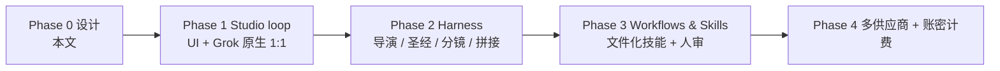
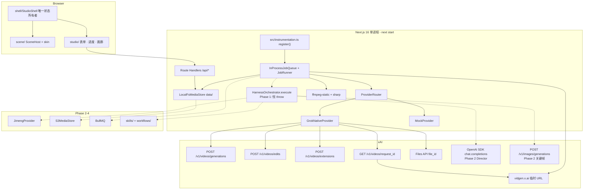
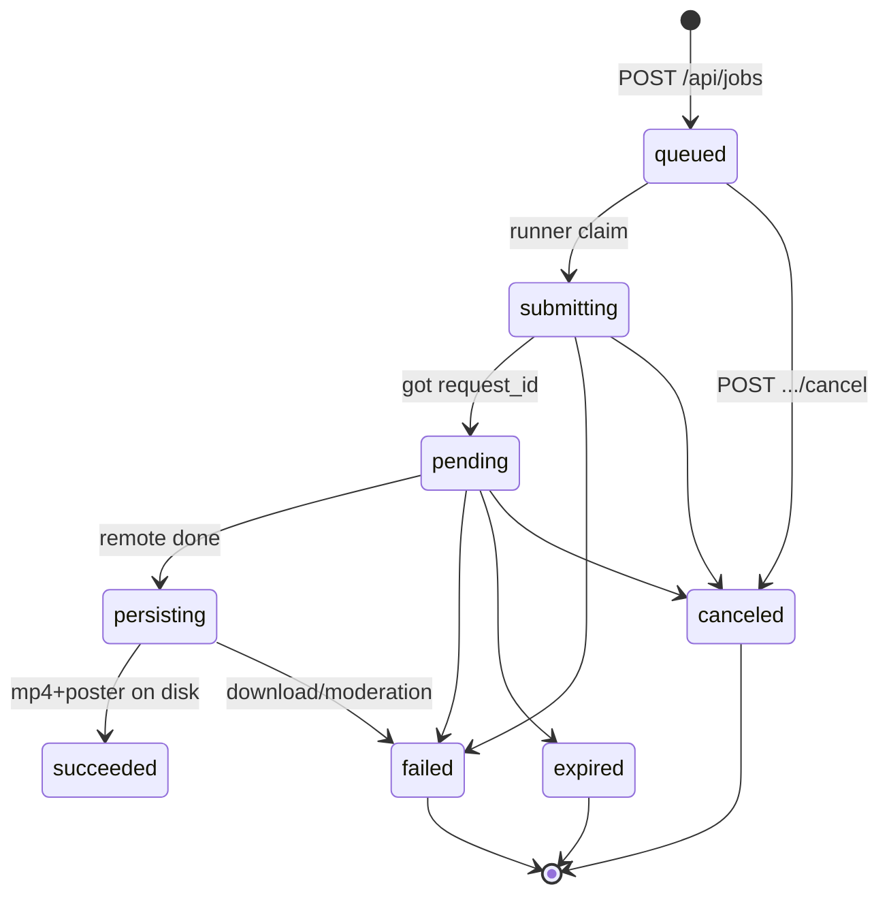
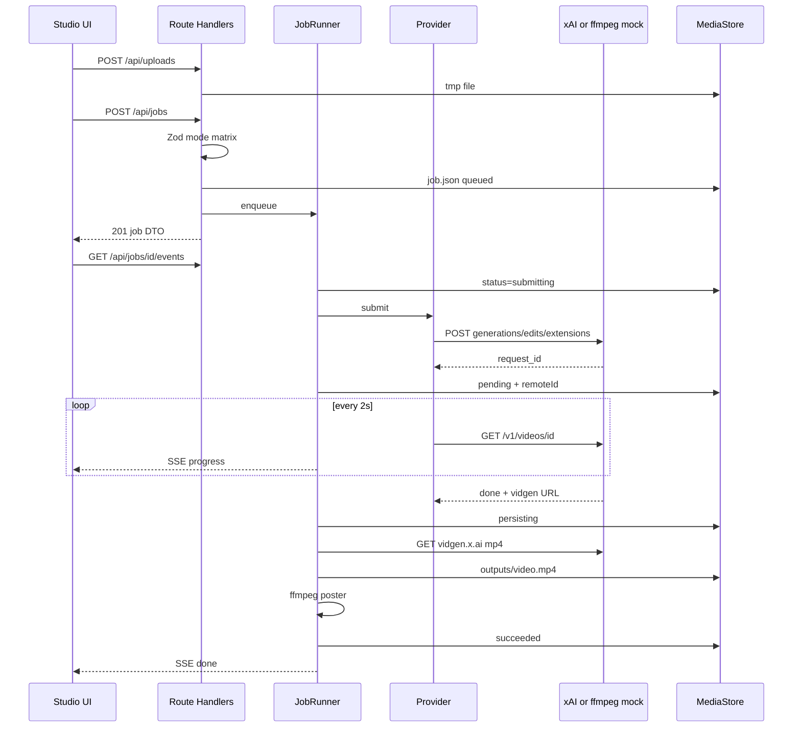
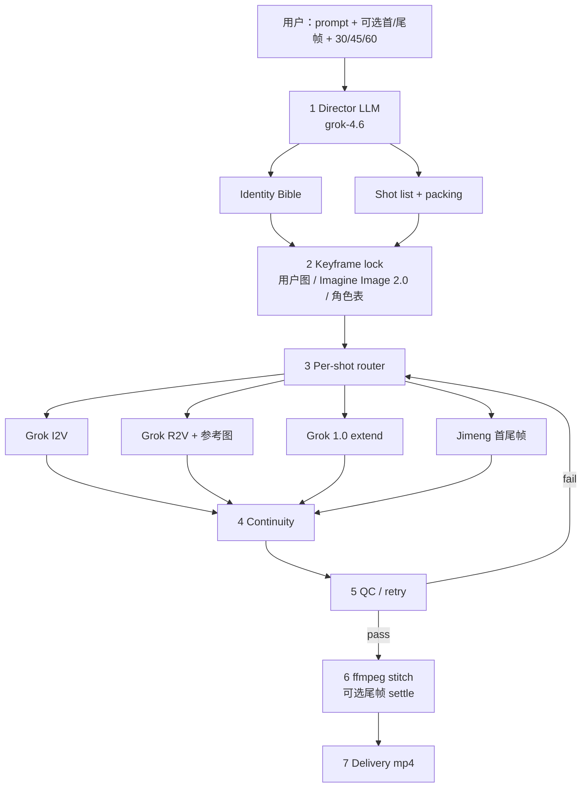

# 流光（Lumen）Web 视频生成平台 — 架构与一致性控制管线设计

> **⚠️ 本文为 Phase 0 历史设计(rev 3),部分内容已与实现漂移。**
> 当前真相以下列文档为准:设计书 [`docs/design.md`](design.md)(rev 4,as-built)、计划书 [`docs/plan.md`](plan.md)、审查报告 [`docs/review-2026-08-29.md`](review-2026-08-29.md) 与 [`docs/review-2026-09-05.md`](review-2026-09-05.md)。文中「orchestrator 恒 throw / PR 13 才读取 HARNESS_ENABLED」自 2026-09-05 起已过时:Harness 已接入并由 `HARNESS_ENABLED` 开关。本文保留作为决策依据(Key Decisions、Grok 能力矩阵、Alternatives)。2026-09-13 起产品方向为多中转按能力路由，Grok 为普通可选成员；Harness 长片（E）已完成并生产实证（`545580f`，`HARNESS_ENABLED=true`），本文 Grok 主视角部分为历史决策，现状以 `docs/design.md` 为准，后续计划见 `docs/plan-next-2026-09-13.md`。

| 字段 | 值 |
| --- | --- |
| 文档标题 | 流光（Lumen）Web 视频生成平台设计 |
| 作者 | TBD |
| 日期 | 2026-08-28 |
| 状态 | Draft（rev 3，回应二次审查） |
| 仓库 | `/home/testpc2/Code/VideoPlatFrom` |
| 产品名 | 流光 / Lumen |
| npm `name` | `lumen`（当前脚手架为 `vp-app`，Phase 1 第一批 PR 改名） |
| 受众 | 将按本文实现的资深工程师；除「开放问题」外不应再追问产品决策 |

---

## Overview

本产品是一个 **Web 视频生成工作室**：Phase 1 把 xAI Grok Imagine Video 的原生能力（文生视频、图生视频、参考生视频、视频编辑、视频延长）做成 **1:1 的端到端回路**——提交、异步进度、本地下载持久化、画廊回放。长期差异化不在「再包一层 API」，而在一套 **Harness（一致性控制管线）**：把用户提示词导演成分镜，锁定首/尾帧与角色资产，在多段 clip 之间强制身份/风格一致，再拼接成 30s / 45s / 60s 长视频。Grok **没有**原生尾帧锁定；尾帧硬锁来自即梦 `jimeng_i2v_first_tail_v30`（或等价 Seedance `first_frame` / `last_frame`）。用户已确认：**长视频必须由 harness 组装，一致性控制就是产品本身。**

交付顺序是绑定的：**先设计完整架构与完整一致性管线（本文，Phase 0），再搭平台；Phase 1 不跑 harness，不偷偷拼接 30–60s。** Phase 1 的优先级是 **酷炫、可替换的 Three.js 场景层 + 100% 对齐 Grok 原生能力**。Harness、工作流、skills、即梦、账密计费全部留扩展点，按 Phase 2–4 落地。

---

## Background & Motivation

### 当前仓库状态（以 2026-08-28 工作区为准）

`create-next-app` 已跑完，**没有业务代码**：

| 路径 | 现状 |
| --- | --- |
| `package.json` | `"name": "vp-app"`，Next **16.3.3**，React 19.2.8，Tailwind 4，pnpm 10.33.0 |
| `src/app/` | 仅默认 `page.tsx` / `layout.tsx` / `globals.css` / `favicon.ico` |
| 已装依赖 | `openai@^7.8.0`、`zod@^4.4.3`、`ffmpeg-static@^5.3.0`、`sharp@^0.35.4`、`vitest@^4.1.11`、`vite-tsconfig-paths@^6.1.1` |
| `pnpm-workspace.yaml` | **不是** monorepo；只为 `onlyBuiltDependencies: [ffmpeg-static]`（`sharp` 在 `ignoredBuiltDependencies`） |
| OS PATH | **没有**系统 `ffmpeg`，必须用 `ffmpeg-static` |
| 环境 | `XAI_API_KEY` **当前缺失** → Phase 1 必须有 **mock 模式** |
| `AGENTS.md` | Next.js 16 agent 规则：写代码前必须读 `node_modules/next/dist/docs/` |
| `.gitignore` | 尚未忽略 `data/`、媒体产物 |

脚手架约定（实现时必须遵守，见 Next 16 文档）：

- App Router + `src/`；Route Handler 用 `src/app/api/**/route.ts`
- 启动钩子是 `src/instrumentation.ts` 的 `register()`（**不要**放进 `app/`）
- Next 16 将 `middleware.ts` **重命名为** `src/proxy.ts`；Phase 1 不需要 proxy，也 **禁止** 新建 `middleware.ts`
- `layout.tsx` 已使用 `LayoutProps<"/">`（Next 16 类型）；后续改 `lang="zh-CN"`
- 写代码前阅读：`instrumentation.md`、`route-handlers.md`、`server-and-client-components.md`、`environment-variables.md`、`testing/vitest.md`、`self-hosting.md`

#### Next 16 实现铁律（复制即错）

Next 16 App Router 把动态段 `params` 和页面 `searchParams` 做成 **Promise**。实现时必须 `await`，并用生成的 helper 类型，**禁止**抄 Next 14/15 的同步 `params.id`。

```ts
// 页面：src/app/jobs/[id]/page.tsx
export default async function JobPage({ params }: PageProps<"/jobs/[id]">) {
  const { id } = await params;
}

// 若读 query：
export default async function Page({
  searchParams,
}: PageProps<"/gallery">) {
  const q = await searchParams;
}

// Route Handler：src/app/api/jobs/[id]/route.ts
export async function GET(
  _req: Request,
  ctx: RouteContext<"/api/jobs/[id]">,
) {
  const { id } = await ctx.params;
}

// src/app/api/media/[jobId]/[file]/route.ts
export async function GET(
  req: Request,
  ctx: RouteContext<"/api/media/[jobId]/[file]">,
) {
  const { jobId, file } = await ctx.params;
}
```

`PageProps` / `RouteContext` 由 `next typegen` / `next dev` 生成，全局可用、不必 import。PR 5（Route Handler）与 PR 6（`jobs/[id]/page.tsx`）的验收标准包含：TypeScript 无 `params.id` 无 await 的用法。

### 痛点

1. Grok 单次最长 **15s**，编辑输入最长 **~8.7s**，延长每次 **2–10s**；30–60s 必须拆镜 + 拼接，但若无身份圣经与首尾帧策略，拼接结果会「换脸、换衣、换光」。
2. Grok **没有** `last_frame` 参数；UI 若暗示「会停在这张尾帧」就是产品谎言。
3. `vidgen.x.ai` 结果 URL **临时**；不落盘等于刷新即丢。
4. 无 key 时无法开发 UI；必须 mock，且 mock 必须打标，避免被当成真片。
5. 视觉方向用户稍后才给 Three.js 参考；若把 WebGL 和生成表单缠在一起，后面只能重写。
6. cine（MIT）证明 Grok 原生回路可以很小；ArcReel（AGPL）证明一致性产品需要资产圣经与人审，但 **禁止 fork AGPL 源码**。

### 开源先验（学习，不抄 AGPL）

| 项目 | 许可 | 我们偷的是想法，不是代码 |
| --- | --- | --- |
| [daniel-farina/cine](https://github.com/daniel-farina/cine) | MIT | **Phase 1 最强参照。** Quick Builder = 一次性 T2V/I2V；Projects = 多镜拼接（我们的 harness）。Job 队列刷新后仍在；媒体进 `output/` 永不提交。cine 是 React + Rust API + Node media-server + worker 四进程，对 Phase 1 **过重**，只取其职责切分，不复制进程拓扑。I2V 前把静帧压到很小的 JPEG（cine 目标约 ≤96KB）——大图是 xAI 常见失败模式。 |
| [ArcReel/ArcReel](https://github.com/ArcReel/ArcReel) | **AGPL-3.0** | 资产圣经、人审门、生成前/后成本、中断可恢复、skills 目录。**禁止复制源码或派生。** |
| [calesthio/OpenMontage](https://github.com/calesthio/OpenMontage) | **AGPL-3.0**（GitHub 仓库 LICENSE，2026-08 核实） | skills/workflows 作为一等文件，而不是 hardcoded if/else。**禁止复制源码或派生**（与 ArcReel 同等对待）。 |
| open-director / SeedCamp2.0 / openstory / ai-video-studio / two-71/studio / openslop | 各异 | 导演多 agent、路由重试与安全门、durable execution、provider adapter + 队列。 |

**给我们的公式：** `provider adapter + job 状态机 + 持久化媒体 + 可选导演图`。Phase 1 = cine 式 Quick Builder。Phase 2 = ArcReel 式圣经 + OpenMontage 式 skills。

---

## Goals & Non-Goals

### Goals

**Phase 0（本文）**

- 写清全平台架构、Grok 1:1 模式矩阵、一致性管线、扩展点、风险、开放问题、可独立合并的 PR 切片。

**Phase 1（设计批准后立刻做）**

- Web 工作室：中文文案；Three.js 场景层与工作室表单 **物理隔离**；占位皮肤可整文件替换。
- 五种 Grok 原生模式端到端：`text-to-video` / `image-to-video` / `reference-to-video` / `edit-video` / `extend-video`。
- 异步：提交 → 进度（轮询 + SSE）→ 下载并持久化 mp4 → 画廊 / 下载。
- 无 `XAI_API_KEY` 时 mock（ffmpeg 从静帧生成带「MOCK」水印的 clip）；有 key 时走真 Grok。
- UI 展示 30 / 45 / 60 时长选项但 **禁用**；**禁止** Phase 1 静默拼接冒充长视频。
- 尾帧文件可采集并写入 job，**不得**声称 Grok 会停在该帧。
- 预留 harness / workflow / skill / Jimeng 的**类型**与恒 throw 的 stub（不创建可执行管线文件）。

**Phase 2–4：** 见「分阶段交付」。

### Non-Goals（Phase 1 明确不做）

- 导演 LLM、分镜、身份圣经执行、多 shot 生成、QC、ffmpeg 拼接多段 **生成** 镜头。
- 即梦 / Seedance / 任何非 Grok 视频供应商的真实调用。
- 用户系统、积分、支付、多租户（推荐默认；见开放问题）。
- 时间线精修编辑器（Remotion / 剪映导出）——Phase 3+。
- 锁定某种 Three.js 美术风格（用户会后补参考）。
- Fork 或 vendoring AGPL 产品。
- 把 cine 的四进程（Vite + Rust + media-server + PM2 worker）搬进本仓。
- 使用 OpenAI SDK 的 **整个** `openai.videos.*` 资源（`create` / `edit` / `extend` / `remix`）。它们打的是 Sora 形 `POST /videos`（及 `/videos/edits`、`/videos/extensions`），状态枚举是 `queued|in_progress|completed`，模型是 `sora-2*`。xAI 是 `POST /v1/videos/generations` + `request_id` + `pending|done|failed|expired`。方法名碰巧相似，**不是**同一协议。
- 部署到无长驻进程的 serverless（Vercel Fluid 等）：ffmpeg-static + in-process worker 需要 `next start` 单节点。
- Phase 1 创建 `harness/director.ts`、`bible.ts`、`keyframes.ts`、`chain.ts`、`qc.ts`、`stitch.ts` 或可执行的 skill runner。

---

## Key Decisions

1. **单进程 Next.js 16 App Router，不拆 Python/FastAPI，不拆 cine 四进程。** 理由：仓库已是 Next 16 + `src/`；Phase 1 流量是单人工作室；媒体与 job 用接口隔开，队列与对象存储可替换。代价：HMR / 多实例下 in-process worker 脆弱（见风险）。
2. **视频走 xAI REST `fetch`；禁止整个 `openai.videos.*`。** 已装 `openai@7.8.0` 的 `videos.create()` → `POST /videos`（Sora）；同资源还有 `videos.edit()` → `POST /videos/edits`、`videos.extend()` → `POST /videos/extensions`，状态是 `queued|in_progress|completed`。xAI 是 `POST /v1/videos/generations|edits|extensions` + `GET /v1/videos/{request_id}` + `pending|done|failed|expired`。方法名相似，协议不同。OpenAI SDK **只**留给 Phase 2：`chat.completions` → `https://api.x.ai/v1`。PR 3 用 grep 门禁：`openai.videos` 零命中。
3. **`VideoProvider` + `JobRunner` + `MediaStore` 三接口是系统骨架。** Phase 1 只接线 `GrokNativeProvider` 与 `MockProvider`；`LocalFsMediaStore`；`InProcessJobQueue`。S3 / BullMQ / Jimeng 以相同接口后补。`HarnessOrchestrator.execute` 在 Phase 1 **恒 throw**（见 KD 12）。
4. **模式由字段组合决定，并在服务端用 Zod 硬校验。** 与官方 Request Modes 一致：`image` 与 `reference_images` 互斥（400）；edit/extend 只用 1.0；1.5 不接受源视频；**edit 与 extend 都不得发送 `aspect_ratio` / `resolution`**（extend 的 `duration` 是延长段秒数，不是成片总长）。UI 按「每模式控件矩阵」显隐，但 **UI 不是安全边界**。`GrokNativeProvider` **永不读取** job 上的尾帧文件。
5. **默认模型按模式自动选择，不提供「auto 模型」黑盒。** T2V/I2V/R2V → `grok-imagine-video-1.5`；edit/extend → `grok-imagine-video`（1.0）。官方模式：1.5 生成，1.0 延长。高级面板只读展示实际 model id。
6. **本机 `data/` 是成片唯一真相；`vidgen.x.ai` 只作瞬态。** `status=done` 后立刻流式下载到 `outputs/video.mp4`；浏览器只读 `/api/media/{jobId}/video.mp4`（Range/206）。另见 Alternative F：可附带 `storage_options` 作 Files 备份，但不替代本机落盘。
7. **无 key = mock，有 key = live；禁止静默降级。** 顶栏明确「模拟模式」或「已连接 Grok Imagine」。可用 `LUMEN_FORCE_MOCK=1` 强制 mock（有 key 也走假片，便于 UI 开发）。
8. **Three.js 是可替换皮肤，不是生成逻辑。** **Phase 1 终态**下，唯一允许同时 import `scene/` 与 `studio/` 的模块是 `src/components/shell/StudioShell.tsx`。PR 6（无 Three.js）的 Shell **只** import `studio/`，左侧渲染 CSS 占位 `div[data-scene-slot]`，**禁止** `import` 尚不存在的 `scene/`。PR 7 **第一次**加入 `import { SceneHost } from "@/components/scene/SceneHost"` 并填进该槽。`scene/` 只可依赖 `three` / 本目录，禁止 import `studio`、`shell`、`@/lib/jobs`；`studio/` 零依赖 `three`。`SceneProgress` 收窄为 `{ phase, progress }`。占位皮肤：暗色电影棚、胶片颗粒、进度驱动的卷轴/光线；禁止紫粉 AI 渐变。
9. **30/45/60 在 Phase 1 可见但禁用（「即将推出」），不隐藏。** 让用户看见路线图，同时无法点下去触发假拼接。
10. **Phase 1 展示尾帧上传，只存不用。** 文案必须写清「当前 Grok 不会以该图为结束帧；将用于后续长视频一致性」。REST 映射表禁止把 `last.jpg` 放进 `image`。
11. **Phase 1 本地单用户，无账户无积分。** `data/` 即全部状态。鉴权留给 Phase 4。队列深度 `MAX_QUEUED_JOBS=20`，超出 429。
12. **Harness 在 Phase 1 只落 `harness/types.ts` + `pack-duration.ts` + 恒 throw 的 `orchestrator.ts`。** 即使 `.env` 里 `HARNESS_ENABLED=true`，Phase 1 代码也必须 throw `HARNESS_NOT_ENABLED`。打开 flag 并真正执行是 **PR 13**。禁止创建 `director.ts` / `bible.ts` / `keyframes.ts` / `chain.ts` / `qc.ts` / `stitch.ts`。
13. **I2V / 参考图先经 `sharp` 压成小 JPEG 再交给 Grok。** 学习 cine：过大静帧是失败主因。目标 ≤256KB、最长边 ≤1280；循环降低 quality 至 60，仍超则拒收。
14. **产品改名为 Lumen / 流光，package `lumen`。** 避免 `vp-app`；不与 cine/ArcReel 撞名。品牌可在开放问题中推翻。
15. **Skills 与 workflows 是目录里的文件，不是 if/else。** Phase 1 建空 `skills/`、`workflows/` 与 **纯 TS 类型**（`SkillManifest`、`SkillLoader`、`WorkflowGraph`、`GateNode`）；不写 markdown 执行器、不建 `/approve` 路由。Phase 3 才执行。
16. **`ffmpeg-static` / `sharp` 必须 external，且 health 缺二进制则失败。** `next.config.ts` 设置 `serverExternalPackages: ['ffmpeg-static', 'sharp']`，并 tracing 进 ffmpeg 二进制。`pnpm-workspace.yaml` 把 `sharp` 从 `ignoredBuiltDependencies` 挪到 `onlyBuiltDependencies`。App Router 默认会打包这些包，`__dirname` 指向的 ffmpeg 路径在 `next start` 下会丢。

---

## 分阶段交付



| 阶段 | 做什么 | 明确不做什么 |
| --- | --- | --- |
| **0 设计** | 全架构 + 一致性管线 + PR 切片 | 不写业务代码 |
| **1 Studio loop** | Three.js 占位皮肤；五种 Grok 模式；async job；persist mp4；mock；30/45/60 禁用；尾帧只存 | 无导演 LLM、无多 shot stitch、无 QC、无 Jimeng |
| **2 一致性 harness** | Director、bible、shots、keyframe、router、tail-chain、QC、ffmpeg stitch；打开 30/45/60 | 不把「静默 concat 两段 15s」当成产品 |
| **3 Workflows & skills** | `skills/*.md` + workflow 图；人审门；单镜重做 | 不把技能硬编码进 router |
| **4 Jimeng / 计费** | `JimengProvider`；账密；credits；S3；Redis 队列 | 不阻塞 Phase 1–2 的本地单用户路径 |

Feature flags（`.env`，默认全关除 scene skin）：

```
HARNESS_ENABLED=false          # Phase 1 代码忽略此值，恒 throw；PR 13 才读取
WORKFLOWS_ENABLED=false
JIMENG_ENABLED=false
LUMEN_FORCE_MOCK=false
NEXT_PUBLIC_SCENE_SKIN=placeholder
JOB_CONCURRENCY=2
MAX_QUEUED_JOBS=20
```

---

## Proposed Design

### 系统上下文



**部署约束：** Phase 1 目标是本机 / 单 VM `pnpm start`（Node 运行时）。`ffmpeg-static`、磁盘 `data/`、in-process 轮询都不适合 serverless。`export const runtime = "nodejs"` 写在使用 ffmpeg / `fs` 的 Route Handler 上。Route Handler 与 JobRunner **必须同属一个 Node isolate**（SSE 的 EventEmitter 不能跨进程）；禁止对 Phase 1 做多实例负载均衡。

#### `next.config.ts` 与原生二进制（PR 1 必须落地）

当前 `next.config.ts` 为空。App Router 会打包 Route Handler 依赖；默认 `serverExternalPackages` 含 `sharp` **不含** `ffmpeg-static`（见 `node_modules/next/dist/lib/server-external-packages.jsonc`）。`ffmpeg-static` 用 `__dirname` 解析约 80MB 的二进制，打包后路径失效。

```ts
// next.config.ts
import type { NextConfig } from "next";

const nextConfig: NextConfig = {
  serverExternalPackages: ["ffmpeg-static", "sharp"],
  outputFileTracingIncludes: {
    "/*": ["./node_modules/ffmpeg-static/ffmpeg"],
  },
};

export default nextConfig;
```

`pnpm-workspace.yaml` 改为：

```yaml
ignoredBuiltDependencies:
  - unrs-resolver
onlyBuiltDependencies:
  - ffmpeg-static
  - sharp
```

`GET /api/health`：**ffmpeg-static 解析为 `null` 或二进制文件不存在 → `ok: false`**（失败关闭，禁止假装能出片）。mock 模式额外要求 watermark 字体文件存在。

### 目标目录（相对仓库根；均为拟建，当前不存在）

```
/home/testpc2/Code/VideoPlatFrom/
  package.json                 # name: lumen; "test": "vitest run"
  next.config.ts               # serverExternalPackages + tracing
  pnpm-workspace.yaml          # sharp 进入 onlyBuiltDependencies
  .env.example
  .gitignore                   # 只增加 /data（含 data/tmp，不要另加 /uploads）
  vitest.config.mts
  skills/                      # Phase 3：空目录 + .gitkeep
  workflows/                   # Phase 3：空目录 + .gitkeep
  data/                        # gitignored；job + 媒体 + tmp + idempotency
  src/
    instrumentation.ts         # Node only：启动 JobRunner + tmp 清扫
    app/
      layout.tsx               # lang=zh-CN，中文标题
      page.tsx                 # 只渲染 <StudioShell />
      gallery/page.tsx
      jobs/[id]/page.tsx       # await params（PageProps）
      api/
        health/route.ts
        uploads/route.ts
        jobs/route.ts          # POST create, GET list
        jobs/[id]/route.ts     # GET; POST cancel|retry 见 HTTP 层
        jobs/[id]/cancel/route.ts
        jobs/[id]/retry/route.ts
        jobs/[id]/events/route.ts  # SSE；poll 仍是真相
        media/[jobId]/[file]/route.ts  # file ∈ {video.mp4, poster.jpg} + Range
    components/
      shell/
        StudioShell.tsx        # 终态才同时 import scene+studio；PR 6 只 import studio + CSS 槽
      scene/                   # 只可依赖 three / 本目录；禁止 import studio、shell、@/lib/jobs
        SceneHost.tsx
        types.ts
        registry.ts
        skins/placeholder/
      studio/                  # 禁止 import three / scene
        StudioChrome.tsx
        GenerateForm.tsx
        JobProgress.tsx
        GalleryGrid.tsx
        ModeFields.tsx
        DurationPicker.tsx
        LiveMockBanner.tsx
    lib/
      env.ts
      log.ts
      ffmpeg.ts
      cost.ts
      jobs/
        schema.ts              # Zod JobPublic 单一形状
        state-machine.ts
        store.ts
        runner.ts
        queue.ts
        idempotency.ts
      providers/
        types.ts
        router.ts
        grok/client.ts
        grok/native.ts
        grok/mode-matrix.ts
        grok/rest-map.ts       # 模式 → REST body；golden tests
        mock.ts
        jimeng.ts              # Phase 1: 抛 NotImplemented
      storage/
        types.ts
        local-fs.ts
      media/
        preprocess.ts          # sharp
        persist.ts             # download vidgen（及可选 Files 备份）
        poster.ts
        fonts/                 # OFL CJK subset + LICENSE
      harness/                 # Phase 1 仅此三文件
        types.ts
        pack-duration.ts       # 纯函数，可单测，runner 不得 import 去拼接
        orchestrator.ts        # execute(): never  throw HARNESS_NOT_ENABLED
      workflows/types.ts
      skills/types.ts
    types/
      job.ts
      scene.ts
```

`tsconfig.json` 已有 `"@/*": ["./src/*"]`，沿用。

### Grok 原生能力矩阵（Phase 1 必须 1:1）

来源：xAI 文档 2026-08-20（generation / image-to-video / reference-to-video / editing / extension）。实现以 REST 为准，SDK 示例仅作对照。

| 模式 `NativeMode` | 模型 | 端点 | 必填 | 可选 | duration | aspect_ratio | resolution | 音频 |
| --- | --- | --- | --- | --- | --- | --- | --- | --- |
| `text_to_video` | `grok-imagine-video-1.5` | `POST /v1/videos/generations` | `prompt` | — | 1–15，默认 **8** | `1:1` `16:9` `9:16` `4:3` `3:4` `3:2` `2:3`（默认 16:9） | `480p`/`720p`/`1080p`（默认 480p） | 默认开；`generate_audio: false` 静音 |
| `image_to_video` | 同上 | 同上 + `image` | 首帧图；prompt **可选** | — | 同上 | 默认跟图片；显式传入会 **拉伸** | 480/720/1080 | 同上 |
| `reference_to_video` | 同上 | 同上 + `reference_images` 和/或 `reference_audios` | 至少 1 张参考图 **或** 1 个 voice | 最多 7 图、3 个 preset `voice_id` | 最长 15s | 同上 | **最高 720p**，禁止 1080p | 可用 `<AUDIO_0>`；图用 `<IMAGE_0>`… |
| `edit_video` | `grok-imagine-video`（1.0） | `POST /v1/videos/edits` | 源视频 + prompt | — | **不可自定义**，跟输入；输入最长 **8.7s** | 跟输入 | 跟输入，**封顶 720p** | 跟模型 |
| `extend_video` | `grok-imagine-video`（1.0） | `POST /v1/videos/extensions` | 源视频 + prompt | `duration` = **延长段** 秒数 | 输入 2–15s；延长 **2–10**，默认 **6**；输出 = 输入 + 延长 | 跟输入 | 跟输入，封顶 720p | 跟模型 |

硬约束（服务端拒绝，返回 400 + 中文原因；**禁止静默丢弃字段**）：

- `image` + `reference_images` → 400（官方）。
- `text_to_video` 无 prompt → 400。
- `image_to_video` 无首帧 → 400。
- `reference_to_video` 无图且无 voice → 400；图 >7 或 voice >3 → 400。
- `edit_video` / `extend_video` 无源视频 → 400。
- `extend_video.duration` 不在 2–10 → 400。
- 1.5 模式带 `sourceVideo` → 400（1.5 **不接受**源视频）。
- R2V 选 1080p → 400。
- **edit** 传入 `duration` / `aspectRatio` / `resolution` → 400。
- **extend** 传入 `aspectRatio` / `resolution` → 400（官方 extension 页不接受这两项；输出跟输入、封顶 720p）。
- **`POST /api/jobs` + `edit_video`**：sidecar `durationSec > 8.7` → 400。
- **`POST /api/jobs` + `extend_video`**：sidecar `durationSec < 2` 或 `> 15` → 400。
- 用户选 30/45/60 → 400，文案「长视频将由一致性管线提供，尚未开放」。
- 未知 `voice_id` → 把 Grok 的 400 原文转给用户（官方会返回可用列表）。

载体（与发明的 12MB 阈值无关）：

| 资产 | 本地上限 | 送给 xAI 的方式 |
| --- | --- | --- |
| 首帧 / 参考图 / 尾帧（尾帧 **不送 Grok**） | 经 sharp 后 ≤256KB | 静帧：`data:` URI（`image.url` / `reference_images[].url`） |
| 源视频（edit/extend） | **48MB**（xAI Files 单文件上限，https://docs.x.ai/developers/files） | **上传阶段只落本地**。`JobRunner` **submit 时**才 `POST /v1/files`（`purpose` 以 Imagine Files 输入文档为准，PR 5 重读，不得省略），REST `video: { file_id }`。不用 data URI，也不把 `localhost` 当公网 URL。edit/extend 时长限制在 **`POST /api/jobs`** 按 `mode` 校验，不在 upload |

本机 `localhost` URL **不能**当公网 URL 传给 xAI。Phase 1 **不接受**用户传入任意远程 URL（防 SSRF）。

异步协议：

```
submit → { request_id }
GET /v1/videos/{request_id}
  status: pending | done | expired | failed
  progress: 0–100（pending 时 0–99，done=100，failed 可缺省）
  done → video.url (https://vidgen.x.ai/...)
        + video.duration
        + video.respect_moderation
        + video.file_output?.file_id   # 若请求带了 storage_options
        + usage.cost_in_usd_ticks      # 1 USD = 10_000_000_000 ticks
  failed → error.code + error.message
```

官方 error.code：`invalid_argument` | `permission_denied` | `failed_precondition` | `service_unavailable` | `internal_error`。鉴权失败、缺模型、限流是 **同步** HTTP 错误，不会出现在 deferred `error.code`。

`respect_moderation === false`：视为失败，用户可见「未通过安全审核」，不把 URL 送进画廊。

1.5 T2V 内部是「先出首帧再 I2V」，中间图 **不返回**。Phase 2 多镜 **不要** 依赖 T2V；应先 `grok-imagine-image-2.0` 出关键帧再 I2V。

#### 定价与 `src/lib/cost.ts`

**默认估算器使用官方平坦按秒价**（https://docs.x.ai/developers/pricing 与模型卡，2026-08-28 核实）：

| 模型 | 估算单价 |
| --- | --- |
| `grok-imagine-video-1.5` | **$0.080 / sec** |
| `grok-imagine-video` | **$0.050 / sec** |

`estimateCostUsd({ model, durationSec }) = rate * durationSec`。**不**按 480p/720p/1080p 乘系数。例：8s 1.5 → **$0.64**；15s 1.5 → **$1.20**；3s 1.5 冒烟 → **$0.24**。

`usage.cost_in_usd_ticks`：`costUsdActual = ticks / 10_000_000_000`。job DTO 同时带 `costUsdEstimate`（提交时）与 `costUsdActual`（`done` 后若有 ticks）。UI：提交前「约 $X.XX」；完成后若有实际值改显示「$X.XX」。

历史上有第三方/另一份定价页列出分辨率档（1.5：720p $0.14、1080p $0.25；1.0：720p $0.07）。**不得**作为默认系数。可在 `cost.ts` 用注释 + 测试夹具保留该表，并标注「未与 2026-08-28 模型卡交叉验证，禁止用于 UI」。账单以 ticks / xAI 控制台为准。

### Provider 接口（Phase 1 实现 Grok+Mock，预留其它）

```ts
// src/lib/providers/types.ts
export type NativeMode =
  | "text_to_video"
  | "image_to_video"
  | "reference_to_video"
  | "edit_video"
  | "extend_video";

export type AspectRatio = "1:1" | "16:9" | "9:16" | "4:3" | "3:4" | "3:2" | "2:3";
export type Resolution = "480p" | "720p" | "1080p";
export type ProviderId = "grok" | "mock" | "jimeng";

export type MediaRef =
  | { kind: "path"; path: string }
  | { kind: "data_uri"; dataUri: string }
  | { kind: "file_id"; fileId: string }
  | { kind: "url"; url: string };

export type ProviderGenerateRequest = {
  jobId: string;
  mode: NativeMode;
  prompt: string;                // I2V 可空；空则 REST 省略 prompt 键
  model: string;
  durationSec?: number;          // T2V/I2V/R2V: 成片秒；extend: 延长段秒；edit: 禁止
  aspectRatio?: AspectRatio;     // 仅 T2V/I2V/R2V
  resolution?: Resolution;       // 仅 T2V/I2V/R2V
  generateAudio: boolean;        // 仅 T2V/I2V/R2V 有意义
  startImage?: MediaRef;         // 仅 I2V → REST `image`
  referenceImages?: MediaRef[];  // max 7；仅 R2V
  referenceAudios?: { voiceId: string }[]; // max 3；仅 R2V；只要 voice_id
  sourceVideo?: MediaRef;        // 仅 edit/extend → REST `video`
  // 故意没有 lastImage / routeHint。尾帧只存在 job.json.lastFramePath。
};

export type ProviderHandle = {
  providerId: ProviderId;
  remoteId?: string; // xAI request_id
};

export type ProviderPoll = {
  status: "pending" | "done" | "failed" | "expired";
  progress: number;
  remoteUrl?: string;
  durationSec?: number;
  respectModeration?: boolean;
  errorCode?: string;
  errorMessage?: string;
  usage?: {
    costInUsdTicks?: number;     // 透传 usage.cost_in_usd_ticks
    costUsdActual?: number;      // ticks / 1e10
    raw?: unknown;
  };
  fileOutputId?: string;         // video.file_output.file_id，可选备份
};

export interface VideoProvider {
  readonly id: ProviderId;
  capabilities(): {
    modes: NativeMode[];
    maxDurationSec: number;
    supportsLastFrameLock: boolean;
    maxResolution: Resolution;
  };
  submit(req: ProviderGenerateRequest): Promise<ProviderHandle>;
  poll(handle: ProviderHandle): Promise<ProviderPoll>;
}
```

`ProviderRouter.select(req)`（Phase 1 **没有** `routeHint`，也 **不** 把 harness 塞进 router）：

- `LUMEN_FORCE_MOCK` 或无 `XAI_API_KEY` → `MockProvider`
- 否则 → `GrokNativeProvider`

Phase 1 `JimengProvider.submit` **必须 throw** `Error("JIMENG_NOT_IMPLEMENTED")`。`HarnessOrchestrator.execute` **必须 throw** `Error("HARNESS_NOT_ENABLED")`，与 env 无关。Jimeng 路由是 Phase 4 / PR 15，那时再给 `Shot.route` 用，而不是污染 `ProviderGenerateRequest`。

### Grok REST 客户端

```ts
// src/lib/providers/grok/client.ts — 仅服务器
const XAI_BASE = "https://api.x.ai/v1";

export function xaiHeaders() {
  const key = process.env.XAI_API_KEY;
  if (!key) throw new Error("XAI_API_KEY missing");
  return { Authorization: `Bearer ${key}`, "Content-Type": "application/json" };
}

// POST ${XAI_BASE}/videos/generations | /videos/edits | /videos/extensions
// GET  ${XAI_BASE}/videos/${requestId}
```

**禁止** `openai.videos.create|edit|extend|remix`（PR 3 grep 门禁）。OpenAI SDK 留给 Phase 2：

```ts
import OpenAI from "openai";
export const grokChat = new OpenAI({
  apiKey: process.env.XAI_API_KEY,
  baseURL: "https://api.x.ai/v1",
});
// 仅 grokChat.chat.completions.create({ model: "grok-4.6", ... })
```

Worker 轮询间隔 **2s**（官方示例 5s；2s 足够顺滑且不打爆 10 rps 量级限额）。单 job 超时 **15 分钟**。`service_unavailable` / `internal_error`：最多 2 次指数退避重提交；`invalid_argument` 不重试。

#### REST 字段映射（`GrokNativeProvider` 唯一允许发出的 JSON）

实现放在 `src/lib/providers/grok/rest-map.ts`。`lastFramePath` **不出现在任何 Grok body**。空 I2V prompt **省略键**，不传 `""`。`generate_audio`：仅 T2V/I2V/R2V；默认开则 **省略**（勿传 `true` 增加歧义）；静音才传 `false`。Phase 1 参考音频只要 `{ "voice_id": "eve" }`，不传合作方自定义 `url`。

可选备份（Alternative F）：所有 live submit 可附加 `"storage_options": { "filename": "{jobId}.mp4" }`（私有、不创建 public_url）。解析 poll 的 `video.file_output.file_id` 写入 job，下载仍以 `video.url` 为第一路径。

| 模式 | 端点 | REST 发送 | REST 永不发送 |
| --- | --- | --- | --- |
| `text_to_video` | `POST /v1/videos/generations` | `model`, `prompt`, `duration?`, `aspect_ratio?`, `resolution?`, `generate_audio?`（仅 false） | `image`, `reference_images`, `reference_audios`, `video` |
| `image_to_video` | 同上 | `model`, `image: { url \| file_id }`, 非空才有 `prompt`, `duration?`, `aspect_ratio?`, `resolution?`, `generate_audio?` | `reference_*`, `video`；**不得**把 `last.jpg` 放进 `image` |
| `reference_to_video` | 同上 | `model`, `prompt`, `reference_images?: [{url\|file_id}]`（≤7）, `reference_audios?: [{voice_id}]`（≤3）, `duration?`, `aspect_ratio?`, `resolution?`（≠1080p）, `generate_audio?` | `image`, `video` |
| `edit_video` | `POST /v1/videos/edits` | `model`, `prompt`, `video: { url \| file_id }` | `duration`, `aspect_ratio`, `resolution`, `image`, `reference_*`, `generate_audio` |
| `extend_video` | `POST /v1/videos/extensions` | `model`, `prompt`, `video: { url \| file_id }`, `duration`（延长段 2–10） | `aspect_ratio`, `resolution`, `image`, `reference_*` |

Golden tests（PR 3，fixture 对比序列化 JSON）：

1. I2V body 不含 `last.jpg` / `lastFrame` / 尾帧 data URI。
2. R2V + 1080p → 在进 fetch 前抛，HTTP 400。
3. 1.5 模式 + `sourceVideo` → 400。
4. edit + `duration`/`aspect_ratio`/`resolution` → 400。
5. extend + `aspect_ratio`/`resolution` → 400。
6. I2V 空 prompt → JSON 无 `prompt` 键。
7. T2V `generateAudio: true` → JSON 无 `generate_audio` 键。

### MockProvider

触发：无 `XAI_API_KEY` 或 `LUMEN_FORCE_MOCK=1`。

行为：

1. 用 `sharp` 做底板：有首帧则用首帧，否则按 prompt hash 生成深色纯色图，居中写 prompt 前 40 字。
2. `ffmpeg-static` Ken Burns（极慢 zoom）+ 烧录字幕。时长 = 请求 duration（缺省 8s），fps 24，H.264 + AAC（若 `generateAudio` 则 440Hz 轻提示音，否则 `-an`）。
3. 在 3–6s 内把 progress 从 0 推到 100，让 UI 可演示。
4. 直接写 `data/jobs/{id}/outputs/video.mp4`，runner 走本地 copy，不走 HTTP。

**CJK 字体（否则 drawtext 出豆腐或 spawn 失败）：** `ffmpeg-static` **不**带中文字体。把一份 OFL 许可的 Noto Sans SC **子集**（至少覆盖 `MOCK · 模拟模式 · 非 Grok 真片` 与 ASCII）vendoring 到 `src/lib/media/fonts/NotoSansSC-subset.otf`，并附 `LICENSE`。`drawtext` **必须** `fontfile=` 该路径。

- 字体存在：烧录 `MOCK · 模拟模式 · 非 Grok 真片`
- 字体缺失：退化为纯 ASCII `MOCK`（health 在 mock 模式下 `ok: false`，禁止默默出无标记片）

PR 2 验收：ffmpeg exit code 0 且命令行含 `fontfile=`；输出 mp4 非空。不依赖 `/usr/share/fonts`。

ffmpeg 调用统一走 `src/lib/ffmpeg.ts`：

```ts
import ffmpegPath from "ffmpeg-static";
import { spawn } from "node:child_process";
import { access } from "node:fs/promises";
if (!ffmpegPath) throw new Error("ffmpeg-static binary missing");
await access(ffmpegPath);
```

**禁止** `spawn("ffmpeg", ...)` 依赖 PATH。

### Job 状态机

Phase 1 单 clip：



取消与重试是 **独立 HTTP**，不是状态机里的隐式回环：

| 动作 | 端点 | 行为 |
| --- | --- | --- |
| 取消 | `POST /api/jobs/:id/cancel` | `queued`：直接 `canceled`，不 submit。`submitting`/`pending`：标 `canceled`，停 poll。若之后 xAI 仍返回 `done`：**不得**写入 `outputs/`，不得进入画廊，状态保持 `canceled`。`persisting`/`succeeded`/`failed`/`expired`/`canceled` → 409。 |
| 重试 | `POST /api/jobs/:id/retry` | 仅 `failed`/`expired`。**新建** `jobId`，复制 `inputs/` 与生成参数，入队。原 job 不变。201 返回新 `JobPublic`。禁止 `retryCount++` 原地复活。 |

持久化：**每次**转换先写 `data/jobs/{id}/job.json` 再往外发事件。崩溃恢复：`instrumentation.ts` 启动时扫描 `queued|submitting|pending|persisting`：

- `queued`：重新入队
- `submitting` 无 `remoteId`：回 `queued`
- `pending` 有 `remoteId` 且未 canceled：继续 poll
- `persisting` 有 `remoteUrl`：继续下载
- 超过 15min：标 `failed` / `expired`
- 启动时调用 `sweepTmp()`：删除 `data/tmp/` 中 mtime > **24h** 的字节与 sidecar；总 tmp > 2GB 时按最旧删。**同时**在 runner 单例上 `setInterval(sweepTmp, 60 * 60 * 1000)`，并对 timer `.unref()`，避免挡住进程退出。禁止靠「没有定时器的每小时」口头约定。tmp 阶段 **没有** xAI `file_id`，清扫只删本地。

Phase 1 `JobStatus` 枚举不含 `directing|keyframing|generating_shots|qc|stitching|awaiting_approval`。这些字符串只出现在 `harness/types.ts` 的 `HarnessJobStatus`（PR 10+ 才并入状态机）。`JobRunner` 不得 import `pack-duration` 去做拼接。

### 数据落盘

```
data/
  jobs/
    {jobId}/
      job.json
      inputs/
        start.jpg
        last.jpg          # 可空；Phase 1 不送 Grok
        source.mp4
        ref-0.jpg … ref-6.jpg
      outputs/
        video.mp4
        poster.jpg
      shots/              # Phase 2 才写；Phase 1 不建此目录
      bible.json          # Phase 2
      logs.jsonl
  tmp/{uploadId}          # 处理后的字节（图=JPEG，视频=mp4）
  tmp/{uploadId}.json     # UploadSidecar；24h TTL
  idempotency/{sha256}.json  # { jobId, createdAt }
```

`MediaStore`：

```ts
export interface MediaStore {
  writeJobFile(jobId: string, rel: string, bytes: Buffer | Uint8Array): Promise<string>;
  readJobFile(jobId: string, rel: string): Promise<Buffer>;
  statJobFile(jobId: string, rel: string): Promise<{ size: number }>;
  openJobFile(jobId: string, rel: string): Promise<NodeJS.ReadableStream>;
  /** 冻结 URL：只允许这两个 basename → 内部 outputs/ */
  publicPath(jobId: string, file: "video.mp4" | "poster.jpg"): string;
  listJobs(): Promise<string[]>;
}

// publicPath(jobId, "video.mp4")  === `/api/media/${jobId}/video.mp4`
// publicPath(jobId, "poster.jpg") === `/api/media/${jobId}/poster.jpg`
// 磁盘：data/jobs/{jobId}/outputs/video.mp4 与 poster.jpg
```

Phase 1：`LocalFsMediaStore`，根目录 `process.env.DATA_DIR ?? path.join(process.cwd(), "data")`。后期 `S3MediaStore` 实现同一接口。`.gitignore` **只**增加 `/data`（覆盖 `data/tmp`、`data/jobs`、`data/idempotency`）。不要忽略一个从不存在的 `/uploads`。

### 进程内队列

```ts
// src/instrumentation.ts
export async function register() {
  if (process.env.NEXT_RUNTIME !== "nodejs") return;
  const { startJobRunner } = await import("./lib/jobs/runner");
  await startJobRunner(); // 内含 sweepTmp() + setInterval(..., 3600_000).unref()
}
```

`InProcessJobQueue`：内存 `Set` + 磁盘 scan；`JOB_CONCURRENCY` 默认 2（**在飞** Grok/mock 数）。另限 **排队深度**：`queued + submitting + pending + persisting` 的个数 ≥ `MAX_QUEUED_JOBS`（默认 20）时 `POST /api/jobs` 返回 **429**（中文：「队列已满，请等待进行中的任务完成」）。无鉴权本地 API 不能无限堆积 live job 烧 key。

```ts
export interface JobQueue {
  enqueue(jobId: string): Promise<void>;
  onBootRecover(): Promise<void>;
  activeCount(): Promise<number>; // queued+submitting+pending+persisting
}
```

注释标明后续 `BullMQJobQueue`。`next dev` HMR 会重跑 `register()`——`startJobRunner` 必须幂等（`globalThis` 单例）。SSE 的 EventEmitter 必须挂在同一单例上；HMR 会丢掉订阅者，因此 **轮询是真相，SSE 是尽力而为**。

### HTTP 层

全部 Route Handler，`runtime = "nodejs"`。校验用 Zod 4（已装 `zod@^4.4.3`）。**不要**把 `XAI_API_KEY` 送到客户端；浏览器只拿 job DTO。

#### `POST /api/uploads`

`multipart/form-data`，字段 `file` + `role` = `start` | `last` | `reference` | `source_video`。

**禁止** `await request.formData()` 把整个文件读进内存。用 `busboy` 或 `@fastify/busboy` 把 `request.body`（Web stream → Node Readable）**流式写入** `data/tmp/{uploadId}`，累计字节超限立即销毁请求。

上传 **与 mode 无关**。客户端可以先上传源视频再切换 edit/extend tab。此处 **不** 做 8.7s / 2–15s 判断，也 **不** 调用 xAI Files（避免 tmp 孤儿按 $0.025/GiB/day 计费）。

- 图片：JPEG/PNG/WebP，`preprocessImage()` 后覆盖写 `data/tmp/{uploadId}`（JPEG 字节）。
- 视频：`video/mp4`，最大 **48MB**。ffmpeg 探针宽高与 `durationSec`。只拒绝非 mp4、超 48MB、探针失败。

同时写 sidecar `data/tmp/{uploadId}.json`：

```ts
type UploadSidecar = {
  uploadId: string;
  role: "start" | "last" | "reference" | "source_video";
  width: number;
  height: number;
  bytes: number;
  mimeType: string;
  durationSec: number | null; // 仅视频
  createdAt: string;
};
```

响应（图与视频同一形状）：

```ts
{
  uploadId: string;
  role: UploadSidecar["role"];
  width: number;
  height: number;
  bytes: number;
  durationSec: number | null;
}
```

**没有** `fileId`。create job 时把 tmp 字节 move 进 `data/jobs/{id}/inputs/`，把 sidecar 字段拷进 `job.json.assets`。

未被认领的 tmp：`sweepTmp()` 删 mtime > 24h 的 `{id}` + `{id}.json`（见状态机：boot + `setInterval` 每小时）。

#### 幂等

`data/idempotency/{sha256(idempotencyKey)}.json` → `{ jobId, createdAt }`。24h 内同 key 返回原 `JobPublic`（200 或 201 均可，实现固定 **200** 重放）。无 key 则每次新 job。

#### `POST /api/jobs`

`Content-Type: application/json`。

```ts
// 请求（与 src/lib/jobs/schema.ts 同步）
{
  mode: NativeMode,
  prompt: string,                 // T2V 必填；I2V 可空字符串；其它必填
  durationSec?: number,           // T2V/I2V/R2V: 1–15；extend: 2–10；edit: 禁止
  aspectRatio?: AspectRatio,
  resolution?: Resolution,
  generateAudio?: boolean,        // default true
  startUploadId?: string,
  lastUploadId?: string,          // 仅存储
  referenceUploadIds?: string[],  // max 7
  voiceIds?: string[],            // max 3，preset
  sourceVideoUploadId?: string,
  idempotencyKey?: string
}
```

服务端读各 `uploadId` 的 sidecar。**按 `mode` 校验源视频时长**（upload 阶段不做）：

- `edit_video` 且 `assets.source.durationSec > 8.7` → 400（「编辑源片最长 8.7 秒」）
- `extend_video` 且 `durationSec < 2` 或 `> 15` → 400（「延长源片须为 2–15 秒」）
- 缺 sidecar / 缺 `source_video` 角色不匹配 → 400

move 之后 `job.json` 持有：

```ts
assets: {
  start?: { path: "inputs/start.jpg"; width: number; height: number };
  last?: { path: "inputs/last.jpg"; width: number; height: number };
  references?: Array<{ path: string; width: number; height: number }>;
  source?: {
    path: "inputs/source.mp4";
    width: number;
    height: number;
    durationSec: number;
    xaiFileId: string | null; // submit 前恒 null
  };
}
```

`JobRunner` 在 live + edit/extend 的 **submit** 步：从 `inputs/source.mp4` `POST https://api.x.ai/v1/files`（`purpose` 按 Imagine Files 输入文档，PR 5 重读，不得省略），把返回 id 写入 `assets.source.xaiFileId`，再发 REST `video: { file_id }`。mock 跳过 Files。若 job 在已有 `xaiFileId` 之后被 cancel：尽力 `DELETE /v1/files/{id}`，失败只打日志。

响应 **201**：单一 Zod schema `JobPublic`（见「API / Interface Changes」）。创建时 `status: "queued"`、`progress: 0`、`output: null`、`error: null`、`costUsdActual: null`、`harness: { enabled: false }`、`bible: null`、`shots: null`。

深度 ≥ `MAX_QUEUED_JOBS` → **429**。

#### `GET /api/jobs`

`JobPublic[]`，按 `createdAt` 降序，默认 50。

#### `GET /api/jobs/:id`

同一 `JobPublic`。`await params`。`remoteId` 仅 `NODE_ENV=development` 可多返回 `debug.remoteId`，不进 `JobPublic`。

#### `POST /api/jobs/:id/cancel` / `POST /api/jobs/:id/retry`

见状态机表。retry 201 新 `JobPublic`。

#### `GET /api/jobs/:id/events`

SSE。**轮询 `GET /api/jobs/:id` 是真相**；SSE 在 `next dev` HMR 下可丢订阅，属尽力而为。

响应头：

```
Content-Type: text/event-stream
Cache-Control: no-cache, no-transform
Connection: keep-alive
X-Accel-Buffering: no
```

`export const maxDuration = 900`（15 分钟）。心跳每 15s 发送 `: ping`。Route Handler 与 runner **同一 isolate** 的 `globalThis` EventEmitter；多 `next start` 实例禁止。

事件体（`data:` JSON）：

| event | data |
| --- | --- |
| `snapshot` | `{ job: JobPublic }`（连接时立即一条） |
| `progress` | `{ id, progress, status }` |
| `status` | `{ id, status, progress }` |
| `log` | `{ id, level, message, ts }` |
| `done` | `{ job: JobPublic }` |
| `error` | `{ job: JobPublic }` |

测试：关掉 EventEmitter 后仅靠 2s 轮询仍能到达 `succeeded`。

#### `GET /api/media/:jobId/:file`

**冻结 URL（浏览器只用这两个）：**

- `/api/media/{jobId}/video.mp4` → 磁盘 `outputs/video.mp4`
- `/api/media/{jobId}/poster.jpg` → 磁盘 `outputs/poster.jpg`

`file` 是 **单个** path segment，白名单 `video.mp4` | `poster.jpg`。`jobId` 必须是 UUID。禁止 `..`、禁止 `/outputs/video.mp4` 这种多段路径。

**必须实现 HTTP Range**（PR 5，不是画廊抛光）：

- `Accept-Ranges: bytes`
- `Content-Length`（完整）或 `Content-Range` + 206
- `Content-Type: video/mp4` 或 `image/jpeg`
- 用 `stat` + `createReadStream({ start, end })`，禁止把整文件读进 Buffer
- `?download=1` → `Content-Disposition: attachment; filename="lumen-{jobId}.mp4"`

无 Range 时 Safari/Chrome 无法拖动进度条。

#### `GET /api/health`

```ts
{
  ok: boolean,                 // ffmpeg 二进制存在且 dataDir 可写；mock 时还要字体存在
  mockMode: boolean,
  harnessRunnable: false,      // Phase 1 恒 false
  ffmpeg: { present: boolean; path: string | null },
  mockFont: { present: boolean },
  dataDirWritable: boolean,
  grokKeyPresent: boolean,
  queued: number
}
```

**不**回 key。`ffmpeg-static === null` 或文件缺失 → `ok: false`。

### 创建 → 完成时序



### UI 结构与中文文案

`src/app/page.tsx` 是 Server Component，**只**渲染 `<StudioShell />`。

`src/components/shell/StudioShell.tsx`（`'use client'`）持有当前 job 的 `JobPublic`，轮询/SSE，把表单放在 `studio/`。`scene/` 与 `studio/` **禁止互相 import**。

**分 PR 组合（KD 8 约束的是 Phase 1 终态，不是 PR 6 树）：**

- **PR 6：** Shell **不得** `import` `scene/` 或 `three`。左侧渲染 CSS 槽，保证 `pnpm tsc` 绿：

  ```tsx
  <div className="relative min-h-0 flex-1">
    <div
      data-scene-slot
      className="absolute inset-0 bg-[#070709]"
      aria-hidden
    />
    {/* 生成按钮与表单在右侧，z-10，不进此槽 */}
  </div>
  ```

- **PR 7：** **第一次** `import { SceneHost } from "@/components/scene/SceneHost"`，用 `<SceneHost progress={...} />` 填进 `data-scene-slot`。此后 Shell 才同时依赖 scene + studio。

```
┌─────────────────────────────────────────────────────────────┐
│ 流光  [模拟模式 | 已连接 Grok Imagine]     画廊     健康点   │
├──────────────────────────┬──────────────────────────────────┤
│                          │  生成（始终在 DOM 高层，不被     │
│   SceneHost（WebGL）      │  canvas 挡住）                   │
│   只消费 SceneProgress    │  模式 Tabs（字段随模式显隐）     │
│                          │  提示词 / 首帧 / 尾帧 / 参考     │
│                          │  时长：见下表，不是统一 1–15     │
│                          │  约 $X.XX · 生成按钮              │
│                          │  JobProgress 百分比 + 状态文案    │
└──────────────────────────┴──────────────────────────────────┘
```

**布局铁律：** 生成按钮、进度数字、错误 toast 在普通 HTML 层，`z-index` 高于 canvas。WebGL 失败时 SceneHost 退化为 CSS 暗底，**表单仍可用**。

#### 每模式控件矩阵（PR 6 验收；服务端 mode-matrix 同步）

| 控件 | T2V | I2V | R2V | Edit | Extend |
| --- | --- | --- | --- | --- | --- |
| 提示词 | 必填 | 可选（空则省略 REST 键） | 必填 | 必填 | 必填 |
| 首帧 | 隐藏 | 必填 | 隐藏 | 隐藏 | 隐藏 |
| 尾帧 | 可见，只存 | 可见，只存 | 可见，只存 | 可见，只存 | 可见，只存 |
| 参考图 ≤7 | 隐藏 | 隐藏 | 至少图或音色之一 | 隐藏 | 隐藏 |
| 音色 ≤3 | 隐藏 | 隐藏 | 可选 | 隐藏 | 隐藏 |
| 源视频 | 隐藏 | 隐藏 | 隐藏 | 必填 | 必填 |
| 时长 | 1–15 启用；30/45/60 可见禁用。默认 8。文案「成片时长（秒）」 | 同 T2V | 同 T2V | **隐藏**（只读展示源片时长） | **2–10，默认 6**。文案「延长 2–10 秒（加在原片之后），不是成片总时长」 |
| 比例 | 启用，默认 16:9 | 启用（官方：显式会拉伸） | 启用 | **隐藏** | **隐藏** |
| 分辨率 | 480/720/1080，默认 720p | 同 T2V | 480/720，1080 禁用 | **隐藏** | **隐藏** |
| 生成音频 | 启用，默认开 | 同 T2V | 同 T2V | 隐藏 | 隐藏 |

Extend 只读行：「成片约 {源时长 + 延长段} 秒」。Edit 辅助：「输出时长/画幅与源片相同，分辨率封顶 720p」。

推荐文案（可微调，语义不可改）：

| 控件 | 文案 |
| --- | --- |
| 产品名 | 流光 |
| T2V | 文生视频 |
| I2V | 图生视频（首帧） |
| R2V | 参考生视频 |
| Edit | 编辑视频 |
| Extend | 延长视频 |
| Prompt | 提示词 |
| Start | 首帧（作为起始画面） |
| Last | 尾帧（仅保存，用于后续长视频一致性） |
| Last helper | Grok 目前不能锁定结束帧。上传后不会让成片停在这张图上。 |
| Duration T2V/I2V/R2V | 成片时长（秒） |
| Duration extend | 延长 2–10 秒（加在原片之后），不是成片总时长 |
| 30/45/60 | 即将推出 · 由一致性管线拼接 |
| Audio | 生成音频 |
| Cost | 约 $X.XX（以 xAI 账单为准） |
| Mock banner | 模拟模式：未配置 XAI_API_KEY，生成带水印的占位视频 |
| Live banner | 已连接 Grok Imagine |
| Submit | 生成 |
| R2V voices | 参考音色（最多 3 个，preset voice_id） |
| 1080p on R2V | 参考生视频最高 720p |

默认值：T2V/I2V/R2V duration 8、aspect `16:9`、resolution `720p`（平坦按秒计价下与 480p 同价，体验更好；用户可改回 480p）、`generateAudio=true`。Extend duration 默认 6。

I2V 不填 prompt：允许，服务端送空或省略需与官方一致（官方 I2V prompt optional）——实现时 **省略空 prompt 字段**，不要传 `""` 以免踩 `invalid_argument`。

### Three.js 皮肤层（必须可整层替换）

```ts
// src/components/scene/types.ts — 刻意不镜像 job 状态机
export type SceneProgress = {
  phase: "idle" | "working" | "done" | "error";
  progress: number; // 0–100
};

// StudioShell 映射：
// idle → idle
// queued|submitting|pending|persisting → working
// succeeded → done
// failed|expired|canceled → error

export interface SceneHandle {
  update(p: SceneProgress): void;
  resize(width: number, height: number): void;
  dispose(): void;
}

export interface SceneSkin {
  id: string;
  label: string;
  mount(container: HTMLElement): Promise<SceneHandle>;
}
```

`registry.ts`：

```ts
export const SCENE_SKINS: Record<string, () => Promise<SceneSkin>> = {
  placeholder: () => import("./skins/placeholder").then(m => m.placeholderSkin),
};
```

`SceneHost`：`'use client'` + `next/dynamic` `ssr: false`。Host **只**提供 DOM 容器并调用 `skin.mount(container)`，**自己不 mount R3F Canvas**。皮肤可选用 vanilla `three` 或在皮肤文件内使用 R3F；替换皮肤不必改 Host。

用户丢入新皮肤：

1. `src/components/scene/skins/{id}/index.ts` 实现 `SceneSkin`
2. 在 `registry.ts` 加一行
3. `.env` `NEXT_PUBLIC_SCENE_SKIN={id}`

**禁止** `studio/` 或 `GenerateForm.tsx` `import * as THREE` / `@react-three/*`。**禁止** `scene/` import `@/lib/jobs` 或 `JobPublic`。

占位皮肤规格（在参考图到达前）：

- 背景 `#070709`，轻微胶片颗粒 shader 或 CSS overlay
- 中央悬空片盘 / 细光环，`progress` 映射旋转与发光强度
- 无文字（文字走 HTML）；无紫色霓虹；无粒子爆炸
- `prefers-reduced-motion`：停旋转，只留静态棚

### 一致性控制管线（现在设计，Phase 2 实现）

产品命题：用户要 30–60s **同一角色、同一光线、同一服装** 的连续影片。Grok 单 clip ≤15s，无尾帧锁。Harness 是唯一合法的长视频路径。



#### Layer 1 — Director

输入：`prompt`、目标时长、可选首/尾帧、可选参考图、语言（默认中文）。

输出：严格 JSON（Zod），模型 `grok-4.6`（回退 `grok-4.5`），`response_format: json_object` 或 JSON schema。

```ts
// src/lib/harness/types.ts — Phase 1 只提交类型；不跑 LLM、不建 director.ts 等文件
export type IdentityBible = {
  version: 1;
  logline: string;
  style: {
    palette: string[];
    lighting: string;
    lens: string;
    era: string;
    doNotChange: string[];
  };
  characters: Array<{
    id: string;
    name: string;
    lockedTraits: string[];
    sheetAssetIds: string[];
    voiceId?: string;
  }>;
  locations: Array<{ id: string; name: string; refAssetIds: string[] }>;
  props: Array<{ id: string; name: string; refAssetIds: string[] }>;
};

export type Continuity = "hard_cut" | "tail_chain" | "extend";

export type ProviderRouteHint =
  | "grok_t2v"
  | "grok_i2v"
  | "grok_r2v"
  | "grok_extend"
  | "jimeng_first_last";

export type Shot = {
  id: string;
  index: number;
  durationSec: number;          // ≤15 for Grok generate; ≤10 for extend tail
  prompt: string;
  characterIds: string[];
  locationId?: string;
  startFrame?: { source: "user" | "generated" | "extracted"; assetId: string };
  endFrame?: { source: "user" | "generated" | "extracted"; assetId: string };
  route: ProviderRouteHint;
  continuity: Continuity;
  generateAudio: boolean;
};

export type HarnessPlan = {
  targetDurationSec: 30 | 45 | 60;
  packing: { clips: Array<{ kind: "generate" | "extend"; durationSec: number }> };
  bible: IdentityBible;
  shots: Shot[];
  stitch: { transition: "hard_cut" | "xfade"; settleLastFrame: boolean };
};
```

Phase 1 `job.json` 预留：`bible: null`、`shots: null`、`harnessPlan: null`、`lastFramePath: string | null`。

Phase 1 harness 源文件 **仅**：

```ts
// src/lib/harness/orchestrator.ts
export interface HarnessOrchestrator {
  execute(jobId: string): Promise<never>;
}

export const harnessOrchestrator: HarnessOrchestrator = {
  async execute() {
    throw new Error("HARNESS_NOT_ENABLED");
  },
};
```

`pack-duration.ts` 可单测，**runner 不得 import 它去做拼接**。`JobRunner` 若被误调 `harnessOrchestrator.execute`，必须让 job `failed`（不应发生）。

#### Layer 2 — Keyframe lock

优先级：

1. 用户首帧 → shot[0].startFrame
2. 用户尾帧 → 最后一镜 endFrame（**只有** `jimeng_first_last` 或 settle clip 能硬锁）
3. 角色表 / 场景静帧：`POST /v1/images/generations` model `grok-imagine-image-2.0`，写入 `data/jobs/{id}/inputs/sheets/`
4. 禁止对多镜长视频直接 T2V（中间首帧不可控）

#### Layer 3 — Per-shot 路由

| 条件 | 路由 |
| --- | --- |
| 需要硬锁尾帧（用户尾帧、场景结算） | `jimeng_first_last`（**PR 15 开工前必须重读火山/Ark 文档**；下文请求形为未核实草稿） |
| 连续动作、上一镜刚结束 | `grok_extend`（1.0，2–10s）接在 1.5 生成之后 |
| 有角色表、不要锁死首帧构图 | `grok_r2v`（参考图 ≤7 + 可选 voice） |
| 有明确首帧（用户或抽帧） | `grok_i2v` |
| 以上皆非（应极少） | `grok_t2v` 仅用于 bib 外的空镜 |

Grok 官方推荐：1.5 生成，1.0 延长。连续 25s 动作优先 `15 generate + 10 extend`，优于两个 15s hard cut。

#### Layer 4 — 三种连续性（可混合）

1. **Tail-frame chaining：** ffmpeg 抽上一镜最后一帧 → 下一镜 I2V 首帧。身份靠「像素连续」，动作会有切点。
2. **Keyframe-cut：** 每镜独立关键帧（角色表 + 构图），硬切。适合分镜、对白。
3. **Hybrid（默认 30–60s）：** 段落内 `generate+extend` 尽量长；段落之间 tail-chain。用户尾帧：PR 13（Grok-only）用 0.5–1s freeze settle；PR 15 起才允许最后一镜走 Jimeng 硬锁。

#### Layer 5 — QC / retry

每镜完成后：

- ffmpeg 实测时长，误差 >0.4s 重试
- 抽首尾帧；若有角色表，用 `grok-4.6` 视觉对比（Phase 2 不做本地 CLIP 依赖）打 0–1 分，低于 0.6 则 **同一 startFrame** 收紧 prompt 重试
- 检测黑帧 / 冻帧（`ffmpeg blackdetect` / `freezedetect`）
- 每镜最多 2 次自动重试，然后 `needs_review`（Phase 3 人审）

#### Layer 6 — Stitch

- 默认 **hard cut**（xfade 会抹脸）
- `ffmpeg-static` concat demuxer；统一 fps/像素/像素格式
- 可选 last-frame settle：PR 13 为最后 0.5–1.0s freeze；短 Jimeng 首尾帧仅 PR 15+
- 音频：loudnorm；硬切处 20ms fade 避免爆音
- 输出 `outputs/video.mp4`，与 Phase 1 单 clip **同一交付槽**，画廊无感知

#### Layer 7 — Delivery

与 Phase 1 相同：poster、画廊、下载。DTO 增加 `shots[]` 供未来时间线。

#### 时长装箱（纯函数，Phase 1 即可单测，不接入 UI）

Grok generate 上限 15s，extend 上限 10s，故 **单段连续运动上限 25s**。超过必须切镜。

| 目标 | 推荐 packing | 备选 |
| --- | --- | --- |
| 30s | `15 gen + 10 ext + 5 gen(tail-chain)` | `15 + 15` hard cut |
| 45s | `15+10` + `15+5` 两段，段间 tail-chain | `15×3` |
| 60s | `(15+10)×2 + 10 gen` 或 `15×4` | **Grok-only（PR 13 启用 30/45/60 时）：** 用户尾帧只写入最后一镜 `endFrame` 并 **freeze settle**，不调用即梦。Jimeng 硬锁是 PR 15 |

`src/lib/harness/pack-duration.ts`：

```ts
export function packDuration(targetSec: 30 | 45 | 60): HarnessPlan["packing"] { /* ... */ }
```

Phase 1 测试覆盖该函数；`JobRunner` **不得 import 并执行**拼接。

即梦 / Seedance（**Phase 4 / PR 15；请求形未在本次审查核实，实施前重读厂商文档**）：

- 草稿线索（可能过期）：火山 `CVSync2AsyncSubmitTask`、`req_key=jimeng_i2v_first_tail_v30`、两张同比例图、`frames` 121/241；或 Ark `role: "first_frame" | "last_frame"`
- 环境变量预留 `JIMENG_AK` / `JIMENG_SK` 或 `ARK_API_KEY`，Phase 1 **不读、不发请求**
- PR 13 打开 30/45/60 时必须能在 **无即梦** 下交付（Grok generate+extend+tail-chain+可选 freeze settle）

### Workflows & Skills 扩展点（Phase 3）

```ts
// src/lib/skills/types.ts — 仅类型，无执行器
export type SkillPortType = "string" | "image" | "video" | "bible" | "shot";

export type SkillManifest = {
  id: string;
  name: string;
  version: string;
  description: string;
  inputs: Record<string, SkillPortType>;
  outputs: string[];
};

export interface SkillLoader {
  load(): Promise<SkillManifest[]>; // Phase 1 实现返回 []
}

// src/lib/workflows/types.ts
export type WorkflowNode =
  | { id: string; kind: "skill"; skillId: string }
  | { id: string; kind: "provider"; route: ProviderRouteHint }
  | { id: string; kind: "gate"; gate: GateNode };

export type GateNode = {
  id: string;
  label: string;
  timeoutSec?: number;
};

export type WorkflowGraph = {
  id: string;
  version: 1;
  nodes: WorkflowNode[];
  edges: Array<{ from: string; to: string }>;
};
```

磁盘约定（Phase 3）：`skills/<id>/SKILL.md` YAML frontmatter 对齐 `SkillManifest`。Phase 1 **不**写 markdown runner，**不**建 `POST /api/jobs/:id/approve`，状态机 **不**包含 `awaiting_approval`。

---

## API / Interface Changes

仓库当前无 API。新增如上。**所有** HTTP 入口共用一个 Zod `JobPublic`：`POST /api/jobs` 201、幂等 200、`GET /api/jobs` 列表项、`GET /api/jobs/:id`、SSE `snapshot`/`done`/`error`。不要同时存在 `harnessEnabled` 与 `harness.enabled`。

```ts
export type JobStatus =
  | "queued"
  | "submitting"
  | "pending"
  | "persisting"
  | "succeeded"
  | "failed"
  | "expired"
  | "canceled";

export type JobPublic = {
  id: string;
  status: JobStatus;
  progress: number; // 0–100
  mode: NativeMode;
  model: string;
  provider: ProviderId;
  prompt: string;
  durationSec: number; // T2V/I2V/R2V=成片秒；extend=延长段秒；edit=源片秒
  aspectRatio: AspectRatio | null; // edit/extend 为 null
  resolution: Resolution | null;   // edit/extend 为 null
  generateAudio: boolean;
  lastFrameStored: boolean;
  lastFrameLocksOutput: false;     // Phase 1 字面量 false
  harness: { enabled: false };     // Phase 1 字面量
  costUsdEstimate: number;
  costUsdActual: number | null;    // ticks 换算；未知则 null
  error: { code: string; message: string } | null;
  output: {
    videoUrl: string;   // /api/media/{id}/video.mp4
    posterUrl: string;  // /api/media/{id}/poster.jpg
    durationSec: number;
  } | null;
  createdAt: string; // ISO
  updatedAt: string;
  bible: IdentityBible | null;
  shots: Shot[] | null;
};
```

---

## Data Model Changes

无数据库。`job.json` 即源。字段变更用 `schemaVersion: 1`；Phase 2 升 `2` 时写 `src/lib/jobs/migrate.ts`（v1→v2 填 `bible: null` 等，已是 v1 默认）。

`job.json` 除 `JobPublic` 可序列化字段外，还含内部 `assets`（不上报给浏览器）：`start` / `last` / `references` / `source`，其中 `source.xaiFileId` 仅 live submit 之后非 null。上传 sidecar 在 `data/tmp/{uploadId}.json`，认领后拷贝进 `assets`。

并发：单节点文件锁（`proper-lockfile` 或自研 `{jobId}.lock`）。Phase 1 不引入 SQLite，除非队列丢失成为事实问题。

`POST /api/jobs` 幂等：`data/idempotency/{sha256(key)}.json` → jobId；24h 内同 key 返回原 `JobPublic`（200）。

---

## Alternatives Considered

**A. cine 式四进程（Vite UI + Rust API + Node media + PM2 worker）**  
优点：职责清晰，worker 与 HMR 解耦。缺点：本仓已是 Next 16；四进程对单人 Phase 1 运维过重；Rust 无现成业务。**拒绝。** 只借 Quick Builder / persist / 压图。

**B. Python FastAPI + LangGraph + 本仓只当前端**  
优点：harness 图好写（ai-video-studio 路线）。缺点：两套运行时、两套部署；与「保持现有 Next 脚手架」冲突。Phase 2 若导演图爆炸，再评估把 `HarnessOrchestrator` 抽 worker，而不是现在重写。

**C. Phase 1 用 1.0 extend 把 15s 续到 25s，再 concat 冒充 30s**  
优点：UI 能开 30s。缺点：用户已禁止；无 QC 的拼接不是产品。**拒绝。**

**D. 直接 fork ArcReel / OpenMontage**  
ArcReel AGPL 会传染本产品。OpenMontage 体量远超 Phase 1。**拒绝 fork；只吸收概念。**

**E. 用 Vercel AI SDK `generateVideo` + `@ai-sdk/xai`**  
优点：轮询封装好。缺点：新主依赖；模式矩阵仍要自己校验；与已装 `openai` 重复。Phase 1 用 `fetch` 更可控。可在 adapter 内部以后再换。

**F. 用 Imagine `storage_options` / Files `file_output` 作为成片主存储**（https://docs.x.ai/developers/model-capabilities/imagine/files/outputs）  
优点：官方持久化，缓解 vidgen 过期；`file_id` 可直接喂给后续 edit/extend，不必再传 data URI。缺点：Files 存储 **$0.025/GiB/day**、下载 **$0.20/GiB**；多一个远端生命周期；本产品画廊要以本机 `data/` 为准。`output.upload_url` 还需要自建预签名 PUT，Phase 1 无此基建。

**Phase 1 选择：本机下载仍是主路径**（浏览器永不直接播 vidgen）。Live submit **附带** `storage_options: { filename: "{jobId}.mp4" }`（私有、无 public_url）作为备份：若 vidgen GET 失败且 poll 含 `file_output.file_id`，则改从 Files API 拉字节。解析并持久化 `file_output`，即使备份下载未用到。不把 Files 当画廊 CDN。

---

## Security & Privacy Considerations

| 威胁 | 缓解 |
| --- | --- |
| `XAI_API_KEY` 泄漏 | 仅服务器 `process.env`；禁止 `NEXT_PUBLIC_`；`.env*` 已在 `.gitignore` |
| 任意文件读取 `/api/media` | `jobId` UUID + basename ∈ {`video.mp4`,`poster.jpg`}；禁止 `..` |
| 上传炸弹 | 图片预处理后 ≤256KB；视频 **48MB**；**流式** busboy，禁止 `formData()` 整包进内存；tmp 24h TTL + 启动清扫 |
| SSRF（把内部 URL 当 image.url） | Phase 1 只送 data URI / file_id，不接受用户任意 URL 转发给 xAI |
| 提示词注入进 Director（Phase 2） | bible JSON schema 收紧；skills 无任意 shell |
| 审核内容 | 尊重 `respect_moderation`；失败不展示 |
| 单用户无鉴权 | 默认绑定 localhost；若暴露公网必须加反向代理 + Phase 4 鉴权（见开放问题） |
| AGPL 污染 | 依赖审查；禁止拷贝 ArcReel / **OpenMontage**（均为 AGPL-3.0）源码 |
| 成本爆炸 | UI 预估；`JOB_CONCURRENCY=2`；`MAX_QUEUED_JOBS=20` → 429；Phase 4 加 credits |

Phase 1 无账户：**任何能打到端口的人都能烧 xAI 余额。** `GET /api/health` 的 README 必须写清「先别把端口映射到公网」。

---

## Observability

结构化日志：`src/lib/log.ts`，JSON 行，字段 `ts, level, jobId, remoteId, mode, event`。`data/jobs/{id}/logs.jsonl` 同步一份。

指标（先日志，Phase 4 再 Prometheus）：

- `job_created_total{mode,provider}`
- `job_completed_total{status}`
- `job_duration_ms`（排队 / 远程 / 下载）
- `xai_poll_errors_total`
- `cost_usd_estimate_sum`
- `mock_mode` gauge

`onRequestError` 在 `instrumentation.ts` 打日志（Next 16 稳定 API）。

告警（单人阶段用日志即可）：连续 3 次 `expired`（URL 或 job）、下载 vidgen 失败、ffmpeg spawn 失败、磁盘 <1GB。

健康：`GET /api/health` + 顶栏点。

---

## Rollout Plan

1. 合并 Phase 1 PR（见文末）到可在无 key 下 `pnpm dev` 出 mock 片。
2. 本地配置 `XAI_API_KEY`，用 3s 480p T2V 打通真链路（平坦价 **$0.24**）。
3. 再测 I2V → R2V → extend → edit。每步看 `data/jobs/*/job.json` 与 mp4 是否可 **seek**（Range）。
4. Phase 1 即使误开 `HARNESS_ENABLED` 也 throw。回滚 = 还原 PR；媒体已在 `data/`。
5. 生产：单节点 `pnpm build && pnpm start`，`DATA_DIR` 挂盘。不要多进程 cluster，直到换 BullMQ。

---

## Risks

| 风险 | 严重度 | 缓解 |
| --- | --- | --- |
| `vidgen.x.ai` URL 很快过期，未下载即丢片 | **高** | `done` 后立刻流式下载；`storage_options` 备份 + 解析 `file_output`；失败标 `failed`，retry 新建 job |
| 成本：15s 1.5 平坦价 **$1.20**/clip（非 $3.75） | **高** | 默认 720p（平坦价下与 480p 同价）；UI 预估 + ticks 实际；concurrency 2；`MAX_QUEUED_JOBS=20`；mock 开发 |
| 1.5 vs 1.0 模式用错（1.5 去 edit） | **高** | mode-matrix 单测 + 服务端拒绝 |
| Next in-process worker：HMR/crash 丢内存队列 | **高** | 每次状态写盘；boot recover；globalThis 单例；接口预留 BullMQ |
| `next start` 多实例抢同一 `data/` | **中** | Phase 1 文档规定单实例；文件锁 |
| 审核 `respect_moderation` / `invalid_argument` 把正常提示词打死 | **中** | 展示官方 message；不重试该类错误 |
| 大图/大视频导致 400 | **中** | sharp 压缩；视频 Files API；cine 经验 |
| 无系统 ffmpeg、`ffmpeg-static` 被 Next 打包丢路径 | **中** | `serverExternalPackages` + tracing；health 缺文件则 `ok: false`；`sharp` 进入 onlyBuiltDependencies |
| Three.js 包体 / WebGL 失败拖垮生成 | **中** | dynamic import；失败降级 CSS；按钮不在 canvas 里 |
| 用户以为尾帧已锁定 | **高（产品）** | UI 文案 + `lastFrameLocksOutput: false` |
| 即梦首尾帧比例不一致 | **中（Phase 2）** | preprocess 统一 aspect |
| Zod 4 API 与 Zod 3 资料不符 | **低** | 以已装 `zod@4.4.3` 文档为准 |
| OpenAI SDK `videos.*`（含 edit/extend）被误接 xAI | **高** | KD 2；PR 3 grep 零命中 `openai.videos` |
| mock 中文水印无字体 | **中** | vendor OFL subset；`fontfile=`；health 检查 |
| 画廊无法 seek | **高** | PR 5 实现 Range/206，不留给 PR 8 |

延迟目标（单用户，720p 8s T2V）：

| 步骤 | 目标 |
| --- | --- |
| `POST /api/jobs` | p95 < 300ms |
| Mock 全流程 | < 8s |
| Live Grok（参考：消费端 Fast 6s/720p ≈25s） | 30–180s，超时 15min |
| `done` → 本地 mp4 可播 | < 5s |
| 首屏 HTML（不含 WebGL） | < 1.5s |

容量：单 clip 8s 720p 约 5–15MB；100 条画廊 < 2GB。Phase 1 不删历史，可手动清 `data/jobs`。

---

## Open Questions

下列是产品选择。实现按「推荐默认」开工；若推翻，只改标记处。

1. **Three.js 视觉语言**  
   **不决定。** 等用户参考。工程上皮肤可替换已锁定。占位：暗色电影棚。

2. **Phase 1 是否要账户 / 积分？**  
   **推荐：不要。** 本地单用户，`data/` 即世界。公网暴露前必须上 Phase 4。

3. **30/45/60 是可见禁用还是藏在「即将推出」后面？**  
   **推荐：可见禁用 + 「即将推出」徽章。** 让路线图可感知，又点不了。

4. **默认模型 1.5 vs auto？**  
   **推荐：按模式自动选具体 id（生成 1.5，edit/extend 1.0），高级区只读展示。** 不要再做一个不透明的 auto。

5. **Phase 1 是否展示尾帧上传？**  
   **推荐：展示，只存，强文案。** 否则 Phase 2 没有用户素材。

6. **品牌名 Lumen / 流光是否保留？**  
   推荐保留；可改为其它中文名，但 `package.json` 不要留 `vp-app`。

7. **默认分辨率 720p（体验）还是 480p（官方默认）？**  
   **推荐 720p。** 2026-08-28 模型卡为平坦 $/s，720p 与 480p **同价**；体验更好。若实际账单出现分辨率档，以 `cost_in_usd_ticks` 为准。

8. **R2V 的 preset 音色列表如何维护？**  
   推荐写死常见 id（`eve` `leo` `ara` `rex` 等，与 TTS 名单对齐），未知 id 让 Grok 400 回传。是否请求官方完整名单？

9. **edit/extend 的源视频：仅本平台已生成，还是允许用户上传任意 mp4？**  
   **推荐两者都要。** 用户上传 mp4 与画廊已有成片均可作为源。上传一律先落本地 sidecar；**submit 时**再 Files `file_id`（见载体表）。**不用** data URI。

10. **Director 用 grok-4.6 还是强制 4.5？**  
    Phase 2 再锁；类型里用 `string`，env `LUMEN_DIRECTOR_MODEL=grok-4.6`。

---

## References

- 本仓：`package.json`、`src/app/*`、`pnpm-workspace.yaml`、`AGENTS.md`、`next.config.ts`、`node_modules/next/dist/docs/`（instrumentation、route handlers、`params` Promise、proxy 更名、vitest、env、self-hosting）、`node_modules/next/dist/lib/server-external-packages.jsonc`
- xAI Video Generation（2026-08-20）：https://docs.x.ai/developers/model-capabilities/video/generation
- Image-to-Video / Reference-to-Video / Editing / Extension
- REST：https://docs.x.ai/developers/rest-api-reference/inference/videos
- Pricing（平坦 $/s，2026-08-28）：https://docs.x.ai/developers/pricing
- Files 48MB：https://docs.x.ai/developers/files
- Imagine persist `storage_options`：https://docs.x.ai/developers/model-capabilities/imagine/files/outputs
- `cost_in_usd_ticks`：1 USD = 10,000,000,000 ticks
- Imagine Video 1.5 发布：https://x.ai/news/grok-imagine-video-1-5
- 即梦首尾帧（**未核实**，PR 15 重读）：https://www.volcengine.com/docs/85621/1791184
- cine（MIT）：https://github.com/daniel-farina/cine
- ArcReel（AGPL-3.0，只读想法）：https://github.com/ArcReel/ArcReel
- OpenMontage（**AGPL-3.0**，只读想法）：https://github.com/calesthio/OpenMontage

---

## PR Plan

原则：每个 PR 可独立 review；合并后 `pnpm lint` 与 `pnpm test` 必须绿（**PR 1 首次加入能通过的 `test` script**）。Phase 1 结束：无 key 可 mock 出片，有 key 可真出片，画廊可 seek。Harness **不执行**。

### PR 1 — 地基：改名、Next 原生二进制、Vitest、共享类型

- **标题：** `chore: rename to lumen, next native binaries, job/provider types`
- **影响文件：** `package.json`（`name: lumen`，`"test": "vitest run"`；devDeps：`@vitejs/plugin-react`、`jsdom`、`@testing-library/react`、`@testing-library/dom`；已有 `vite-tsconfig-paths`/`vitest`）、`next.config.ts`（`serverExternalPackages` + `outputFileTracingIncludes`）、`pnpm-workspace.yaml`（`sharp` → `onlyBuiltDependencies`）、`.gitignore`（**仅** `/data`）、`.env.example`、`README.md`、`vitest.config.mts`、`src/types/job.ts`、`src/lib/jobs/schema.ts`（`JobPublic`）、`src/lib/providers/types.ts`（无 `lastImage`/`routeHint`）、`src/lib/providers/grok/mode-matrix.ts`、`src/lib/harness/types.ts`、`src/lib/harness/pack-duration.ts`、`src/lib/harness/orchestrator.ts`（恒 throw）、`src/lib/cost.ts`（平坦 $/s）、`src/lib/env.ts`、`skills/.gitkeep`、`workflows/.gitkeep`、`src/lib/skills/types.ts`、`src/lib/workflows/types.ts`
- **依赖：** 无
- **内容：** Zod 模式矩阵（30/45/60 拒绝、image+refs 互斥、1.5 禁源视频、**edit 与 extend 禁 aspect/resolution**、extend duration 2–10）；`packDuration` 单测；cost 8s 1.5 = 0.64；`pnpm test` 必须通过。不接 UI、不打 xAI。

### PR 2 — 本地媒体层、字体、mock 片

- **标题：** `feat: local MediaStore, sharp preprocess, ffmpeg-static mock clip`
- **影响文件：** `src/lib/storage/*`、`src/lib/media/preprocess.ts`、`src/lib/ffmpeg.ts`、`src/lib/providers/mock.ts`、`src/lib/media/poster.ts`、`src/lib/media/fonts/*`（OFL subset + LICENSE）、vitest
- **依赖：** PR 1
- **内容：** `LocalFsMediaStore` + `publicPath` 冻结 URL；静帧压缩；mock Ken Burns + **`fontfile=`** CJK subset；poster。单测：体积上限、ffmpeg exit 0 且 argv 含 `fontfile=`、mp4 非空。缺二进制时 API 尚未存在，单测直接 assert `ffmpeg-static` 非 null。

### PR 3 — Grok REST 客户端、字段映射、Router

- **标题：** `feat: Grok native VideoProvider, REST map, mock/live router`
- **影响文件：** `src/lib/providers/grok/client.ts`、`native.ts`、`rest-map.ts`、`src/lib/providers/router.ts`、`src/lib/providers/jimeng.ts`（throw）、`src/lib/media/persist.ts`、单测 mock fetch
- **依赖：** PR 1–2
- **内容：** 按 REST 映射表序列化；`storage_options` 备份；poll 映射 `progress` / `cost_in_usd_ticks` / `file_output`。Golden tests：I2V 不含尾帧、R2V 1080p 400、1.5+source 400、edit+duration 400、extend+aspect 400、空 prompt 省略键。grep 门禁：源码无 `openai.videos`。不打外网。

### PR 4 — Job 状态机、磁盘 store、instrumentation worker

- **标题：** `feat: job state machine and in-process runner via instrumentation`
- **影响文件：** `src/instrumentation.ts`、`src/lib/jobs/state-machine.ts`、`store.ts`、`queue.ts`、`runner.ts`、`idempotency.ts`、`src/lib/log.ts`
- **依赖：** PR 3
- **内容：** 合法转换；boot recover；`JOB_CONCURRENCY`；`MAX_QUEUED_JOBS`；`sweepTmp()` 在 boot **以及** `setInterval(..., 3600_000).unref()`；cancel 后 xAI `done` 不落盘。`harnessOrchestrator.execute` 不可达。单测：`pending` 崩溃 resume；EventEmitter 挂在 `globalThis`。`register()` 仅 `NEXT_RUNTIME === "nodejs"`。

### PR 5 — HTTP API（uploads 流式 / jobs / SSE / **Range media** / health）

- **标题：** `feat: job HTTP API with SSE, Range media, streamed uploads`
- **影响文件：** `src/app/api/health/route.ts`、`uploads/route.ts`、`jobs/route.ts`、`jobs/[id]/route.ts`、`jobs/[id]/cancel/route.ts`、`jobs/[id]/retry/route.ts`、`jobs/[id]/events/route.ts`、`media/[jobId]/[file]/route.ts`；依赖 `busboy` 或 `@fastify/busboy`
- **依赖：** PR 4
- **内容：** **`await params` / `RouteContext<>`**；单一 `JobPublic`；中文错误；30/45/60 400；队列满 429；SSE 头 + `maxDuration=900` +「poll 为真相」；**Range/206**；上传 **mode-agnostic**（sidecar `{uploadId}.json`，不调 Files，不做 8.7s/2–15s）；`POST /api/jobs` 按 mode 做源片时长校验；live submit 才 `POST /v1/files`（`purpose` 重读文档）并写入 `assets.source.xaiFileId`。验收：无 UI `curl` mock job；`Range: bytes=0-1` → 206；10s 源片 upload 成功、作为 edit 的 job create 400、作为 extend 的 create 201。

### PR 6 — 工作室表单（无 Three.js）+ StudioShell

- **标题：** `feat: Chinese studio form matching Grok native per-mode controls`
- **影响文件：** `src/app/layout.tsx`、`globals.css`、`page.tsx`（只挂 Shell）、`src/components/shell/StudioShell.tsx`、`src/components/studio/*`、`src/app/jobs/[id]/page.tsx`（**`await params` / `PageProps`**）
- **依赖：** PR 5
- **内容：** 按「每模式控件矩阵」显隐；extend 文案「延长段不是总时长」；30/45/60 禁用徽章；尾帧只存文案；平坦价成本；mock/live banner；生成按钮不依赖 WebGL。Shell **禁止** import `scene/` / `three`；左侧必须有 `div[data-scene-slot]` CSS 暗底占位（`bg-[#070709]`）。验收：edit 看不到时长滑杆；extend 2–10；`tsc` 在无 `src/components/scene/` 时仍绿。

### PR 7 — Three.js SceneHost 与占位皮肤

- **标题：** `feat: swappable Three.js scene host with placeholder cinematic skin`
- **影响文件：** `package.json`（`three` `@react-three/fiber` `@react-three/drei` `@types/three`）、`src/components/scene/**`、`StudioShell.tsx`（**本 PR 首次** `import { SceneHost }`）
- **依赖：** PR 6
- **内容：** 创建 `scene/`；Host 不自行 mount R3F；`dynamic(..., { ssr: false })`；用 `<SceneHost progress={...} />` 填 PR 6 的 `data-scene-slot`。reduced-motion；WebGL 失败降级。皮肤不得 import job schema。此后 KD 8 的「唯一同时 import scene+studio」才成立。

### PR 8 — 画廊、回放、下载与打磨

- **标题：** `feat: gallery playback download and health polish`
- **影响文件：** `src/app/gallery/page.tsx`、`src/components/studio/GalleryGrid.tsx`、README
- **依赖：** PR 6（PR 7 可并行）。**回放依赖 PR 5 的 Range，本 PR 不再补 Range。**
- **内容：** 网格；`<video controls src="/api/media/{id}/video.mp4">`；下载；空状态。README：mock / live / **不要公网裸奔**。

### PR 9 — Phase 1 收口门禁

- **标题：** `test: REST map, Range media, per-mode form contracts, runner resume`
- **影响文件：** `src/**/*.test.ts`
- **依赖：** PR 1–5（及 PR 6 的控件矩阵若已合入）
- **内容：** **失败即挡合并** 若缺少：Issue 3 Range 单测（或集成 curl）、Issue 5 每模式 Zod、Issue 6 REST golden、health/ffmpeg-null。不重复 PR 1 已覆盖的 packDuration，除非回归失败。不引入 Playwright。

---

**Phase 1 之后（不在当前实现范围，仅排序）：**

| PR | 标题 | 依赖 / 注释 |
| --- | --- | --- |
| 10 | `feat: director LLM writes IdentityBible and shot list` | Phase 1；默认仍 throw 直到本 PR 实现 `execute` |
| 11 | `feat: keyframe generation via grok-imagine-image-2.0` | 10 |
| 12 | `feat: per-shot router with tail-frame chaining` | 11 |
| 13 | `feat: QC retry and ffmpeg stitch; enable 30/45/60` | 12。**Grok-only packing**：用户尾帧 → freeze settle，**不**调用即梦。此时才读取 `HARNESS_ENABLED` |
| 14 | `feat: file-based skills and workflow graphs with approval gates` | 13 |
| 15 | `feat: Jimeng first-last-frame provider` | 12 + 重读火山/Ark 文档。打开后 hybrid packing 才把最后一镜路由到即梦 |
| 16 | `feat: auth credits and S3/BullMQ adapters` | 按需 |

每个 Phase 2+ PR 仍须：不破坏 Phase 1 `JobPublic`；长视频只走 orchestrator。
