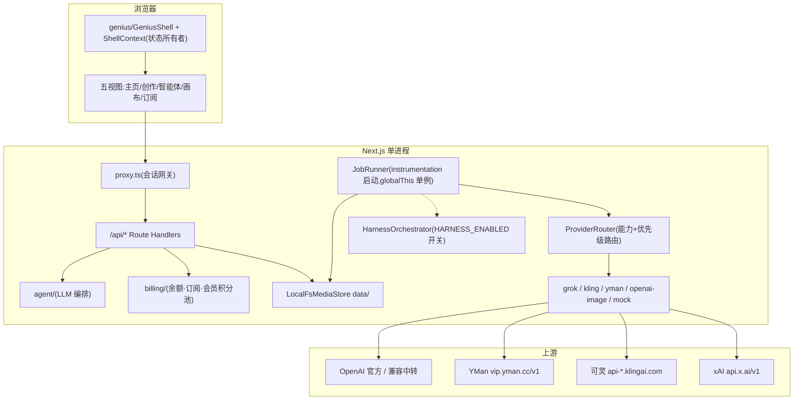

# 流光(Lumen)设计书 — rev 4(as-built)

| 字段 | 值 |
| --- | --- |
| 日期 | 2026-08-30 |
| 基线 | 仓库当前实现;本文以代码为准,取代 `docs/architecture.md`(rev 3,保留为 Phase 0 历史设计与决策依据) |
| 配套 | 计划书 `docs/plan.md`;审查报告 `docs/review-2026-08-29.md` |
| 环境 | Windows / PowerShell,`D:\dev\repos\VideoPlatFrom`,Next.js 16.3.3,pnpm 10.33 |

约定:审查报告 C1–C10 / M1.6 已按本文目标行为落地。标注 **[Phase 2]** 的是 harness 详设；2026-09-05（M2.4）起 orchestrator 已接入 JobRunner，由 `HARNESS_ENABLED` 开关。

---

## 1. 系统总览

单进程 Next.js 16 App Router(`next start`,Node 运行时)。Route Handler、in-process JobRunner、SSE EventEmitter 同属一个 isolate;媒体落本机 `data/`;不支持 serverless 与多实例(接口已为 BullMQ/S3 预留)。



### 上游选择(as-built,`src/lib/env.ts` + `src/lib/providers/router.ts`)

路由**按能力 + 优先级列表**,不按 key 存在性:`pickVideoProvider`/`pickImageProvider` 按 `VIDEO_PROVIDER_ORDER`(默认 `grok`,兼容旧 `VIDEO_PROVIDER=kling` → `kling,grok`,其余值视为只有 `grok`)/`IMAGE_PROVIDER_ORDER`(默认 `openai,grok`)的次序,取第一个「配了 key、未被 `exhaustion.ts` 判定耗尽、`capabilities().modes` 声明支持该模式、(视频)接得下请求画幅 / 分辨率 / 尾帧」的 provider。生产已显式覆盖为 `VIDEO_PROVIDER_ORDER=kling,yman,grok`、`IMAGE_PROVIDER_ORDER=openai,yman`。ORDER 全没选中时的 fallback:配了 XAI key 且未耗尽才试 grok;否则只要配了任何真 key 就 503 `no_provider_available`,完全没 key 才 mock。

| 配置 | 行为 |
| --- | --- |
| `KLING_API_KEY` | 可灵直连视频 key;`KLING_BASE_URL` 默认 `api-beijing`(国际版须 `api-singapore`),见 §2c |
| `YMAN_API_KEY` | 中转渠道 YMan,视频/生图共用一把 key,`YMAN_BASE_URL` 默认 `vip.yman.cc/v1`,见 §2e |
| `OPENAI_API_KEY` | 文生图 OpenAI 兼容通道(官方或中转如 ccgoai),`OPENAI_BASE_URL` 默认 `api.openai.com/v1`,见 §2b |
| `XAI_API_KEY` | grok provider 的官方 key,base 默认 `https://api.x.ai/v1` |
| 仅 `SUB2API_API_KEY` | grok 走 Sub2API 反代,base 默认 `http://127.0.0.1:8080/v1` |
| `XAI_BASE_URL` | 覆盖 grok base(自动补 `/v1`) |
| 都没有 / `LUMEN_FORCE_MOCK=1` | MockProvider |

grok provider(`src/lib/providers/grok/`)走 xAI REST(`/videos/generations|edits|extensions`、`/videos/{id}`、`/images/generations`),Sub2API 与官方字段兼容。**禁止** `openai.videos.*`(Sora 协议,非 xAI)。

## 2. 模式矩阵(as-built,含文生图)

按模式列「当前声明支持的 provider」(抄自各 provider `capabilities().modes`,路由见 §1「上游选择」):

| 模式 | 声明支持的 provider | 备注 |
| --- | --- | --- |
| `text_to_image` | openai(`openai-image`)、yman(生图委托 openai-image 工厂)、grok | 分辨率 `1k|2k`;openai 通道可 202 异步轮询(§2b) |
| `text_to_video` | kling、yman、grok | kling 时长枚举只有 5/10、向上归一写回;yman 按模型档向上取档 |
| `image_to_video` | kling、yman、grok | 首帧必填;首尾帧锁(`last_frame`)只有 kling 声明 |
| `reference_to_video` | yman、grok | yman 参考图上限 ≤9、grok ≤7(各自 `validate` 收紧);kling 不声明 |
| `edit_video` | 仅 grok | 目前唯一声明方;ORDER 内没有可用 provider 时提交返 503 `no_provider_available`,生产当前没有供应商承接 |
| `extend_video` | 仅 grok | 同上(依赖 xAI Files API) |

- 30/45/60:`HARNESS_ENABLED` 未开启时 400「长视频将由一致性管线提供,尚未开放」;开启后仅 t2v / i2v 可提交,任务走 §7 管线——shot 路由是通用 `t2v/i2v/r2v`,按 `image_to_video` + `requireModes:["text_to_video"]` 走 `VIDEO_PROVIDER_ORDER`(可灵 / YMan 都能承接);生产 `HARNESS_ENABLED=false`,开放前提是真实上游验收一条 30s 成片(见 `docs/handoff.md` §5)。
- 尾帧(`last`)只存 `inputs/last.jpg`,只有声明 `supportsLastFrameLock` 的 provider(当前仅 kling)会把它发进请求体;grok 的 `validate` 直接拒绝带尾帧的请求,`toProviderReq` 对不支持的 provider 不填该字段(golden test 按 provider 分开断言)。

### grok provider(xAI,`src/lib/providers/grok/`)

grok 自己一家的字段约束(服务端 Zod + `grok.validate` 双重拒绝):

| 模式 | 模型 | 端点 | 关键约束 |
| --- | --- | --- | --- |
| `text_to_image` | `grok-imagine-image-2.0` | `POST /images/generations` | prompt 必填;分辨率 `1k|2k`;同步返回(无 request_id 轮询),直接进 `persisting` |
| `text_to_video` | `grok-imagine-video-1.5` | `POST /videos/generations` | prompt 必填;duration 1–15(默认 8);7 种画幅;480/720/1080p |
| `image_to_video` | 1.5 | 同上 + `image` | 首帧必填;prompt 可空(空则省略键);`image` 与 `reference_images` 互斥 |
| `reference_to_video` | 1.5 | 同上 + `reference_images/audios` | ≥1 图或音色;图 ≤7、音色 ≤3;最高 720p |
| `edit_video` | `grok-imagine-video`(1.0) | `POST /videos/edits` | 源视频必填,≤8.7s(create 时按 sidecar 校验);禁 duration/aspect/resolution |
| `extend_video` | 1.0 | `POST /videos/extensions` | 源视频 2–15s;`duration`=延长段 2–10(默认 6);禁 aspect/resolution |

- 所有 live 请求附 `storage_options: { filename: "{jobId}.{jpg|mp4}" }` 作 Files 备份;poll/响应解析 `file_output.file_id`。
- 图片/参考图经 sharp 压缩(≤256KB、最长边 1280)后以 data URI 发送;源视频 submit 时 `POST /v1/files` 得 `file_id`。Files 失败即 fail job,禁止源视频 data URI 兜底。

grok 侧定价(`src/lib/cost.ts`,平坦价):1.5 = $0.08/s,1.0 = $0.05/s,图 $0.02/张;实际以 `usage.cost_in_usd_ticks / 1e10` 为准,两者都进 DTO。

## 2b. 生图 provider 路由(2026-09-06,as-built)

`text_to_image` 由 `pickImageProvider`(`src/lib/providers/router.ts`)按 `IMAGE_PROVIDER_ORDER`(默认 `openai,grok`,即加 YMan 之前那条阶梯;生产已覆盖为 `openai,yman`)的次序,取第一个「有 key、未耗尽、`capabilities().modes` 声明 `text_to_image`」的 provider;ORDER 全没选中走 §1 的同一条 fallback(有 XAI key 才试 grok,否则有真 key 503、完全没 key 才 mock)。视频路径不受影响。openai 通道(`src/lib/providers/openai-image/`)官方 `gpt-image-1` 或兼容中转(生产 ccgoai `gpt-image-2`);yman 通道把生图委托给同一工厂(默认 `gpt-image-2`)。

`isMockMode()`(`src/lib/env.ts`)的口径是「xAI / OpenAI / 可灵 / YMan 四把 key 都没有才算 mock」——只配生图 key 的实例整体脱离 mock 模式(视频路径仍各自按自己的 ORDER 走)。

### 上游三种响应

`POST /images/generations` 由 `client.ts` 按状态码 + Content-Type 分流:

| 响应 | 含义 |
| --- | --- |
| 200 + JSON | `{data:[{b64_json}], usage}`,官方 OpenAI 只走这条 |
| 200 + `image/*` | 部分兼容中转直接回二进制 |
| 202 + JSON | 任务未完成,回任务句柄 `{id, poll_after_ms, status:"running"}` |

202 由 `task-poll.ts` 处理:按响应里的 `poll_after_ms`(下限 1s)轮询 `GET /v1/images/tasks/{id}`,`status==="succeeded"` 后 `GET /v1/images/tasks/{id}/result` 取二进制;总时长上限 `OPENAI_IMAGE_TASK_TIMEOUT_MS`(默认 600000ms/10 分钟,上限 60 分钟)。实测 ccgoai high 档 2K 一张需 100–110 秒,202 是主路径而非边缘情况。**计费语义**:上游任务状态 `charged:false`/`charge_status:"pending_delivery"` 直到取回 result 才结算——轮询免费可重复,但重发生成 POST 会新建任务并重复付费,因此生成 POST 请求固定 `maxAttempts:1`,超时即失败、不自动重试。

### 画幅 / 画质 / 计价

- `OPENAI_IMAGE_FLEXIBLE_SIZES=1`(仅接受任意尺寸的兼容中转,如 ccgoai)时 7 个画幅 × 1k/2k 全部原生出图、零裁切(尺寸均为 16 的倍数);未开启时走官方三档尺寸 + `crop.ts`(sharp)居中裁切。官方 `gpt-image-1` 不接受任意尺寸,不要对官方开启此项。
- `OPENAI_IMAGE_QUALITY`(low/medium/high/auto,默认 `high`)必须显式带进请求——漏传被上游按 medium 计费。
- `OPENAI_IMAGE_PRICE_TABLE`(JSON,quality × {1K,2K,4K},`src/lib/cost.ts` 的 `openaiImagePriceTable`/`estimateCostUsd`)配置后按档计价,忽略 token;⚠️ 单位随上游而定——ccgoai 的 `pricing_currency` 是 `CNY`,配表后 `costUsdEstimate`/`costUsdActual` 实际是人民币额度,未做汇率换算。未配表回落 `output_tokens × $40/M`。

### 参考图（图生图，`/images/edits`）

- `supportsImageReference`（`capabilities()` 可选字段,省略=false）表示该生图 provider 的 `text_to_image` 请求接受 `referenceImages`、会改走图生图接口。openai 通道由 `OPENAI_IMAGE_EDITS_ENABLED=1` 打开,yman 生图通道由 `YMAN_IMAGE_EDITS_ENABLED=1` 打开,默认都关——**ccgoai / YMan 是否透传 `POST /images/edits` 未验证**,开前先探针。开关关着时带参考图的请求在 `validate` 被 400 `invalid_argument` 拒绝。
- 开启后,`text_to_image` 且 `referenceImages` 非空 → `POST {base}/images/edits`,手写 multipart(`client.ts`),字段 `model`/`prompt`/`size`/`quality` + 每张参考图一个 `image[]` part(path/data_uri/url 都会转成带文件名的 Blob);其余与 generations 完全同一套:202 轮询、价目、`maxAttempts:1`、`shouldAbort`。harness 的三视图角色表与档A每镜首帧依赖这个能力(§7「能力分层」档A)。
- 已知限制:`mediaRefToBlob` 的 `url` 分支直接 `fetch(ref.url)`,不走 `download-headers` 的 Bearer 分发——Harness 只用本地 path 参考图,url 分支暂不鉴权。

## 2c. 视频 provider 路由(可灵,2026-09-06,as-built)

方案 `docs/plan-kling-video.md`。可灵 provider(`klingProvider`,`src/lib/providers/kling/`)只声明 `text_to_video`/`image_to_video` 两种模式,是否被选中由 `VIDEO_PROVIDER_ORDER` 的次序决定——它要在次序表里、配了 `KLING_API_KEY`、未被判定耗尽才会被 `pickVideoProvider` 选中。其余模式由「声明支持它们的 provider」承接:`reference_to_video` 当前由 yman / grok 声明,`edit_video`/`extend_video` 只有 grok 声明(ORDER 内没有可用 provider 承接时提交返 503 `no_provider_available`),30/45/60 长片走 harness 管线(按 i2v+t2v 能力走 `VIDEO_PROVIDER_ORDER`,可灵 / YMan 都能接,生产 `HARNESS_ENABLED=false` 关闭中)。已作为 `bcad123` 提交并于 2026-09-06 部署到生产(`api-singapore` 域名),详见 `docs/handoff.md` §0c。

### 请求 / 查询形状

- 鉴权:`Authorization: Bearer <KLING_API_KEY>`,域名 `KLING_BASE_URL`(默认 `https://api-beijing.klingai.com`,国际版账号须换成 `https://api-singapore.klingai.com`,否则鉴权报 `1002`),路径**不带** `/v1`。
- 创建:`POST /text-to-video/<model>` 或 `/image-to-video/<model>`(`rest-map.ts` 的 `mapToKlingRequest`);首帧走 `contents[].first_frame.url`(data URI 直接发,与 grok 一致),`last_frame` 永不填。创建请求固定 `maxAttempts:1`——任务一旦 `submitted` 就占并发并计费,重发 POST 是第二条任务。
- 查询:`GET /tasks?task_ids=<id>`,`mapTask` 把 `submitted/processing/succeeded/failed` 映射到内部 pending/done/failed,`succeeded` 时取 `outputs[0].url` 交给 runner 现有的 `persistRemote` 落盘(URL 公网可下,不带 xAI 的下载头)。
- 错误:`code !== 0` 转 `ProviderHttpError`;`1301` 归 `moderation`(复用 runner「未通过安全审核」路径);`1302`/`1303`(限速/并发超包)与 `5000–5002` 归 retryable,走 runner 既有指数退避。

### 时长归一(5/10)与画幅/分辨率/音频

- 可灵 `duration` 接口枚举**只有 5 与 10**(官方能力地图写 3–10s 是营销口径)。`create.ts` 在 provider 真选中 kling 时,把任意 `durationSec` 归一为 `≤5→5`、`>5→10` 并**写回 `job.durationSec`**——4 秒请求被上游按 5 秒计费,账目与详情卡必须如实;`retryJob` 同步重新归一与重新估价。首页时长芯片同源判据(`videoProvider==="kling"`)换成 `[5,10]`。
- 分辨率 **2026-09-06 夜阶段 A 起尊重用户选择**:`resolveKlingSettings` 取请求的 `resolution`(480p 向上归一 720p),`KLING_VIDEO_RESOLUTION` 降级为「用户未选、产品也没规定默认档」时才生效的兜底,并写回 `job.resolution`。`generateAudio`(2026-09-06 阶段一起尊重用户选择):`resolveKlingSettings` 只在「实例允许有声(`KLING_VIDEO_AUDIO=native`)且用户没有选无声(`req.generateAudio !== false`)」时才出声,设为 `native` 才把分辨率抬到 1080p(上游硬约束:有声只支持 1080p);用户选无声时分辨率回到该产品/实例默认档,不再被强抬多收 1080p 的钱。实例不允许有声时,UI 的「有声」芯片显示「暂不可用」,「高清有声」产品也不会出现在 `/api/models` 里(见 §2d、§2f 与 `docs/handoff.md` §0.一)。
- 画幅:t2v 直传 UI 仅有的 16:9/9:16/1:1(i2v 不发画幅,随首帧)。若绕过 UI 直接调 API 发送其他画幅,是在 provider `submit` 阶段被上游 400 拒绝、任务落 `failed`。
- **首尾帧(阶段 A,as-built)**:`ProviderGenerateRequest.lastImage` 只在 i2v 且产品/provider 声明 `supportsLastFrame` 时才有意义;可灵是当前唯一实现方——`rest-map.ts` 把它映到 `contents[].last_frame.url`(data URI),并强制该次请求分辨率为 1080p(写回 `job.resolution` 与定价)。grok 的「尾帧永不进请求体」约束下放为 provider 专属:`grok.validate` 直接拒绝带尾帧的请求,`toProviderReq` 对不支持尾帧的 provider 不填该字段(golden test 按 provider 分开断言,不再是全局单一断言)。`lastUploadId` 仍只允许 `image_to_video`;mock provider 也声明支持尾帧以保 e2e 覆盖。真实冒烟(2026-09-06 晚):可灵首尾帧 1080p 5 秒成功,上游 2.5 积分,售 ¥3。

### 计价与 billing

- 提交估价:`src/lib/cost.ts` 的 `KLING_UNITS_PER_SEC`(积分/秒表,键为 `${model}:${resolution}:${audio}`,如 `kling-2.6:720p:off`=0.3)乘时长,再经 `klingUnitsToUsd` 按 `KLING_USD_PER_UNIT`(默认 0.10,即 $10=100 积分)换成 USD;表里查不到该模型/规格组合时取该模型最贵档,模型完全不认识时取全表最贵档,宁可高估。`estimateCostUsd` 新增第四参 `video?: { resolution, audio }` 承载这个判据。
- 实付:poll 到 `succeeded` 时,`billing[].charge_type==="unit"` 的 `amount`(积分数)覆盖 `costUsdActual`——可灵是三家 provider 里**唯一**给出真实扣费的,账目最准(grok 是 usage ticks 换算,openai 兼容中转可能是人民币额度且未换汇率)。
- 真实冒烟(2026-09-06):文生视频 4s 请求归一为 5s/720p/无声,`succeeded`,`costUsdActual` 0.15(1.5 积分×0.10);图生视频 5s 同样 0.15。

### 已知限制(非缺陷,记录在案)

不调用可灵取消接口(本地取消后上游仍出片计费,文档未见取消端点);`klingTaskTimeoutMs()` 已导出但暂无调用方读取,轮询上限仍是 runner 自身的 15 分钟;成片 URL 上游 30 天后清理,与本项目 `persisting` 即落盘的时机无冲突。`external_task_id=jobId` 已在 2026-09-06 阶段一接入崩溃恢复(`native.ts` 的 `lookupByExternalId`),见 §3。

## 2e. YMan 中转 provider · 能力路由 · 积分耗尽切换(2026-09-06 晚,as-built)

方案 `docs/plan-architecture-2026-09.md` §3.4「功能先于供应商」。目标:接入第三家上游 YMan,并把路由从「按 key 存在性 + 单点开关」改成「按能力 + 优先级列表」,为后续再加供应商铺路。

### 路由规则

`src/lib/providers/router.ts` 的 `pickVideoProvider`/`pickImageProvider` 按 `VIDEO_PROVIDER_ORDER`(默认 `grok`,兼容旧 `VIDEO_PROVIDER`:`=kling` 视为 `kling,grok`,其余视为只有 `grok`)/`IMAGE_PROVIDER_ORDER`(默认 `openai,grok`,即加 YMan 前那条硬编码阶梯)的次序,取第一个「有 key、未被 `src/lib/providers/exhaustion.ts` 判定耗尽、`capabilities().modes` 声明支持该模式、(视频)`capabilities().aspectRatios`/`resolutions`/尾帧声明接得下请求」的 provider。`edit_video`/`extend_video` 目前只有 grok 声明支持(依赖 xAI Files API):配了 XAI key 时经 fallback 落到 grok,没配则提交返 503 `no_provider_available`,不需要每种模式单独配置。harness 长片(30/45/60)也走这条路由——按 `image_to_video` 挑 provider 并要求同时声明 `text_to_video`(`requireModes`),shot 由 §7 管线逐镜提交(详见 §7)。模式接得住但画幅接不住时抛 400,不再静默把画幅换成另一家的默认值。`capabilities()` 新增 `aspectRatios`(不声明 = 不限)与 `durations`(上游按档计费的枚举,不声明 = 连续,默认 `[4,6,8,10]`)。`isMockMode()` 改为「xAI / OpenAI / 可灵 / YMan 四把 key 都没有才算 mock」。

### YMan provider

`src/lib/providers/yman/`:`client.ts` 走 OpenAI 兼容 REST(`https://vip.yman.cc/v1`,Bearer 鉴权);视频三步 `POST /videos`(创建,固定 `maxAttempts:1`,已计费不重发)→ `GET /videos/{id}`(轮询,`not_ready` 判为 pending)→ `GET /videos/{id}/content`(下载,**带 Bearer**,不是匿名 CDN 直链);`native.ts` 是 `ymanProvider`(`id:"yman"`,支持 t2v/i2v/r2v/t2i),生图委托给 `openai-image` 工厂(同一把 key,`YMAN_IMAGE_CONFIG` 通道配置,默认模型 `gpt-image-2`)。

模型目录 `catalog.ts`:模型 ID 必须用上游 `GET /v1/models` 的**展示名**(如 `minimax-H3 文字`、`minimax-h3-933-图文`),旧内部名(如 `minimax_h3_t2v`)作别名识别;`YMAN_MODEL_CATALOG`(JSON)可逐字段合并追加/覆盖模型的档位与积分价目。默认 t2v 模型 `minimax-H3 文字`(纯文生,不收参考图),i2v 模型 `minimax-h3-933-图文`(收参考图 ≤9 张)。

计价:按积分预扣(¥1 = 100 积分,失败自动退),**不与时长成正比**(如 minimax_h3_* 的 5/10/15 秒是 40/90/140 积分);服务端把请求时长向上取到该模型最近一档并写回 `job.durationSec`,首页时长芯片跟着换档;目录里没有的模型按 `YMAN_UNKNOWN_CREDITS`(默认 150)估价,绝不为 0。新增 `usdCnyRate()`(默认 7.2,`USD_CNY_RATE` 覆盖)把人民币积分换算成美元口径的 `costUsdEstimate`/`costUsdActual`(与 §2d 的人民币 `priceCny` 售价是两套独立口径,售价不受此影响)。**分辨率(阶段 A,as-built)**:`resolveYmanSettings` 同可灵一样改为取请求分辨率(480p 归一 720p)。**参考生视频(阶段 A,as-built)**:`referenceUploadIds` 的 schema 层上限从 grok 硬编码的 7 抬到 9,各 provider 在自己的 `validate` 里再收紧——grok 7、yman 9、可灵不支持该 mode;grok 专属校验从通用校验拆成独立的 `grok.validate`。真实冒烟(2026-09-06 晚):YMan `minimax-h3-933-图文` 两张参考图成功,售 ¥2。

音频:YMan 建任务接口没有音频参数,`audioAvailableFor("yman")` 恒为 `false`——是「不可控」而非「一定无声」,不向用户收有声加价,UI 芯片显示「无声 · 暂不可用」。

下载鉴权:`src/lib/media/download-headers.ts` 的 `downloadHeadersFor(url)` 只在目标 origin 命中「自己配置的某个上游 base」时才带对应那家的 key(xAI CDN 直链不需要、Sub2API 落盘 URL 需要、YMan `/videos/{id}/content` 需要),认不出 origin 就不带任何 key——无条件带 key 会把凭据发给上游返回字符串里的任意地址。

### 积分耗尽自动切换

`src/lib/providers/exhaustion.ts`:provider 返回上游「积分不足」(`quota_exhausted`)时,标记该 provider × 通道(视频/图片分开记,`data/provider-state.json`)耗尽 `PROVIDER_EXHAUSTED_TTL_MS`(默认 6 小时,环境变量覆盖),期间路由跳过它改走下一家;到点自动放回去重试——没有主动的「余额恢复了」信号,靠 TTL 兜底。被拒的提交从未被计费,换家不是重复付费,`priceCny`(用户报价)不变,只有 `costUsdEstimate`(我方成本口径)按新 provider 重算。`/api/health` 新增 `exhausted` 列表(谁被绕开、到什么时候、上游原话)。

### 真实冒烟(2026-09-06 16:50,隔离实例,ORDER=yman)

文生视频(5s,`minimax-H3 文字`)、图生视频(5s,`minimax-h3-933-图文`)、文生图(`gpt-image-2`)各一条,全部 `succeeded`;YMan 账户余额 20 → 15.5。价目:minimax 5s 约 50 积分 ≈ ¥0.50、10s ¥1.00;gpt-image-2 约 4–8 积分。

### 已知限制

- `sd-2.5-30秒` 这个模型名的 30 秒档与 harness 的 30 秒长片档撞车,当前不可达。
- `retryJob` 对图片任务仍沿用旧的估价逻辑,未针对换家场景重新验证。

## 2f. 产品目录与模型选择(2026-09-06 夜,阶段 A,as-built)

方案 `docs/plan-frontend-backend-adaptation.md`(用户决策:模型用产品名不露供应商)。`src/lib/products/catalog.ts` 定义七档内置`Product`(视频 快速/标准/高清有声/Grok,图片 快速/标准/Grok),每档绑定一个 provider + 上游模型名(可选,缺省回落各 provider 自己的 env 模型)、能力(modes/resolutions/aspectRatios/durations/audio/supportsLastFrame/maxReferenceImages)与描述;`LUMEN_PRODUCTS`(JSON 数组,见 `.env.example`)按 id 覆盖或追加,坏 JSON/缺字段回落内置表并记 warn。

`availableProducts()` 只列这一刻真能下单的产品:provider 有 key(`hasProviderKey`)、该通道(视频/图片分开)未被 `exhaustion.ts` 判定耗尽、可灵有声档还要求实例确实 `KLING_VIDEO_AUDIO=native`;mock 实例(无任何真 key)返回全部产品。`GET /api/models`(需登录)返回这份列表的白名单字段 + `samplePriceCny`(视频按 5 秒+产品默认分辨率+其音轨档估、图片按 1K 估),**不含** `provider`/上游 `model` 字段——浏览器不该也不需要知道供应商。

`POST /api/jobs` 的 `model` 字段(`createJobBodySchema`,可选,≤64 字符)传的是产品 id。指定时 `productForProvider`/`defaultProductFor` 解出 provider 与上游模型名,并按该产品的能力做 400 校验(mode 不支持 / 画幅不在列 / 分辨率向上归一后仍不支持 / 时长超上限 / 首尾帧不支持 / 参考图超 `maxReferenceImages`);未指定时沿用 §2b/§2c/§2e 的 ORDER + 能力路由,选中 provider 后反查第一个匹配该 mode 的产品打标签。`JobRecord`/`JobPublic` 新增 `product`(id)/`productName`,前端与详情卡只显示 `productName`。

## 2g. 分享(2026-09-06 深夜,as-built)

方案 `docs/plan-architecture-2026-09.md` §4 阶段二。`POST /api/jobs/:id/share` 为一条自己的任务签发分享令牌,`src/lib/share/token.ts` 用 HMAC 派生出**独立于会话 Cookie**的签名密钥——分享令牌与登录会话是两套互不信任的域,任何时候都不应该复用同一把密钥或校验函数。令牌有效期 `SHARE_TTL_HOURS`(默认 24 小时,`shareTtlHours()` 下限 1、上限 24×365),到期即失效;**没有主动吊销机制**,也没有「签发过哪些令牌」的账本,收回的唯一手段是等到期。

公开页面 `src/app/s/[token]` 与接口 `GET /api/share/:token`(+`/media`)**不校验会话**,任何持有链接的人都能看;`/media` 响应 `Cache-Control: public, max-age=3600`(与 §9 讲的「谁能读会变」的私有媒体路由刻意不同——分享链接本身就是公开凭证,长缓存不构成越权)。

## 2d. 余额与计费(2026-09-06 阶段一,as-built)

方案 `docs/plan-architecture-2026-09.md` §3.2、§5(用户 2026-09-06 决策)。定价 × 余额取代日配额成为主闸门:每种任务对用户的**售价**是服务端定值(人民币,与 provider 无关),用户有余额,准入判「余额 − 在途预留 ≥ 本次售价」。`FREE_DAILY_IMAGE_QUOTA`/`FREE_DAILY_FAILURE_LIMIT`(§12.3)降级为防滥用兜底,默认值从 10 抬到 200。

**售价表** `src/lib/billing/prices.ts`(可被浏览器 import,不碰 `node:*`):

```
{ video: { "5": 2, "10": 4, hd: 1.5, audio: 1 }, extend: 3, edit: 4, image: { "1k": 0.5, "2k": 1 } }
```

`priceCny(input)` 按 mode 取值:视频 ≤5s/更长两档基价,1080p 乘 `hd`,有声再加 `audio`;30/45/60 秒 harness 长片按 5 秒段数 × `"5"` 计(30s=12 元);`extend_video`/`edit_video` 是定值;`text_to_image` 按 `imageResolution` 取 `1k`/`2k` 档。`LUMEN_PRICE_TABLE`(JSON,可只写要改的几项)覆盖默认表,坏 JSON 记一条 warn 并回落默认,不挡提交。`createJob`/`retryJob` 按**归一后**的参数(可灵把 4 秒请求归一为 5 秒那一档)算 `priceCny` 并写入 `job.priceCny`,提交后永不改写——它同时是在途预留额和成功后扣款额。

**准入**(`src/lib/billing/admission.ts`):`loadBalanceUsage(userId)` 现算 `balanceCny`(`user.json`)与 `reservedCny`(该用户所有非终态任务 `priceCny` 之和,从 job.json 现算不落盘),`availableCny = balance − reserved`。`assertBalance(userId, priceCny)` 在 `availableCny < priceCny` 时抛 `ProviderHttpError(402, "insufficient_balance")`。判定必须在 `withAdmissionLock` 临界区内、`writeJob` 之前完成(与配额同一把锁),`createJob`/`retryJob` 共用同一个判官。判定前先跑 `settleSubscription`(R05,经动态 import 避开 subscription→admission 静态环):用户跨过 30 天期而没碰过任何读接口时,上一期的会员积分必须先清零、本期积分与当日赠送先入账,再谈「够不够」——否则过期积分会混进 `availableCny` 放行一条本该拒的购买。锁序不变:settle 内部取 user 锁,外层恒为 admission → user。

**结算**(`src/lib/jobs/store.ts` 的 `updateJob`):在同一次写盘里,「非终态 → succeeded」且 `priceCny > 0` 且未结算(`billing.chargedAt` 为空)时,**先扣款、扣成功才盖 `chargedAt`**,再落盘。顺序保证任一时刻要么任务仍非终态(预留占着钱),要么余额已经减了,不留「预留已消失、余额还没减」的窗口。若扣款抛错,任务仍照常落终态(不能卡成「明明出片却显示进行中」),只是不盖 `chargedAt`;后续任意一次 `updateJob` 命中「succeeded 且无 chargedAt」会自动补扣。失败 / 取消 / 过期不扣钱,预留随终态消失。

**幂等与流水**(`src/lib/billing/ledger.ts` + `protocol.mjs` + `file-ledger.mjs`,工作区版本):`user.json` 是资金事实的唯一提交点——`balanceCny`/`memberCreditsCny` 与产生它们的流水(`billing.operations`,逐条带 seq/operationId/输入/前后余额的自校验链)在 `withUserLock` 内的**同一次原子写**落盘,「余额变了、流水没记上」的窗口因此不存在(修 R01)。`data/ledger/<userId>.jsonl` 降级为**派生导出物**,每次提交后整体重建(原子 rename);它与快照不一致(多出快照没有的行、或内容不是快照行集的前缀)时读取与提交都抛 `billing_export_corrupt` 失败关闭,文件缺失时自动重建。幂等判据不变(charge 的 `jobId`、grant 的 `giftCode`、通用 `kind+ref`),但重放必须**同键同输入**——同键撞不同输入抛 409 `billing_idempotency_conflict`,不再静默跳过。`hasChargeFor`/`hasEntryFor`/`hasGiftGrantFor` 对已迁移账号读快照,未迁移账号退回扫 jsonl(严格解析,坏行抛错而非跳过——判定路径不能漏行)。退款经 `options.refundOf` 指向原扣款 ref:内核读原行的 `memberCny` 把退款拆回会员池与已购池(R02——会员池出的钱退回已购池等于把会过期的积分换成永久余额),原扣款不存在即失败关闭,拒绝显式分池与负 delta 混用。`readUser`/`writeUser` 对带 `billing` 的记录做快照校验与链式转移校验(历史不可改写、一次最多追加一条 op、余额必须与链末端一致)。

**迁移**:存量账号 `user.json` 没有 `billing` 字段——读旧流水正常,但一切余额变动报 409 `billing_migration_required`(失败关闭,不会自动迁移)。迁移须停服后跑 `scripts/migrate-billing.mjs --offline --baseline <基线.json>`:基线由人工核对生成,含 `userId`、迁移前 `user.json` 与 `ledger/<id>.jsonl` 的 sha256、`reviewedBy`/`evidence`(谁在什么证据下核对过)、`opening` 期初余额与每条历史入账行属于哪个池(`grantPools`);校验通过才把旧流水原文封存进 `billing.legacyLedger` 并记账进入新格式。新格式不自动回滚到不兼容旧版本。

**充值** `scripts/grant-balance.mjs <邮箱> <金额> --offline [--ref "固定幂等键"] [--note "..."]`:管理员 CLI,走与服务端同一个 `commitChange`(校验快照 → 追加 op → 原子写 user.json → 重建导出),金额可为负(纠正)。`--offline` 是显式声明「服务已停、CLI 串行执行」——仍是纪律而非跨进程锁;`--ref` 给这笔操作一个固定幂等键,结果不明时可安全重跑,缺省时打印警告并每次新增一笔。`reset-password.mjs`/`disable-user.mjs` 同样要求 `--offline`。

**API 面**:`GET /api/me` 新增 `balance:{balanceCny,reservedCny,availableCny}` 与 `prices`(整张售价表,供前端本地算「本次约 ¥x」而不必二次请求)。`POST /api/jobs`/`retry` 余额不足返回 `402 insufficient_balance`。

**UI**:顶栏账号名旁显示「余额 ¥x」(≤520px 与账号名一起隐藏);提交面板显示「本次约 ¥x · 余额 ¥y」,当前配置超出可用余额时提示「当前配置,余额可能不够,请充值」并禁用发送;卡片(作品环 / 最近成片 / 工作室详情)显示售价(元)与「有声/无声」标签而不是美元成本(`costUsdActual` 只留管理员对账用)。视频 provider 是否真的支持音轨由 `/api/health` 与 `page.tsx` 下发的 `audioAvailable` 判定(可灵读 `KLING_VIDEO_AUDIO`,grok/mock 恒真);实例不支持时「有声」芯片锁死在无声并标「暂不可用」,不隐藏入口。

## 2h. 智能体(2026-09-07 凌晨,as-built)

方案 `docs/plan-agent-i18n-subscription-2026-09.md`。用户在智能体首页输入想法,进入会话;每一轮智能体用 LLM 回复并**给出报价提案**,用户批准后才真的创建生成任务(文生图 / 文生视频 / 图生视频,走与 `POST /api/jobs` 相同的服务层)。2026-09-11 起为「默认批准制」。

- LLM 客户端 `src/lib/agent/llm.ts`:OpenAI 兼容 `chat.completions`,提供方顺序 mock(`isMockMode()`)→ `AGENT_API_KEY`+`AGENT_BASE_URL`(默认 `api.openai.com/v1`,模型 `AGENT_CHAT_MODEL` 默认 `gpt-4o-mini`)→ `XAI_API_KEY`(`grok-4.6`)→ 都没有则 503 `agent_unavailable`,**绝不静默落 mock**。生产已配的 ccgoai / YMan 两家中转实测没有对话模型,须单独配 `AGENT_API_KEY` 才能真用。`runTurn` 接收 `locale`(路由经 `localeFromRequest` 解析 `lumen_locale` Cookie / `Accept-Language`),reply 语言随 locale。**LLM 调用本身失败**(`runTurn` 内 502)与**实例没配对话 provider**(503)是两个不同错误码:前者 `agent_upstream_failed`(本轮费用已随 `ref:"agent:<turnId>:refund"` 退回)、后者仍是 `agent_unavailable`;`common.err.agent_upstream_failed` 已入 i18n 字典,前端经 `errorText(t, e)` 翻译。
- 技能 `src/lib/agent/skills.ts`:20 个真实技能定义(id、中英文名与描述、system prompt 片段);可声明 `kinds:["image"]/["video"]` 限定产物类型,越界 action 被丢弃。
- 会话存储 `src/lib/agent/store.ts`:`data/agent/<userId>/<sessionId>.json`,`ownerId` 校验非本人 404,单用户上限 200 条,列表按 `updatedAt` 倒序;`updateSession` 提供锁内读-改-写。
- Turn 实体(`session.turns[]`,与消息同一文件原子写):状态机 `thinking → awaiting_approval → executing → succeeded/failed/rejected`;字段含 `requestHash`(请求体规范化 sha256)、`priceCny`、`chargeRef`(`agent:<turnId>`)、`refundRef`、`proposal`、`jobIds`。同 turnId 重放语义:同参交回现状、异参 409 `idempotency_conflict`、`thinking` 续跑补完、超 2 分钟的 thinking 在详情/单轮读取时惰性退款置 `failed`(`ref:"agent:<turnId>:refund"`,经 `refundOf` 按原扣款 `memberCny` 拆回原池——R02)。
- 一轮定价 `src/lib/agent/run-turn.ts`:先判可用 → 扣一轮费 ¥0.05(`priceTable().agent.turn`)→ LLM 输出 JSON(`{ reply, actions[] }`,每轮最多 2 个)→ 有 action 时落 `proposal`(每条带 `priceCny` 报价快照、`totalCny`、`expiresAt` 30 分钟),助手消息带 `approval:"pending"`,turn 停 `awaiting_approval`,**不建任务**。批准(`POST .../turns/:turnId/approve`)才逐条经 `POST /api/jobs` 同一个限流桶走 `createJob`(幂等 key `agent:<turnId>:<i>`,任务 `priceCny` 按提案快照),turn → `executing` → `succeeded`;批准幂等(succeeded 重放交回现状)、过期 409 `proposal_expired`、`rejected` 终态不可再批。拒绝(`POST .../reject`)落 `rejected` 不建任务、不退轮次费(对话已交付)。action 可带 `imageRef.uploadId`(`up_*` sidecar,owner 校验),video + imageRef 即图生视频。
- 会话预算:`session.budget {limitCny, spentCny}`(PATCH `budgetCny` 正数设定 / `null` 解除,spent 保留);轮次费前与批准时各核一次,超额 402 `budget_exhausted`;批准时把提案总额计入 spent。
- API:`GET/POST /api/agent/sessions`、`GET/PATCH/DELETE /api/agent/sessions/:id`(PATCH 收 `title`/`budgetCny`)、`POST /api/agent/sessions/:id/messages`(20 次/分钟/用户)、`GET /api/agent/sessions/:id/turns/:turnId`、`POST .../turns/:turnId/approve|reject`、`GET /api/agent/skills`(下发 `kinds`)。
- 前端 `src/components/genius/agent/**` 全接真数据:待批提案渲染报价卡(每条 ⚡价 + 合计 + 批准/拒绝),批准后照常轮询任务;预算芯片可设/解除;不可用时置灰「智能体暂未开放」。

## 2i. 订阅与会员积分池(2026-09-07 凌晨,as-built)

方案 `docs/plan-agent-i18n-subscription-2026-09.md`。用户原话:订阅价格 = 上游成本 × 加成(毛利率 15%)。

**定价** `src/lib/billing/plans.ts`:四档 1200/6000/15000/25000 积分每 30 天,每档每日另赠 60 积分。`costRatio = max(默认视频产品 5 秒档成本÷售价, 默认图片产品 1K 成本÷售价)`;「默认产品」= 产品目录中、provider 排在 `VIDEO_PROVIDER_ORDER`/`IMAGE_PROVIDER_ORDER` 首位的那个(与路由第一落点一致,不随 provider 耗尽抖动)。月费 `= ceil1( 积分/100 × costRatio ÷ (1 − 0.15) )`(向上取到 0.1 元,`GROSS_MARGIN=0.15`);年费 `= 12 × 月费`,360 天不打折。生产配置下 `costRatio≈0.54` 对应标准 ¥19.1 / 专业 ¥49.6 / 尊享 ¥106.8 / 至尊 ¥170.3 月费。

**会员积分池**(`user.json.memberCreditsCny`,与已购余额 `balanceCny` 独立):

- **硬约束**:订阅只能用**已购池**购买(`purchaseSubscription` 只看 `balanceCny`),否则「低于面值的钱买到面值积分」形成无限套利;订阅送的积分进独立会员池,到期或跨期清零。
- 扣款(`src/lib/billing/ledger.ts`)顺序固定:先扣会员池,不足部分再扣已购池,流水行记 `memberCny` 字段;`admission.ts` 新增 `effectiveMemberCny` 供准入判定读取「有效(未过期)会员积分」。
- 锁序恒为 admission → user,不得颠倒。
- `purchaseSubscription`(外层 `withAdmissionLock`、内层 `withUserLock`):必填 `idempotencyKey`(订阅 id 由 key 推导);扣款 `ref:"sub:<key>"`,扣款行落内部订单快照 `order:{planId,cycle,priceCny,orderedAt}`(R04);可购额 `= balanceCny − max(0, reserved − 有效会员积分)`,不足报 402 `insufficient_balance` 并带 `purchasableCny`;已有有效订阅报 409 `subscription_active`。恢复路径(R04):扣款行在而订阅记录缺失时按订单快照补建——不再跑一次余额判定(钱已扣过),订阅有效期从 `orderedAt` 起算而非补建时刻;同 key 撞不同 plan/cycle 抛 409 `idempotency_key_reused`;旧扣款行无 `order` 时回落按行内时间戳与现存订阅信息补建;原订阅已完整过期时旧 key 也不能换新单(发放行在账上)。同一 key 同参重放返回 200。
- `settleSubscription`(惰性结算,`GET /api/me`/`GET /api/subscription` 与 `assertBalance` 准入判定前调用):到期清零、跨 30 天期重置为本期积分、按 Asia/Shanghai 自然日无条件补发当日积分;无变更时走无锁快路径。
- API:`GET/POST /api/subscription`(不下发 `costRatio` 等成本口径);`GET /api/me` 的 `balance` 含 `memberCreditsCny`。
- `scripts/usage.mjs` 对账把 `sub:*`(订阅扣款/发放)与 `agent:*`(智能体扣款/退款)分列展示。
- 无支付网关,已购余额只能靠礼品码(§12.6 之前的机制)或管理员 `scripts/grant-balance.mjs` 充值。

## 2j. 画布(2026-09-11,as-built)

`/canvas` 从纯本地原型升级为持久化画布(`src/lib/canvas/`)。

- **存储** `store.ts`:`data/canvases/<userId>/<canvasId>.json`,一文件一画布;`ownerId` 校验非本人 404,`updatedAt` 倒序列表;全部写路径原子(tmp+rename)+ 单画布锁内读-改-写。
- **文档**:四类节点 `text`(内容便签)/ `material`(一份 `uploadId`)/ `gen_image` / `gen_video`,加上 `edges {from,to}`;整篇 `revision` 是乐观并发戳——`PATCH /api/canvases/:id` 必带 `expectedRevision`,对不上 409 `revision_conflict`,冲突方保留本地副本并弹层二选一(2026-09-13,见下「前端」),双标签页不互相静默覆盖。
- **运行** `run.ts`:`POST /api/canvases/:id/nodes/:nodeId/run` 把 `gen_*` 节点变成一次真实 `createJob`——同一套准入、计价、预留与限流,不另起炉灶。提示词 = 连入 text 节点内容(按画布顺序)+ 节点自身 prompt;`gen_video` 有图片输入(material 的 `uploadId`,或上游 `gen_image` 节点已成功的 `outputs/image.jpg` 复制成的 `start` 上传——与 `/api/uploads/from-job` 同链路)即 `image_to_video`,否则 `text_to_video`;`gen_image` 恒 `text_to_image`。幂等键 `canvas:<canvasId>:<nodeId>:<runSeq>`,runSeq 在任务写回后才自增——「建了任务没写回」之间崩溃,重试按同 seq 命中映射;节点已有未终态任务时直接交回,重复点击不重建。
- **API**:`GET/POST /api/canvases`、`GET/PATCH/DELETE /api/canvases/:id`、`POST /api/canvases/:id/nodes/:nodeId/run`;另有 `GET /api/uploads/:id` 读本人上传素材(owner 校验 + `private, no-cache`,素材节点刷新重显用)。
- **前端** `CanvasView.tsx`:右键菜单加四类节点、拖拽定位、文本/提示词防抖 600ms 落盘、素材上传走 `POST /api/uploads`、生成节点轮询 `jobId` 恢复产物;PATCH 409 `revision_conflict` 时保留本地 doc 不动、弹 `.canvas-conflict` 弹层列「本地(未保存)/ 服务端」两份摘要(节点/连线数 + 服务端 `updatedAt`)让用户二选一——「保留本地并覆盖服务端」按 `conflict.server.revision` 重发 PATCH(再 409 就刷新服务端栏继续),「采用服务端」丢弃本地;严格模态——只能点这两个按钮关,Esc / 点外层无动作(避免误触替用户选边)。冲突未决期间 `persist` 不再发 PATCH。
- **整图运行(D 包,2026-09-12,`dag.ts` + `run-store.ts` + `graph.ts`)**:「运行整图」= 一次报价、一次确认、按依赖跑完全部生成节点。
  - `CanvasRun` 落 `data/canvas-runs/<userId>/<runId>.json`:冻结 `graphSnapshot` + `documentRevision` + 逐节点报价快照(`quote.items[].priceCny` + `basisHash` + `inputHash`)+ `nodeExecutions`(waiting_dependencies/ready/awaiting_approval/running/succeeded/failed/blocked,各带 `jobId`/`errorCode`/`reused`/`approval`/`awaitingSince`/`queueWaitSince`)。**run 执行不回写画布文档**——后台写会与用户编辑抢 revision;产物由前端拿最新 run 的执行位 overlay,没有 run 时回退 `node.jobId`。
  - 报价不落盘:`POST /api/canvases/:id/quotes`(可收 `{regenerate?: nodeId[]}`)对(文档 revision + 归一参数 + 价目表 + 复用判定)确定性重算出逐节点明细 + `quote.hash`;`POST /api/canvas-runs` 带 `quoteHash` 重算比对,图/价/复用位变了 409 `quote_stale`。
  - 静态校验(`validateGraph`):环、容量(节点 ≤50/边 ≤100)、生成节点提示词来源(自身或连入 text)、material 归属(`readUploadSidecar` 只查不消耗);任一不过不产生任何付费提交。
  - sweep 执行器:周期泵(3s)+ 创建/取消即踢,重启后按非终态 run 目录扫描续跑,泵无状态、run 文件是事实源。每轮:从 `job.json` 刷新在途节点 → 依赖失败/被拦传播 `blocked` → 依赖全成功的节点经 `createJob` 提交(同一套准入/计价/预留/幂等,子任务键 `run:<runId>:<nodeId>:<attempt>`)。`queue_full` 退避 15s 再试并记 `queueWaitSince`(首次撞满时刻),累计排队超 1h(`QUEUE_WAIT_TIMEOUT_MS`)收敛 `blocked`/`queue_timeout` 并清 `nextAttemptAt`;其余准入拒绝节点 `failed`。run 终态:`succeeded`/`partially_failed`/`failed`/`canceled`。
  - **run 级预算预留(切片二)**:确认报价即把 `quote.totalCny` 按 `reserveJobFunds` 同款分池冻结成 `run.reservation`(含 `remaining*`/`transfers` 台账),「建 run 成功 = 全程钱够」。子任务的钱不再现押:`createJob` 增 `opts.reserveFunds` 回调,在 admission 锁内调 `carveRunShare` 把该节点份额从 run 余量转移给子 Job(`transfers[nodeId]` 幂等,崩溃重试复用份额换 jobId)。会计恰好计一次:未转移在 remaining,transfer 已写而 job 缺失由 transfer 兜底计占用,job 落盘后由 `job.reservation` 计;run 终态余量与孤儿份额自动停计(释放不写盘)。`loadBalanceUsage` 与 `heldMemberEarmarksCny` 共用 `runHeldFunds`(严格读:run 文件损坏 → `billing_state_corrupt` 失败关闭);旧版无 `reservation` 的 run 子任务回落普通 `reserveJobFunds`,准入闸门不因路径被绕过。**transfer 占用的判定按执行位终态与否而非单看任务索引**:锚定 jobId 在任务索引里 → 由 `job.reservation` 计,跳过;jobId 不在索引且该节点执行位已终态(`succeeded/failed/blocked/canceled`)→ 份额已随子任务结算/退回,不再计占用(修的是:用户删除已终态子任务后索引项消失,份额复活为 run 占用、压低可用余额直到 run 终态);jobId 不在索引且执行位非终态或缺失 → 崩溃孤儿,照旧计占用。
  - **审批门(切片二)**:建 run 体 `approvalNodeIds`(⊆ 生成节点,进 requestHash 不进 quoteHash)冻结成 `run.gatedNodeIds`;节点就绪但被设门且无决策 → `awaiting_approval` 停住不提交并记 `awaitingSince`。`POST /api/canvas-runs/:id/approvals` `{nodeId, decision}`:approve → 回 `ready` 继续提交,reject → `blocked`/`approval_rejected` 传播下游;同决策重放幂等,异决策/时机已过 409 `invalid_state`。**审批 24h 超时**(2026-09-13 产品拍板):sweep 在依赖传播之前先把 `awaitingSince` 超 `APPROVAL_TIMEOUT_MS`(24h)的执行位收敛 `blocked`/`approval_timeout`,下游同轮传播 `upstream_failed`;旧 run 缺 `awaitingSince` 时先补记 `now` 不即超时;超时后 approvals 端点也 409 `invalid_state` 不落决策。两种超时 blocked 都没建过 job、份额从未 carve,留在 `run.reservation.remaining*`,run 终态随既有语义停计。取消路径把 `awaiting_approval` 一并标 `blocked`/`canceled`。
  - **产物复用(切片二)**:`nodeInputHash` 递归内容寻址(种类/mode/合并提示词/产品/素材 uploadId/上游 gen 哈希,inputs 保画布顺序——顺序本身是语义)。新 run 建时按 `inputHash` 在该画布历史 run(新→旧)找同节点同输入的成功执行:产物仍在盘上(job 成功、无 `artifactsPurgedAt`、`statJobFile` 在)→ 直接采纳(`exec.reused`,不建任务不扣费);有匹配但产物全不可用 → `blocked`/`output_purged`,**不悄悄重生成**。报价条目带 `inputHash`/`reused`/`adoptedJobId`/`purged`,复用条目 ¥0;`regenerate` 点名集沿 gen 依赖闭包展开(`expandRegenerate`,强制重跑上游 ⇒ 下游一并重跑),进 quoteHash 闭环。
  - 崩溃窗口:提交前先 `lookupIdempotency(ownerId, key)` 查回既有任务接管,不重新解析输入(素材复制每次产生新 uploadId,重建请求只会撞 `idempotency_conflict`)。**这一步在成交价校验之前**——job 已建出说明价在 carve 那一刻已锁定,若先比价再查接管,崩溃窗口叠加价变时会把仍在正常执行的份额误判成 `price_changed`。单节点 `runCanvasNode` 同一修法。报价快照(`quote.items`)对该节点缺失时(只有残缺的 run 文件才会走到)直接 `failed`/`internal_error` 失败关闭,不提交。
  - 两道价关:创建时比 `quoteHash`——`createCanvasRun` 在 `withAdmissionLock` 内额外对报价采纳的历史产物重跑 `jobOutputUsable` 复核,报价到建 run 之间若被删除/清理则 409 `quote_stale`(防的是同一次调用里 `computeQuote` 之后的窄窗口;外部删除会先被 `quoteHash` 不匹配挡住);执行器提交节点前再按报价快照比对归一价,不一致即节点 `failed`/`price_changed` + 下游 blocked——不按新价静默扣款。
  - 素材不消耗:`createJob` 的 `claim()` 会 move 文件并删 sidecar,画布路径(material 与上游产物)一律 `copyUpload`/`storeUploadFromBuffer` 复制成新上传再交出——一份素材可喂多个节点、可支撑重复运行。
  - 取消是持久化意图:`POST /api/canvas-runs/:id/cancel` 只落 `cancelRequestedAt`;泵见它即停提交新节点(未提交的标 `blocked`),在途子任务逐个走 `cancelOwnedJob`(R09 checkpoint 语义不变),全部终态后 run 才落 `canceled`。已落 `cancelRequestedAt` 的 run 不再接受审批决定(`decideCanvasRunApproval` 409 `invalid_state`)——批了也会被下一轮 sweep 收敛成 `blocked`,不留一条永不生效的批准记录。
  - 前端:顶栏「运行整图」→ 报价弹层(逐节点价 + 复用行「重跑」勾选 + 可执行行「执行前需我批准」勾选——gen_video 默认勾 + 总价)→ 确认建 run;节点徽标显示执行态(含「待批准」/「已复用」),`awaiting_approval` 节点出批准/驳回按钮并在下方显示批准截止时间(`awaitingSince + 24h`),3s 轮询 `GET /api/canvas-runs/:id`,运行中可「取消运行」。

## 2k. 通知落盘(2026-09-12 H 包,as-built)

方案 `docs/plan-h-account-notifications-2026-09-12.md`(Codex 评审后修订)。目标:任务终态通知跨刷新/跨设备保留,未读计数一致;SSE 仍只做即时提醒。

- **存储** `src/lib/notifications/store.ts`:`data/notifications/<userId>.json`,`{schemaVersion, ownerId, epoch, nextSeq, lastReadSeq, items≤200}`。`epoch` 是存储代际(随机 `nep_*`),文件缺失/损坏记 warn 后以**新 epoch** 重建——通知是展示数据,不 fail closed;每用户一把内存 tail-promise 锁(与 admission/user/job 锁无交集);`writeJsonAtomic` 落盘。
- **唯一写入点**:`updateJob` 在写 `job.json` + 索引之后、返回之前判「非终态 → 终态」边沿调 `appendJobNotification`,幂等键 `${jobId}:${status}`;**best-effort**,抛错只 `log warn`,不挡任务落盘与扣款。画布 run / 智能体轮次不入此索引(`kind` 字段已预留,二期并入)。
- **API**:`GET /api/notifications` 全量 `{epoch, items(seq 倒序), lastReadSeq, unread}`(不分页,≤200 条一次给齐);`POST /api/notifications/read {epoch, upToSeq}` 游标只进不退,epoch 不符 409 `notifications_stale`。
- **客户端** `ShellContext.syncNotifications()`:整体覆盖本地 notices/unread,触发点为挂载、SSE 每次 open(`useEvents` 的 `onOpen`,含重连——断线期间漏掉的终态靠它补齐)、页面回到前台、本地观察到终态边沿之后;失败 2s/5s/10s 退避三次放弃,在飞合并。SSE 那一跳仍即时插入 Notice + toast(等不了同步),随后 sync 以服务端为准覆盖。「打开铃铛 = 全部已读」:本地持全量,`markNoticesRead` 带 `epoch + 本地最大 seq` POST,409 则重拉不重试。

## 3. Job 生命周期

状态:`queued → submitting → pending → persisting → succeeded`,终态另有 `failed | expired | canceled`。t2i 同步返回,submit 后直接 `persisting`。长片(30/45/60)走 `queued → directing → keyframing → generating_shots → qc → stitching → persisting → succeeded`,由 orchestrator 推进,runner 只接手最后的 persisting。

- 每次状态转换先写 `data/jobs/{id}/job.json` 再发 SSE 事件;**轮询 `GET /api/jobs/:id` 是真相,SSE 尽力而为**。
- 轮询间隔 2s;单 job 15min 超时;`service_unavailable/internal_error` 指数退避重试 ≤2 次,`invalid_argument` 不重试。
- cancel:queued 直接终态;submitting/pending 标记后停 poll;取消后即使上游 done 也不得写 `outputs/`(下载进 tmp,确认状态后 rename);已有 `xaiFileId` 则尽力 DELETE。**产物已 checkpoint 的任务取消不成立**(R09):`persisting` 或 `localOutputPath` 已设意味着上游已产出/字节已拉到本地,费用已发生——`POST /cancel` 返回 200 与当前记录(仍进行中),终态由 persist 落盘路径结算成 succeeded/failed,而不是把已付费的产物删掉。
- retry:仅 `failed|expired`,**新建 job** 复制 inputs 与参数,原 job 不变;单片任务若源 job 带 `error.code==="uncertain_submit"` 同样被 `retry-guard` 409 拦截(见下)。
- boot recover(`instrumentation.register` → `startJobRunner`,幂等,**2026-09-06 阶段一改写单片分支**):`submitting` 且**无** remoteId 不再无条件回 queued——先调 provider 可选的 `lookupByExternalId(jobId)`(可灵已实现,按 `external_task_id` 查)问上游是否已经接过这个请求;查到就把返回的 remoteId 写回 job.json 转 `pending` 续跑,查不到(或 provider 未实现该方法、或查询本身失败)就转 `failed` + `error.code="uncertain_submit"`,由 `retry-guard` 的 `retryBlock()` 拦一键重试(与 harness 分镜级的同名标记共用一套拒绝逻辑与文案模板,§7.2)。`submitting` 有 remoteId → 改 pending 续跑;`pending/persisting` 续跑;超 15min 的 **submitting/pending/persisting/harness 各阶段** 标 expired(这条晚于「uncertain」判定执行,陈旧与「上游是否已接单」是两个互不隶属的问题);`queued` 一律重新入队,不因排队久而失败。harness 阶段的任务由 pump 重新交给 `orchestrator.execute`,它按 job.json 里的 plan / shot 记录续跑(shot 级 recover 见 §7.2)。
- **上游退避(2026-09-06 阶段一,`runner.ts`)**:`submit` 阶段收到 `rate_limited`/`quota_exhausted`(尚未计费的拒绝)时不直接判失败,而是把任务从 `submitting` 打回 `queued` 并记 `upstreamRetries`/`nextAttemptAt`(15s→30s→60s 指数退避,`pump()` 跳过未到 `nextAttemptAt` 的 `queued` 任务,并用一个到期即唤醒的定时器避免轮询空转),满 3 次仍失败才终态失败(`quota_exhausted` 显示「平台余额不足,请联系管理员」,`rate_limited` 显示「上游繁忙,已重试 3 次仍失败」,上游原文进 `error.detail` 落盘但不下发给浏览器)。这两个码同时被 `quota.ts` 的止损阀排除(连同 `uncertain_submit`),因为它们不是用户的错。
- **运行期模糊提交(R06,`runner.ts` `resolveAmbiguousSubmit`)**:submit 抛出的失败里,4xx 业务拒绝(参数/鉴权/限流/余额)与内部错误是「确定没接单」,照原路径走;5xx、`upstream_timeout`、`upstream_unavailable` 是「请求可能已送达」——不当未计费失败重发,而是先走 provider 的 `lookupByExternalId(jobId)`(目前仅可灵实现,按 `external_task_id` 查):查回 remoteId 就接管成 `pending` 继续轮询(照常计费、照常出片);查不到、provider 没这能力或查询也挂了,转 `failed`+`error.code="uncertain_submit"`(原错误进 `detail`),由 `retryBlock` 锁死一键重试——与崩溃恢复路径同一个标记、同一套拒绝语义。例外:`missing_api_key`/`mock_failure` 抛在请求发出之前,算确定失败。
- 并发 `JOB_CONCURRENCY=2`;活跃(queued+submitting+pending+persisting)≥ `MAX_QUEUED_JOBS=20` 时 `POST /api/jobs` 429;单账号在途任务数 ≥ `MAX_QUEUED_JOBS_PER_USER`(默认 5)时同样 429(2026-09-06 深夜,防止一个账号占满全站队列)。
- `sweepTmp`:boot + 每小时(timer `.unref()`),删 24h 前的 tmp 字节与 sidecar。
- **索引与轮询(2026-09-06 深夜,as-built)**:`data/jobs/index.json` 是从各 `job.json` 派生的缓存,写完某条任务后增量维护、启动时重建、读取前自愈——配额、余额预留、留存清理、首页列表、`GET /api/jobs` 分页、`activeCount` 全部改读这份索引,不再对 `jobs/` 目录做全表扫描;`pump()` 额外维护一份内存待办集合。上游轮询从固定间隔改成阶梯 2s→5s→10s(上限 `UPSTREAM_POLL_MAX_MS`,默认 10000),进度不变时不写盘;单 job 超时改按 provider 各自的 `capabilities().taskTimeoutMs`(新增 `YMAN_TASK_TIMEOUT_MS`)判定,崩溃恢复的陈旧阈值 = provider 超时 + 5 分钟;冷启动 `maintenance()` 延后 30 秒执行;客户端 SSE 连接健康时轮询回退到 10 秒一次。实测 `/api/me` 230ms→20ms、首页 SSR 650ms→150ms。

## 4. HTTP API(as-built)

全部 `runtime="nodejs"`,Zod 4 校验,中文错误,`JobPublic` 单一 DTO(见 `src/lib/jobs/schema.ts`;`output` 为 `kind: video|image` 判别联合)。

| 端点 | 说明 |
| --- | --- |
| `POST /api/uploads` | multipart 流式(@fastify/busboy);`role ∈ start|last|reference|source_video`;图 ≤**6MB**(2026-09-06 阶段一从 12MB 下调,sharp 后覆盖写)、视频 mp4 ≤**24MB**(从 48MB 下调,ffmpeg 探针,产线 2 核/1.8G/`MemoryMax=700M` 下的内存预算,见 §3.3 与 `docs/plan-architecture-2026-09.md` P1);写 `data/tmp/{up_16hex}` + sidecar json;**不**做模式相关校验、不调 Files |
| `POST /api/jobs` | 幂等 key 24h 重放(同 key 撞不同请求体 409 `idempotency_conflict`,R07);队列满 429;按 mode 校验(含 edit ≤8.7s / extend 2–15s);可选 `model`(产品 id,§2f)按产品能力再校验一遍;余额不足 **402 `insufficient_balance`**(§2d);tmp 字节 move 进 `inputs/`;uploadId 必须匹配 `^up_[0-9a-f]{16}$` |
| `GET /api/jobs` | `?before&limit&kind` 游标分页,信封 `{jobs, nextBefore?}`;走 §5 任务索引,同一毫秒的任务不切开;`kind` 可按 mode 分类 |
| `GET /api/jobs/:id` | 单个 |
| `PATCH /api/jobs/:id`(2026-09-06 深夜) | 改 `tags`(≤5 个、每个 ≤16 码点),非本人 404 |
| `DELETE /api/jobs/:id`(2026-09-06 深夜) | 终态 204;进行中 409 `job_active`;删任务目录,**不退款** |
| `POST /api/jobs/:id/share`(2026-09-06 深夜) | 签发分享令牌 → `/s/<token>`;HMAC 派生密钥独立于会话 Cookie,`SHARE_TTL_HOURS`(默认 24 小时)到期失效,无吊销机制,见 §2g |
| `POST /api/jobs/:id/cancel|retry` | 见 §3;retry 同样受 402 余额判定 |
| `GET /api/jobs/:id/events` | SSE,`maxDuration=900`;15s `: ping` 心跳 + abort 时解除订阅 |
| `GET /api/events`(2026-09-06 深夜) | 全局事件流,驱动前端通知 toast / 铃铛的即时插入,只在当次连接内有效;落盘与历史见下两行(§2k) |
| `GET /api/notifications`(H 包,§2k) | 全量返回 `{epoch, items(≤200,seq 倒序), lastReadSeq, unread(服务端算)}`;不分页 |
| `POST /api/notifications/read`(H 包) | `{epoch, upToSeq}`;epoch 不符 409 `notifications_stale`(客户端重拉 GET);游标只进不退 |
| `GET /api/templates`(2026-09-06 深夜) | 读 `data/templates/*.json`(`data-seed/templates` 提供六条示例种子);首页模板回填用 |
| `GET /api/share/:token` / `GET /api/share/:token/media`(2026-09-06 深夜) | 公开接口,不校验会话;`media` 响应 `public, max-age=3600`;见 §2g |
| `GET /api/models`(2026-09-06 夜,阶段 A) | 需登录;返回 `availableProducts()` 的白名单字段 + `samplePriceCny`(§2f),不含 `provider`/上游模型名 |
| `POST /api/uploads/from-job`(阶段 A) | `{ jobId, role }`;把调用者自己一条 `succeeded` 且未清理的图片任务产物复制成一次新上传(走与手动上传相同的 `preprocessImage`),`role ∈ start|last|reference`;别人的/不存在的/非图片/已清理的任务分别 404/400 |
| `GET /api/me/ledger`(阶段 A) | `?before=&limit=&kind=`;倒序游标分页,`limit≤200`;已迁移账号读 billing 快照(顺带自愈导出文件),未迁移账号读 jsonl、坏行跳过 |
| `POST /api/me/redeem`(阶段 A) | `{ code }`;礼品码认领 + 入账同一临界区(§5);成功 `{ amountCny, balance }`;404 无效 / 409 已用 / 429(IP+用户各一桶,5 次/分钟) |
| `GET/POST /api/subscription`(2026-09-07,§2i) | `GET` 返回当前订阅状态(先惰性结算);`POST { planId, cycle }` 购买/续订,只扣已购池,`idempotencyKey` 必填;402 `insufficient_balance`(带 `purchasableCny`)/409 `subscription_active` |
| `GET/POST /api/agent/sessions`、`GET/PATCH/DELETE /api/agent/sessions/:id`、`POST /api/agent/sessions/:id/messages`、`GET /api/agent/skills`(2026-09-07,§2h) | 会话增删改查与发消息(消息 20 次/分钟/用户);LLM 不可用时消息接口 503 `agent_unavailable` |
| `GET /api/media/:jobId/:file` | 白名单 `video.mp4|poster.jpg|image.jpg`;`jobId` 经 `assertSafeId`;先做 owner 校验(§12.2)再看缓存头;`Cache-Control: private, no-cache` + 弱 ETag(size+mtime)+ `Last-Modified`,`If-None-Match` 命中在 owner 校验**之后**评估、回 304(§9);Range/206;支持 suffix range `bytes=-N`,416 带 `Content-Range: bytes */size`;`?download=1` 加 attachment |
| `GET /api/health` | ffmpeg 二进制/字体/dataDir 可写/upstream kind/队列深度;新增 `audioAvailable`(当前视频 provider 会不会真的出音轨,§2d);缺 ffmpeg → `ok:false`(匿名可访问) |
| `POST /api/auth/register` | 邮箱 + 密码(≥8 位) + 一次性邀请码;成功即写会话 Cookie 并返回 `MePublic` |
| `POST /api/auth/login` | 邮箱 + 密码;IP+邮箱滑动窗口限流(10 次/分钟) |
| `POST /api/auth/logout` | 清除会话 Cookie,并递增 `sessionEpoch`(2026-09-06 深夜起,与改密同一套失效机制) |
| `POST /api/auth/logout-all`(H 包) | `revokeUserSessions`(sessionEpoch+1) + 清本会话 Cookie,全部设备下线;账户页「退出全部设备」用 |
| `POST /api/auth/password`(2026-09-06 深夜) | 需校验旧密码;成功后 `sessionEpoch+1`,本机当次会话不掉线,其余会话失效 |
| `GET /api/me` | 当前用户 email + `createdAt`(H 包) + `balance:{balanceCny,reservedCny,availableCny}` + `prices`(售价表)+ `quota:{limit,used,inFlight,remaining,resetsAt,blocked}`(§2d、§12.3);白名单挑字段,不下发 `sessionEpoch`/`passwordHash` |
| `POST /api/canvases/:id/quotes`(D 包) | 整图确定性报价:体可带 `{regenerate?: nodeId[]}`(强制重跑,按实计价);返回 `{canvasId, revision, quote:{hash,totalCny,reusedCount?,items[]}}`;不落盘,图非法/越权素材 400,非本人 404 |
| `GET /api/canvases/:id/runs`(D 包) | 该画布的 run 列表(倒序),前端取最新一次做产物 overlay |
| `POST /api/canvas-runs`(D 包) | `{canvasId, quoteHash, idempotencyKey, approvalNodeIds?, regenerate?}`;同 key 同参重放交回原 run(200),异参 409 `idempotency_conflict`,报价过期 409 `quote_stale`,余额不足 402 `insufficient_balance`(总价冻结) |
| `GET /api/canvas-runs/:id`(D 包) | run 详情(轮询真相);非本人 404 |
| `POST /api/canvas-runs/:id/approvals`(D 切片二) | `{nodeId, decision: "approve"\|"reject"}`;节点在 `awaiting_approval` 时生效,同决策重放幂等,异决策/时机已过 409 `invalid_state` |
| `POST /api/canvas-runs/:id/cancel`(D 包) | 落 `cancelRequestedAt`:停提交新节点、在途子任务走 job cancel,全终态后 run → `canceled`;终态 run 幂等交回 |

`src/proxy.ts` 对全部 `/api/*`(除 register/login/logout/health)校验 HMAC 签名会话 Cookie,零 I/O 验签,校验通过后网关层再读一次 `user.json` 确认 `disabled` 不为真;未登录访问非 `/api/*` 页面由页面本身(`/`)服务端 307 到 `/login`。旧的 `LUMEN_ACCESS_TOKEN` / `POST/DELETE /api/auth/session` 已删除,详见 §12。

## 5. 数据落盘

```
data/
  jobs/index.json                       # 2026-09-06 深夜:任务索引,从各 job.json 派生的可重建缓存(非事实源);
                                         # 配额/余额预留/留存清理/首页/分页/activeCount 均改读此文件,写完
                                         # job.json 后增量维护,启动时重建,读取前自愈
  jobs/{jobId}/
    job.json            # JobRecord(JobPublic + schemaVersion/remoteId/assets/...)
    inputs/  start.jpg last.jpg source.mp4 ref-0..6.jpg
    outputs/ video.mp4 poster.jpg | image.jpg
    inputs/sheets/character-N-{view}.jpg    # harness 三视图角色表(front/side/back;R2V 与档A首帧需要)
    shots/{index}/video.mp4 tail.jpg first.jpg  # harness 每镜成片、tail-chain 抽取帧与档A生成首帧
    logs.jsonl
  tmp/{uploadId} + {uploadId}.json     # 24h TTL
  idempotency/{ownerId,clientKey 的 sha256}.json   # 2026-09-11 起为可重建缓存(R07):原子写;
                                                  # 命中时回读 job.json 校验 owner 与内嵌幂等键,
                                                  # miss/不可信时按 jobs/index.json 的 idempotencyKey
                                                  # 从任务事实源重建。事实源是 job.json.idempotency
                                                  # {key, requestHash}——同 key 异参 409
  users/
    index.json                         # email → usr_xxx,派生缓存,可从下方目录重建
    usr_xxx/user.json                   # 事实源:email、密码哈希、disabled、sessionEpoch、balanceCny(2026-09-06);
                                         # 工作区版本起另含 billing{legacyLedger, opening, operations[]}
                                         # ——余额与流水在此同一原子写提交
  invites/<code>.json                   # 一次性邀请码:{ code, createdAt, note?, usedBy?, usedAt? }
  gift-codes/<code>.json                # 2026-09-06 夜(阶段 A):礼品码,{ code, amountCny, createdAt, note?, usedBy?, usedAt?, creditedAt? }
  ledger/<userId>.jsonl                 # 2026-09-06:余额流水;{at,kind,amountCny,balanceAfterCny,jobId?,ref?,memberCny?,note?}
                                         # 工作区版本起降级为 billing 快照的派生导出物(整体重建,不再追加写);
                                         # 与快照不一致时读写均失败关闭(billing_export_corrupt)
  agent/<userId>/<sessionId>.json       # 2026-09-07:智能体会话记录,ownerId 校验,单用户上限 200 条(§2h);
                                        # 2026-09-11 起内嵌 turns[](轮次状态机)与 budget
  canvases/<userId>/<canvasId>.json     # 2026-09-11:画布文档,ownerId 校验,revision 乐观并发(§2j)
  canvas-runs/<userId>/<runId>.json     # 2026-09-12:画布整图运行——冻结图快照/逐节点报价与执行位/
                                         # run 级预算预留台账/审批门/复用判定(§2j)
  notifications/<userId>.json           # 2026-09-12 H 包:任务终态通知,{epoch,nextSeq,lastReadSeq,items≤200};
                                         # 坏文件以新 epoch 重建(展示数据不 fail closed),§2k
  templates/*.json                      # 2026-09-06 深夜:创作模板,首次部署需 cp -r data-seed/templates data/templates
                                         # (data-seed/templates 提供六条示例种子,不随代码自动生成)
```

`MediaStore` 接口(`storage/types.ts`)由 `LocalFsMediaStore` 实现,id 白名单 `[A-Za-z0-9_-]+`、rel 路径解析后必须落在 jobDir 内;后期 `S3MediaStore` 同接口替换。

生产实例(阿里云)另有 `/opt/genius/backups/genius-data-<时间戳>.tgz`(`scripts/backup.sh`,白名单 `users/ invites/ gift-codes/ ledger/ agent/ templates/ canvases/ canvas-runs/ notifications/ + jobs/*/job.json`,不含产物,保留最近 14 份,`chmod 600`)与阿里云 ECS 控制台配置的整盘自动快照(每日一份、保留 7 天),两层数据安全见 §10.2。

## 6. 前端(2026-09-06 晚起:侧栏 + 五视图 Genius App 壳,as-built)

**2026-09-06 晚起,整站已换成「侧栏 + 五视图 + 悬浮创作面板」的 Genius App 壳**(`docs/plan-ui-genius-app.md`),取代了本节曾经描述的单屏三视图(首页/工作室/作品)+ three.js 场景层设计——那一版的 `app/page.tsx`(旧,单文件)、`components/lumen/LumenHome.tsx`、`components/shell/AccessTokenPrompt.tsx` 已从仓库删除。**完整 UI 规格、DOM 契约、颜色/字体/圆角令牌、与交接包的有意偏离见根目录 `DESIGN.md`**,本节只记后端如何与前端交接:

- 路由 `src/app/(shell)/`:`layout.tsx`(服务端校验会话、下发 provider 能力)+ `page.tsx`(主页)/`create/page.tsx`/`agent/page.tsx`/`canvas/page.tsx`/`subscription/page.tsx`/`account/page.tsx`(H 包,账户页:账号/余额/安全三卡,入口在头像菜单,不进侧栏),六个路由共享同一个 `GeniusShell`(`src/components/genius/GeniusShell.tsx`);唯一客户端状态所有者是 `ShellContext.tsx`(`useShell()`)。
- 路径收窄:创作面板只暴露 `text_to_video / image_to_video / text_to_image`(内部 `t2v / i2v / t2i`);首帧 `startUploadId`,可灵档另有尾帧槽(`lastUploadId`,§2c);`reference_to_video / edit_video / extend_video` 仍保留在 API 与 provider 层,UI 置灰。
- **时长 / 画幅 / 音频芯片由服务端按 provider 能力下发**(见 §2e):`router.ts` 的 `videoDurationsFor(providerId)`(读 `capabilities().durations`,不声明则默认 `[4,6,8,10]`,开启 harness 时追加 30/45/60)、`videoAspectRatios()`(`VIDEO_PROVIDER_ORDER` 里所有有 key 的 provider 支持画幅的并集)、`audioAvailableFor(providerId)`(可灵读 `KLING_VIDEO_AUDIO`,YMan 恒 `false`,grok/mock 恒真)经 `/api/health` 与 `(shell)/layout.tsx` 解析一次下发给 `ShellContext`;前端不再写死档位或按 provider 名特判。选中具体产品(§2f)时,规格弹层进一步收窄到该产品自己的能力。
- API 边界:`src/lib/client/{jobs,auth,agent,subscription,templates,models,notifications,canvas}.ts`(create/cancel/retry/幂等 key)、`useJobLive.ts`(SSE + 轮询)、`useEvents.ts`(全局事件流 + `onOpen` 重连回调)、`labels.ts`(终态判断/计时)。401 由 `client/http.ts` 整页跳转 `/login`。
- 成片来源:主页瀑布流与详情浮层直接用 `JobPublic.output`(视频取 `posterUrl`,图片取 `imageUrl`),按 `output.kind` 分视频/图片;`artifactsPurgedAt` 非空显示「作品已过期清理」占位卡。
- 依赖:`three`/`@types/three`/`raw-loader` 与旧场景层代码(`src/lib/scene/`、`src/shaders/`、`ClothVeil.tsx`、`SceneHost.tsx`)已于 2026-09-07 一并移除,`next.config.ts` 不再有 `*.html` raw-loader 规则;前端不含任何 WebGL 依赖。
- 画布 `/canvas` 与智能体 `/agent`(§2h)、订阅 `/subscription`(§2i)均已接真实后端(画布见 §2j)。

## 7. Harness 一致性管线 **[Phase 2 详设 — 产品核心]**

- **供应商无关（2026-09-13 E1+E2 落地，`02163a0`/`bb22d75`，未部署）**：shot 路由枚举 `t2v / i2v / r2v`（`ShotRoute`），续接一律「上一镜尾帧 → 下一镜 i2v」（`tail_chain`），不再有 extend 片段，也不碰任何一家的私有 Files API。长片任务在 `selectProvider`/`currentProviderId` 里按 `image_to_video` 模式走 `pickVideoProvider` 的正常 ORDER（要求该 provider 同时声明 `text_to_video`，`requireModes` 约束），可灵（t2v/i2v、5/10 秒档）与 YMan（t2v/i2v/r2v）都能承接；`assertProductFit` 对长片同样要求产品 provider 声明 t2v+i2v。`harnessSettingsFor`（`src/lib/jobs/provider-settings.ts`）以合法单段时长 10 秒调用 `providerSettingsFor` 取归一后的 resolution/audio/ratio，`durationSec` 仍取目标总长 30/45/60——创建、重试、耗尽换家（`switchAwayFromExhausted`）三处共用。30/45/60 永不进任何原生请求体——grok 的 rest-map 仍对这三个时长拒 `harness_duration`（golden 保障）。生产 `HARNESS_ENABLED=false` 仍关闭，开放前提是真实上游验收至少一条 30s 成片（见 `docs/handoff.md` §5）。
- `Harness Director`：`src/lib/harness/director.ts` 走 `agentLlmConfig()`（`AGENT_API_KEY` → `AGENT_BASE_URL`，生产 ccgoai `gpt-5.4-mini`；其下回落 XAI；都没有且非 mock → `HarnessFailure("llm_unavailable")`），`response_format` 用 `json_object`，严格 JSON Schema 以文本嵌进 system prompt、Zod 本地校验，格式失败最多重试 2 次。mock 模式（`agentLlmConfig().provider === "mock"`）用 `mock-director.ts` 的确定性计划：首镜 t2v、其后 tail-chain i2v，全部 10 秒段。
- **开关（as-built）**：`HARNESS_ENABLED` 未开启时 `orchestrator.execute` 抛 `HARNESS_NOT_ENABLED`、API 对 30/45/60 返回 400；开启后 `createJob` 接受 30/45/60（仅 t2v / i2v），`costUsdEstimate` 先按 `packHarnessDuration` + 选中 provider 的 `estimateCostUsd` 预估，Director 出计划后按真实 packing 重算为 `costUsdPlanned`。`/api/health.harnessRunnable` 反映开关。
- `cost.ts` 的 `estimateHarnessCostUsd(clips, { model, video })` / `estimateHarnessRetryBudgetUsd` 按选中 provider 的价目逐 clip 求和（`video` hint 带归一后的 resolution/audio/provider），未改变原生单 clip 计价；`LLM_RATE_USD_PER_MTOKEN`（`grok-4.6` 输入 $3 / 输出 $15，未知模型回落它，**列表价占位，未经账单核实**）、`estimateLlmCostUsd`、`LLM_RESERVE_USD`（Director $0.30、视觉 QC $0.05 的保守预留）。成本护栏：`budgetCap`（纯函数，= 提交时 `costUsdEstimate × 2`，见 §7.2）覆盖**每一次**付费调用——分镜提交、Director、角色表、每镜首帧、视觉 QC——超限即停并以 `budget_exceeded` 失败。

### 7.1 管线

```
用户输入(prompt + 可选首/尾帧/参考图 + 30/45/60)
 → L1 Director(agentLlmConfig 配置的对话模型, json_object + 内嵌 JSON Schema) → IdentityBible + shots + packing
 → L2 Keyframe(用户图 / 三视图角色表 / 档A 每镜首帧,图片通道 selectProvider)
 → L3 Per-shot 路由(t2v / i2v / r2v,按选中 provider 的 caps 校验)
 → L4 连接(tail-chain 尾帧→i2v / hard_cut;档A 生成首帧)
 → L5 QC(时长/黑帧冻帧/视觉一致性打分)→ 失败回 L3 重试(≤2 次/shot)
 → L6 Stitch(ffmpeg concat, loudnorm, 硬切 20ms 音频 fade, 可选 freeze settle)
 → L7 交付(与单 clip 同一 outputs/ 槽位,画廊无感知)
```

### 7.2 关键规格(含审查优化 H1–H4)

- **Director(M2.1):** `chat.completions` 走 `agentLlmConfig()`（`directorModel()` 取 `config.model`），`response_format: json_object`，JSON Schema 以文本嵌入 system prompt，Zod 校验失败重试 ≤2；输出必须满足 packing 合法性（每镜 durationSec ∈ {5,10}，sum = 目标）。
- **Keyframe(M2.2):** `src/lib/harness/keyframe.ts` 已实现尾段候选帧抽取与 Laplacian 方差选帧（默认最后 0.5 秒、12 帧），候选临时目录始终清理；`keyframe-plan.ts` 已实现用户首尾帧优先级和 tail-chain 抽取帧依赖校验；`identity-sheet.ts` 的 `requestIdentitySheet(input, provider, model, view, frontRef)` 按 Bible 逐视图构造角色表 prompt（zh/en）并带 moderation 拒绝门禁；`identity-sheet-store.ts` 已实现图片校验、JPEG 归一化、原子落盘到 `inputs/sheets/character-N-{front,side,back}.jpg` 和取消清理。**三视图（E2）**：角色表 provider 由 `selectProvider({mode:"text_to_image"})` 按 `IMAGE_PROVIDER_ORDER` 选出、模型 `modelForProvider(provider,"text_to_image")`；正面图 t2i（16:9 白底宽画布、1k），侧面/背面仅当 `imageCaps.supportsImageReference` 时以正面图为 `referenceImages` 生成，失败或不支持只留正面、`log warn` 不阻断；`bible.characters[i].sheetAssetIds = [front, side?, back?]`，经 `updateHarnessBible` 写回 job.json。**档A 每镜首帧（E2）**：`supportsImageReference` 为真时 `lockPlan` 给「hard_cut 且无 startFrame 且 `characterIds.length>0`」的镜补 `startFrame={source:"generated",assetId:"shots/{i}/first.jpg"}`、`route:"i2v"`；keyframe 阶段以该镜 characterIds 的角色表为参考图出 t2i（prompt = `shot.prompt` + Bible 锁定项摘要 + 静态首帧句，画幅随 job.aspectRatio、1k），落 `shots/{index}/first.jpg`（`persistGeneratedImage`），预留 key `first:{shot.id}`；首帧失败该镜退回 t2v（删 startFrame）、warn 不中断。需要角色表的判据：r2v 镜或有 generated 首帧的镜涉及的角色。
- **shot 级状态(M2.3):** `src/lib/harness/shot-state.ts` 已实现严格 schema、状态迁移、失败最多 2 次重排和 runnable 过滤；`state.ts` 已将 `HarnessPlan` 与 shot records 原子保存到内部 `JobRecord.harnessPlan/harnessShots`，重复初始化不会重置已成功 shot，Phase 1 public DTO 仍隐藏这些内部字段；`shot-router.ts` 的 `buildShotRequest` 把 t2v/i2v/r2v 映射为原生 mode（t2v→`text_to_video`、i2v→`image_to_video`+`startImage`、r2v→`reference_to_video`+`referenceImages`），模型取 `job.model`、能力校验取选中 provider 的 `caps`（时长档、r2v 参考图按 `caps.maxReferenceImages` 截断、角色表优先于场景参考）；`shot-executor.ts` 与 `run-persisted-shot.ts` 已跑通单 shot submit/poll/persist/succeeded、有限重试、取消清理、pending/persisting 续跑；`shot-coordinator.ts` 与 `run-persisted-plan.ts` 已跑通无依赖并行、依赖等待、崩溃恢复（无 remoteId 回 queued，有 remoteId 续 poll/persist）；`stitch.ts` 已实现硬切 concat、20ms 音频 fade、loudnorm、可选 0.5–1s freeze settle。JobStatus 已并入 `directing|keyframing|generating_shots|qc|stitching`。orchestrator 已接入 JobRunner（见下「编排」）。
- **QC(M2.4,as-built):** `qc.ts` 在每镜落盘前跑 ① 时长误差 ≤0.4s（期望 = `shot.durationSec`）、② `blackdetect`(≥0.5s 黑段)/`freezedetect`(≥2s、-60dB);`visual-qc.ts` 是 ③ 视觉 rubric(五维 0–1)，模型取 `visualQcModel()`——`HARNESS_QC_VISUAL_MODEL` 优先，未设时用 `agentLlmConfig().model`,对每镜抽**首 / 中 / 尾三帧**,参考图为**用户首帧(固定身份锚)**、本镜起始帧(上一镜尾帧)与角色表;`overall` 为五维均值,`identity = min(face, hair, wardrobe)`,`visualQcPasses` 要求两者同时 ≥ 阈值(审查 R04:换脸不能被光色均掉)。只在设置 `HARNESS_QC_VISUAL_THRESHOLD` 且非 mock 时启用——**阈值仍需 `evals/runs` 对照集校准**(H2),仓库不预设。这是抽样检查,不是逐帧检查;Director 目前只收到「有 / 无首尾帧」与参考资产路径,看不到图像内容(R07 记录的能力边界)。任一项不过 → shot `failed` → executor 用收紧后的 prompt(`tightenShotPrompt`,追加 Bible 锁定项)重试,≤2 次后 `needs_review`,job 以 `needs_review` 失败并在 error 里带最后一次 QC 原因。**终态失败即时升级(2026-09-05 晚第三轮续,tester 发现的结构问题已修):** `shot-executor.ts` 的 `executeShotOnce` 现在识别 `ShotFailure.terminal`——例如视觉 QC 判定预算超限这类不可重试的失败——命中后立即置 `needs_review`,不再进入重试队列白跑一轮(修前会先排一次重试,靠下一次分镜预留检查才拦住,浪费一次可能的付费尝试)。job 级 `qc` 阶段做聚合校验(每镜文件存在、qc 记录通过、成本未超上限)。拼接后再做**整片时长校验**(`verifyFilmDuration`,R08):期望 = 目标 + 定格(有用户尾帧时 0.75s),容差 = 0.4s × 镜数(逐镜误差会累计,不假装总和更准),不过 → `qc_duration` 失败并删成片;结果记在 `harnessStitch`。
- **成本护栏(H4,as-built,2026-09-05 晚第三轮：Director / 角色表 / 视觉 QC 纳入预留):** 四个数分开存——`costUsdEstimate`(提交时 packing 预估,随 provider 价目而变,grok 平坦价下 30s ≈ $2.40,**永不改写**)、`costUsdPlanned`(Director 计划后按真实 packing 重算,**不参与预算计算**)、`costUsdActual`(所有上游回报费用之和,含按列表价折算的 LLM 调用)、软告警 `costOverTarget`。**预算上限 `budgetCap()` 是纯函数,恒等于 `costUsdEstimate × 2`**,不随 `costUsdPlanned` 浮动(评测按提交时的数字算达标率,上限跟着计划涨会让上限失去约束力)。`withReservation`(Director、角色表、视觉 QC——reserve → run → release,调用期间同步占位)与 `reserveShotBudget`(分镜提交与重试,跨 submit/poll/persist 占位到 `onState` 才释放)共用同一张在途预留表:**每一次付费调用前**都检查「已支出 + 其他在途预留 + 本次目录价预估 ≤ 上限」,超限直接 `budget_exceeded`(分镜/视觉 QC 是 `ShotFailure({ terminal: true })` → 该镜 `needs_review`;Director/角色表/整片是 `HarnessFailure` → job 失败),不再发请求。shot 记录的 `costUsd` **跨重试累计**(`priorCostUsd` 记前几次已花),上游没回费用的付费调用标 `costUnknown`;Director / 视觉 QC 的 token 经 `bookLlmUsage` 记入 `llmUsage`,回了 usage 的按 `LLM_RATE_USD_PER_MTOKEN` 折算美元并计入 `costUsdActual`,没回 usage 的记 `unpricedCalls`。`costIsIncomplete` 现在**只**看 `llmUsage.unpricedCalls > 0` 或某个 shot 的 `costUnknown`(LLM 调用只要回了 usage 就不再算「不完整」,不阻塞后续重试)——job `costIncomplete = true` 时 UI 成本显示「≥」,退款场景下账目不完整还会让 `reserveShotBudget` 直接拒绝重试(`budget_unknown`)。`costOverTarget` 是软告警:`costUsdActual` 超过 `costUsdEstimate × 1.5` 时置位一次并 `log warn`,不停任务,标志不回落。1.5× 是评测的成本达标线,2× 是执行硬停,两者不互换。**崩溃重启在途预留重建(2026-09-05 晚第三轮续,Codex 审查 P1 已修):** `generateShots` 调度前调用导出的 `seedInFlightReservations(records, shots, reserved, pricing)`,对状态为 `pending`/`submitting` 且已有 `remoteId` 的分镜按 `shotListPrice(shot, pricing)` 重建在途预留;`persisting` 的分镜费用已入账不重复预留。修前的问题是进程重启后这些「已提交未完结」的分镜会从预留表里消失,后续新分镜可能超支而不被拦截。
- **尾帧策略:** 用户尾帧只记录为最后一镜 endFrame,不进 Harness 请求体(原生 `last_frame` 锁是 provider 能力——当前只有可灵声明 `supportsLastFrameLock`,走普通 i2v 路径);有尾帧时 stitch 在**目标时长之外**追加 0.75s freeze settle(定格取生成片末帧,不是用户尾帧图;它只是收尾方式,不等于「与用户尾帧匹配」,评测另记 `settleMatchesLastFrame`)。
- **编排(`orchestrator.ts`,as-built):** `lockPlan(raw, job, caps, imageCaps)` 把 Director 计划归一化——只保留能物化的帧引用(用户首帧 → shot 0、tail-chain 抽帧 → `shots/{i-1}/tail.jpg`),有 startFrame 的镜强制 I2V;provider 不声明 `reference_to_video` 时 r2v 镜按连续性降级(tail_chain→i2v、hard_cut→t2v);档A(见 Keyframe 条)补 generated 首帧,不支持 i2i 时 `source:"generated"` 的引用照旧删除。**能力分层**(档位由 `lockPlan` 按 caps 自动落,不由 LLM 决定):A = 图片 provider 声明 `supportsImageReference`(三视图 + 每镜生成首帧 i2v);B = 视频 provider 声明 `reference_to_video`(角色表、r2v 参考图);C = 只有 `image_to_video`(仅正面表供视觉 QC 比对,首镜 t2v/用户首帧 i2v、其后 tail_chain i2v)。当前生产(openai/ccgoai 生图 + kling 视频)落 C,YMan 视频落 B,ccgoai 确认透传 `/images/edits` 后升 A。`beforeShot` 在依赖镜成功后用 `extractSharpestTailFrame` 抽尾帧;`stitchOrder` 按 index 拼接每镜成片;拼接尺寸由画幅 + 分辨率推得(`stitchDimensions`)。每镜请求的 `jobId` 为 `{jobId}-shot-{i}`,mock 的暂存目录用完即删。
- 状态机 `directing|keyframing|generating_shots|qc|stitching` 已并入 JobStatus(可取消、计入队列深度);**超时语义**:每个 shot 的每次尝试轮询上限 15 分钟(`shot-executor`),启动恢复按 job `updatedAt` 15 分钟未动判陈旧,没有整片级 deadline(R11)。public DTO 新增 `harness.enabled`、`shots[]`(id / index / durationSec / status / retries / error)、`costUsdPlanned`、`costIncomplete`、`costOverTarget`(软告警,见上)、`retryBlocked`(见下 R09,`store.ts` 的 `toPublic` 派生计算,不落盘),Bible 仍不公开。恢复语义(2026-09-05 晚第三轮,`shot-recover.ts`):崩溃窗口落在「已 `provider.submit` 返回、`remoteId` 未落 job.json」之间(`submitting` 且无 `remoteId`)时,上游可能已接单,盲目重提交会重复付费,所以不走 `requeue` 而是直接判 `needs_review` + `error.code = "uncertain_submit"`,留给人工核对;其余 `requeue` 分支在续跑时保留 `costUnknown` 与累计后的 `priorCostUsd`,不再因重启而丢失账目字段。
- **人工复核最小闭环(R09):** 镜头重试耗尽 → job 以 `needs_review` 失败,`error` 带镜号与最后原因,`shots[]` 逐镜可见;用户点 Retry(`retryJob`)时 harness job **继承计划与已成功镜**(复制 `shots/`,失败 / 待复核镜重置为 queued、retries 0,成功镜的费用带入 `costUsdActual`),不重跑 Director、不重付成功镜。approve 路由与单镜重做 UI 仍在 M3。**复制校验(2026-09-05 晚第三轮续,Codex 审查 P1 已修):** `retryJob` 复制保留镜的成片目录后,对每个保留的 `succeeded` 分镜 `access` 其 `outputPath`;任一文件缺失就删除半建的新 job 目录并抛 `ProviderHttpError(500, "retry_copy_failed")`,不再让复制失败被 `.catch` 静默吞掉、留下标记 `succeeded` 但文件缺失的分镜。**Retry 禁用规则(`src/lib/jobs/retry-guard.ts`,用户决定):** job 的 `harnessShots[]` 中任一分镜的 `error.code === "uncertain_submit"`(即上文「恢复语义」提到的崩溃窗口)时,`retryJobUnlocked` 在状态检查后、任何写入前直接抛 `ProviderHttpError(409, "retry_blocked", message)`,message 按镜号升序列出中文说明;public DTO 的 `retryBlocked` 字段（`retry-guard.ts` 的 `retryBlock(rec)`）供 UI 判断是否隐藏一键重做入口,避免对可能已被上游接单的镜重复付费。

### 7.3 时长装箱(已实现纯函数)

`packHarnessDuration(target)`(`src/lib/harness/pack-duration.ts`)把目标拆成 5/10 秒 clip——上游原生请求只有这两档(可灵只收 5/10,YMan 虽有 15 档但通用 harness 类型只取 5/10),更长的一致性靠 tail_chain → i2v 续接;Director 可在 sum 不变的前提下把某个 10 拆成 5+5。成本预估 = 每 clip 按选中 provider 的 `estimateCostUsd` 求和(下表是 grok 平坦价的参考量,不是固定值):

| 目标 | 推荐 packing | 预估成本(grok 平坦价参考) |
| --- | --- | --- |
| 30s | 10+10+10 | ≈ $2.40 |
| 45s | 10×4 + 5 | ≈ $3.60 |
| 60s | 10×6 | ≈ $4.80 |

## 8. Skills / Workflows **[Phase 3]**

沿用 architecture.md 设计:`skills/<id>/SKILL.md`(frontmatter 对齐 `SkillManifest`)、`WorkflowGraph` + `GateNode` 人审门、`awaiting_approval` 状态与 approve 路由。当前仅类型与空目录。

## 9. 安全

| 威胁 | 缓解 |
| --- | --- |
| key 泄漏 | 仅服务端 env;禁止 NEXT_PUBLIC;日志不打 key |
| 路径穿越 | media `assertSafeId`;uploadId 正则;MediaStore rel 越界拒绝 |
| 上传炸弹 | busboy 流式 + 大小上限;tmp TTL;超限即时删残留 |
| SSRF | 不接受用户任意 URL 转发上游;只送 data URI / file_id |
| 额度燃烧 | 并发/队列深度限制;按用户每日出图配额(§12.3);止损阀 `FREE_DAILY_FAILURE_LIMIT`;Sub2API 场景务必不暴露公网 |
| 越权访问他人任务 | `ownerId` 覆盖任务读写/幂等/上传四条路径,非本人一律 404(§12.2) |
| 媒体跨账号泄漏(2026-09-06) | `/api/media` 用 `private, no-cache` 而非长 `max-age`/`immutable`:字节本身不可变,但「谁能读」会变(同浏览器切账号登录),长缓存会让共享缓存或 304 跳过 owner 校验;`no-cache` 强制每次都过一遍 `readJobForUser`,revalidation 命中时才回 304,带宽仍省 |
| 会话伪造/重放 | HMAC 签名 Cookie,`timingSafeEqual` 校验,每请求读一次 `disabled`;改密写 `sessionEpoch` 使旧会话失效 |
| 撞库/枚举 | 登录注册按 IP+邮箱滑动窗口限流;邀请码用尽/不存在统一 400 `invite_invalid`,不区分原因 |
| 审核 | `respect_moderation === false` 视为失败,不进画廊 |
| AGPL | 禁止拷贝 ArcReel / OpenMontage 源码,只学概念 |
| 提交/上传刷量(2026-09-06 深夜) | `POST /api/jobs` 10 次/分钟、`POST /api/uploads` 5 次/分钟;`MAX_QUEUED_JOBS_PER_USER`(默认 5)挡单账号占满全站队列(§3) |
| CSRF/跨站提交(2026-09-06 深夜) | `src/proxy.ts` 对全部非 GET 请求校验 `Origin`/`Referer`;**两者都缺失时放行**——设计取舍,记为已知行为而非遗漏,收紧前先确认是否会挡到合法的非浏览器客户端 |
| 健康检查信息泄漏(2026-09-06 深夜) | `GET /api/health` 匿名只回 `{ok}`;带会话时才下发 `disk/queue/runner` 等详细信息;磁盘剩余 <5% 判不健康并触发 `ALERT_WEBHOOK_URL` 告警 |
| 分享令牌信任域(2026-09-06 深夜) | 分享令牌用独立于会话的 HMAC 密钥派生(§2g),即使会话密钥 `LUMEN_SESSION_SECRET` 单独轮换,分享链接不受影响,反之亦然 |
| 排障与追溯(2026-09-06 深夜) | 每请求生成 `x-request-id`,经 `AsyncLocalStorage` 贯穿日志(`reqId`/`jobId`/`ownerId`),用于跨用户投诉时定位单条请求的完整处理链路 |

## 10. 部署与运维(Windows 注意项)

- 开发 `pnpm dev`;生产单节点 `pnpm build && pnpm start`,`DATA_DIR` 可挂盘;禁止多实例(SSE/内存队列同 isolate 约束);
- `outputFileTracingIncludes` 用 `./node_modules/ffmpeg-static/ffmpeg*`,兼容 `ffmpeg.exe`;
- `serverExternalPackages: ["ffmpeg-static", "sharp"]`;ffmpeg 一律经 `src/lib/ffmpeg.ts`(路径来自 ffmpeg-static,禁止 PATH spawn);
- mock 水印字体 `src/lib/media/fonts/NotoSansSC-subset.ttf`(OFL),缺失时 health `ok:false`;
- 观测:`log.ts` JSON 行 + `data/jobs/{id}/logs.jsonl`;health 顶栏点;指标 Phase 4 再 Prometheus。

### 10.1 生产部署实例(2026-09-06,阿里云 8.209.212.178)

Windows 构建机 → Linux 部署机跨平台发布,`output: "standalone"` 在此路径行不通(Next 生成的 pnpm 符号链接写死构建机绝对路径,到 Linux 全是死链),改为手工打包 + 服务器装依赖:

1. 本地 `pnpm build`,打包 `.next`(排除 `cache`/`dev`/`types`)+ `public` + `package.json` + `pnpm-lock.yaml` + `pnpm-workspace.yaml` + `next.config.ts`(约 11MB)。
2. 服务器 `pnpm install --prod`——**必须在服务器装**,`sharp`/`ffmpeg-static` 是平台相关原生二进制,Windows 版不能用。
3. **必做**:Turbopack 把 `serverExternalPackages`(`ffmpeg-static`/`sharp`)编成带 hash 的别名(如 `ffmpeg-static-<16位hex>`),构建机与部署机解析的 hash 不一致,不补齐就 500 起不来;部署脚本需扫 `.next/server/chunks/*.js` 提取这类别名,在 `node_modules` 里按真实包名建软链。
4. 路径 `/opt/genius`,配置 `/opt/genius/.env`(权限 600,`DATA_DIR=/opt/genius/data`、`JOB_CONCURRENCY=1`、`HARNESS_ENABLED=false`);systemd 单元 `genius.service`(`MemoryHigh=550M`/`MemoryMax=700M`/`OOMPolicy=stop`,实测常驻 86–145MB)。
5. 反代入口借用同机已有的 taiyu Caddy 容器,新增站点块 `genius.homeaistack.online → reverse_proxy 10.255.1.1:3000`(`taiyu_default` 网络网关,不是 docker0 的 10.255.0.1);Caddyfile 改前备份。
6. 健康检查:`curl -H "Authorization: Bearer $TOKEN" http://127.0.0.1:3000/api/health`。

详细操作步骤见 `docs/handoff.md`;生产已挂 `https://genius.homeaistack.online`(经同机 taiyu 的 Caddy 反代终结 TLS),3000 端口本身不对外(安全组只开 22/80/443)。

### 10.2 部署回滚与 CI(2026-09-06 阶段一,as-built)

- `scripts/deploy.sh`:上传前本地跑 `pnpm exec tsc --noEmit`(`--skip-check` 可跳过);服务器侧把旧 `.next` 先 `mv` 成 `.next.prev` 再解压新包,`systemctl start` 后轮询 `/api/health`(`HEALTH_TRIES=10 × HEALTH_GAP=6s`,要求 HTTP 200 且 body `ok:true`);health 不达标就 `systemctl stop` → 用 `.next.prev` 换回 `.next` → 重启 → 再验一次 → 脚本以非零退出告知本地「已回滚」还是「回滚也没救」。首次部署没有 `.next.prev` 时明确打印警告并保留当前构建重启。
- `scripts/backup.sh`:见 §5,cron 每日在服务器本机跑;`--data-dir`/`--backup-dir`/`--keep` 可覆盖,退出码非 0 表示这次没产出可用包。
- `.github/workflows/ci.yml`:push `main` 与所有 PR 触发,`pnpm exec tsc --noEmit` → `pnpm exec eslint src` → `pnpm test`(与 `AGENTS.md` 验证门禁前三条逐字一致),Ubuntu runner 上装依赖顺带验证 `sharp`/`ffmpeg-static` 的 Linux 原生二进制能装上;不跑 `pnpm e2e`(需要浏览器 + `next build`,留到后续单独 workflow)。同分支连续 push 只保留最后一次运行。

## 11. 与 rev 3 的差异清单

1. 基线从"空脚手架计划"改为 as-built(Phase 1 已实现);
2. 新增 `text_to_image` 模式(同步返回路径、`image.jpg` 白名单、`1k|2k`);
3. 新增 Sub2API 上游与 `upstream kind` 概念;
4. 场景层按实现修订(SceneHost 放映机 skin,替代 skin registry;warp-field 作为独立 shader 资源;three 收敛为单一 0.185);
5. 源视频 data URI 兜底被判定违规,回归"Files 失败即 fail";
6. Windows 环境适配(tracing glob、路径);
7. harness 详设吸收 H1–H5(清晰度选帧、QC 校准、shot 断点/并行、成本护栏、即梦 spike 前置);
8. 最小鉴权(ACCESS_TOKEN)从 Phase 4 提前到 M1,后于 §12 被会话鉴权取代;
9. PR 计划由 `docs/plan.md` 的 M1–M4 里程碑取代;
10. §12 新增用户系统 / 日配额 / 数据留存清理,`LUMEN_ACCESS_TOKEN` 单口令模式退役。

## 12. 用户系统 · 日配额 · 数据留存清理(2026-09-06,as-built)

方案见 `docs/plan-users-quota.md`(v2,已按 Codex 两轮评审修订);目标是把单用户实例变成靠一次性邀请码限量发放的多用户实例,按人限定每日出图数量。不引入数据库,沿用现有「文件系统 + 原子替换」的落盘风格。

### 12.1 用户存储与会话

- 注册成功即入账 `SIGNUP_BONUS_CNY`(常量,¥5,`src/lib/users/service.ts`,流水 `ref:"signup"`)——不是环境变量,改动需要改代码。
- `data/users/usr_xxx/user.json` 是唯一事实源(email、scrypt 密码哈希及其自描述参数、`disabled`、`sessionEpoch`);`data/users/index.json` 是 email→id 的派生缓存,启动时校验并按需从 `user.json` 目录重建。
- 密码用 scrypt,参数自描述以便未来调参不破坏旧哈希;`burnPasswordTiming` 在用户不存在时仍烧一次等量耗时,防止靠响应延迟枚举邮箱。
- 会话是 HMAC-SHA256 签名 Cookie(`usr_xxx.<过期时间戳>.<签名>`),密钥 `LUMEN_SESSION_SECRET`(必需,未设置服务启动即报错),`timingSafeEqual` 校验。签名与校验分居两处:`src/lib/users/session-token.ts` 是零 I/O 纯函数供 `src/proxy.ts` 网关层用;`src/lib/users/session.ts` 额外读一次 `user.json` 校验 `disabled` 与 `sessionEpoch`(改密即令旧 Cookie 失效)。无服务端会话表,故不能单点撤销会话,只能靠这两个字段或轮换密钥(全体登出)。
- 邀请码:`data/invites/<code>.json`,12 位 base32(去混淆字符),`scripts/mint-invites.mjs N --note "..."` 批量生成并打印到标准输出(不写日志);注册在与用户注册同一把进程内串行锁中校验码存在且 `usedBy` 为空、建用户、回写 `usedBy`/`usedAt`;码用尽或不存在统一 400 `invite_invalid`,不区分原因。
- 管理员由 `LUMEN_ADMIN_USER_ID` 绑定具体 user id(不再按邮箱匹配,邮箱可被抢注);未设置则没有任何人是管理员,无主的历史任务(§12.2)仅对管理员可见。

### 12.2 会话网关与 `ownerId` 隔离

`src/proxy.ts` 取代旧的 `LUMEN_ACCESS_TOKEN` 校验,对 `/api/*`(除 register/login/logout/health)做零 I/O 验签,通过后由各 handler 再读一次 `user.json` 确认未被禁用。`JobRecord` 新增 `ownerId?: string`,以下四条路径均已校验:

| 路径 | 越权处理 |
| --- | --- |
| 任务 detail / SSE / cancel / retry | 非本人 404(不用 403,避免探测任务是否存在) |
| `GET /api/media/:jobId/:file` | 同样按 owner 校验,不因是静态文件跳过 |
| 幂等回放 | 文件名改为 `sha256(ownerId + "\0" + clientKey)`,回放命中后仍校验 `rec.ownerId` 匹配当前用户;旧的无主幂等记录视为未命中 |
| 上传 sidecar 认领 | sidecar 增加 `ownerId`,跨用户认领按「上传不存在」拒绝,返回 **400 `invalid_argument`**(与「真的不存在」逐字一致)——例外于「越权一律 404」的约定,因为这是 `POST /api/jobs` 请求体字段校验,不是按 id 寻址的资源路由(方案 §5.3) |

首页 SSR(`listJobRecords`)按会话过滤;无主历史任务(旧数据无 `ownerId`)仅 `LUMEN_ADMIN_USER_ID` 可见。

### 12.3 配额:预留 + 结算

只对 `text_to_image` 计数,口径见 `src/lib/jobs/quota.ts`。**2026-09-06 阶段一起降级为防滥用兜底**——主闸门是 §2d 的余额模型,`FREE_DAILY_IMAGE_QUOTA` 默认值同时从 10 抬到 200(正常付费用户碰不到,脚本刷图仍会被挡):

- 今日已用 = 今日「成功落盘」的生图任务数(按 `completedAt` 归日,`store.updateJob` 在非终态→终态边上盖章且永不覆盖);今日在途 = 该用户当前处于非终态的生图任务数;准入条件 = 已用 + 在途 < `FREE_DAILY_IMAGE_QUOTA`(默认 200)。
- 止损阀与配额都**不**把 `rate_limited`/`quota_exhausted`/`uncertain_submit` 计入失败次数(§3):上游拒绝或提交结果未知不是用户的错。
- 判定与落盘必须在同一个 `withAdmissionLock` 临界区内完成,且在幂等回放判定之后、`writeJob` 之前;`createJob` 与 `retryJob` 共用同一段检查(重试同样会向上游发新的计费请求)。
- `withAdmissionLock` 的串行队列(`tail`)挂在 `globalThis.__lumenAdmissionLockTail` 而非模块级变量——Next dev 会把同一模块打进多张模块图,模块级变量会裂成两条互不相干的临界区,与 `run-store.ts` 的 run 锁同一纪律。
- 上游 5xx/超时/内容审核拒绝、用户取消:任务转终态,预留自动释放,不占额度(实测上游 `charged:false`/`charge_status:"pending_delivery"` 直到取回 result 才结算,与「不扣额度」语义一致)。
- 独立止损阀 `FREE_DAILY_FAILURE_LIMIT`(默认 30):账号每日失败/取消次数超限即拒绝新提交,防止有人靠反复失败消耗上游余额;它的优先级高于配额判定。
- 「今日」按 Asia/Shanghai 自然日,用 `Intl.DateTimeFormat` 反算,不做每用户时区。
- `GET /api/me` 返回 `quota:{limit,used,inFlight,remaining,resetsAt,blocked}`;超限时创建/重试返回 `429 quota_exceeded`。管理员不豁免配额。
- 已知限制:配额按账号计;同一人拿多个邀请码可开多号,不再加机制(分发环节问题)。

### 12.4 数据留存清理

`src/lib/jobs/retention.ts`:终态任务且 `completedAt ?? updatedAt` 超过 `DATA_RETENTION_DAYS`(默认 30,0 关闭)时删 `outputs/`、`inputs/`、`shots/` 三个目录,写 `artifactsPurgedAt`(同一次 `updateJob` 内,先给缺 `completedAt` 的老记录补章再写清理时间戳,保证幂等)——**只写这个字段,不改 `status`**,不碰任何非终态任务。runner 每小时的 `maintenance()` 依次跑 tmp 清理 → idempotency 24h 清理 → retention。已清理任务禁止一键重试(`retryJob` 返回 409 `artifacts_purged`,输入已删,UI 引导「用这条提示词重新生成」走全新提交与全新配额);UI 画廊对 `artifactsPurgedAt` 非空的任务显示占位卡「作品已过期清理」,不请求已删除的 media。取消操作触发的 `job failed` 日志级别由 warn 降为 info,避免和真实失败一起淹没日志。

### 12.5 登录 / 注册

路由 `/login`(`src/app/login/page.tsx`、`src/components/genius/LoginScreen.tsx`):登录/注册两个 tab,注册多一栏邀请码,顶栏新增 `LanguageSwitch.tsx` 语言切换(§13),不引组件库。未登录访问 `(shell)` 任意路由由服务端 307 到 `/login`;登录成功后整页跳转,保证 SSR 首屏带上新会话。顶栏账号菜单(disclosure)显示完整邮箱 + 「退出」(窄屏收窄,见 `DESIGN.md`)。`src/lib/client/http.ts` 收到 401 时整页跳转登录页。

### 12.6 账号自助与运维 CLI(2026-09-06 深夜,as-built)

- `POST /api/auth/password` 是用户自助改密(此前只能靠管理员用 CLI 重置):要求带旧密码,校验通过后写新哈希并把 `sessionEpoch+1`——发起改密的这台设备当次会话不掉线(靠请求里已验证的会话直接续用),其余设备的旧会话因 `sessionEpoch` 不匹配而失效。退出登录同样递增 `sessionEpoch`。
- 新增三个管理 CLI(与 `scripts/grant-balance.mjs`/`scripts/mint-invites.mjs` 同一套风格,均走 `scripts/lib/users-store.mjs`):`scripts/reset-password.mjs`(管理员强制重置某账号密码)、`scripts/disable-user.mjs`(封禁/解封账号,写 `disabled`)、`scripts/usage.mjs`(按天/用户/provider 维度统计用量并与流水对账,2026-09-07 起把 `sub:*`/`agent:*` 扣款与会员积分发放分列展示)。`scripts/lib/users-store.mjs` 的 scrypt 参数与哈希逻辑必须与服务端 `src/lib/users/service.ts` 逐字一致,脚本自带自检,改一边要同步改另一边(与既有的 `grant-balance.mjs` 那条约束同源)。

## 13. 多语言(i18n,2026-09-07 凌晨,as-built)

方案 `docs/plan-agent-i18n-subscription-2026-09.md` §2。目标:整站支持 `zh-CN`/`en` 两语,不新增后端多语言业务逻辑,只做前端文案层。

- `src/lib/i18n/locales.ts`:两种 locale,读取顺序 Cookie `lumen_locale` → 请求头 `Accept-Language` → 默认 `zh-CN`。
- `src/lib/i18n/messages/<locale>/<namespace>.ts`:命名空间按视图划分(`shell/home/composer/create/canvas/login/share/common/agent/subscription`),`zh-CN` 是键的事实源,`en` 类型由它推导,英文漏译在编译期报错(不是运行时兜底)。
- `I18nProvider` + `useT()` 挂在根布局(`src/app/layout.tsx`),全部客户端组件经 `useT("ns.key")` 取文案,不写死字符串。
- `src/components/genius/LanguageSwitch.tsx` 出现在顶栏与登录页,写 Cookie 切换语言并刷新。
- DOM 契约(`data-mode`、`data-dur` 等状态值)保持 ASCII,不随语言变化,e2e 选择器不受影响。
- 服务端 API 的错误 `message` 仍是中文(日志与 CLI 依赖);**用户可见的错误文案由前端按码本地化**(2026-09-12 H 包):`src/lib/i18n/errorText.ts` 的 `errorText(t, e)` 把 `ApiError` 的 `code` 映射到 `common.err.<code>` 字典——`error-codes.test.ts` 静态扫描 `src/**/*.{ts,mjs}` 的全部错误出口(`ProviderHttpError`、quota `code:`、`billingError()`、路由 `error:{code}` 信封、proxy `refuse()`),每个码都必须在字典里,缺一条测试红;`invalid_argument`/`invalid_state`/`conflict` 三个码在字典文案后拼服务端 message(细节在原文里);字典没有的码(上游透传/漏测新码)与非 `ApiError` 一律 `common.err.unknown` 带 `x-request-id`(`ApiError.requestId` 从响应头读),不再把服务端原文直接上屏。改密弹窗对 `invalid_credentials`/401/403 有语境覆盖(`shell.pwd.err.wrong`「当前密码不正确」)。
- `playwright.config.ts` 钉 `locale: zh-CN` + `accept-language` 头,保证既有中文断言的 e2e 不因语言切换而失败;新增 `e2e/i18n.spec.ts` 覆盖语言切换本身。
