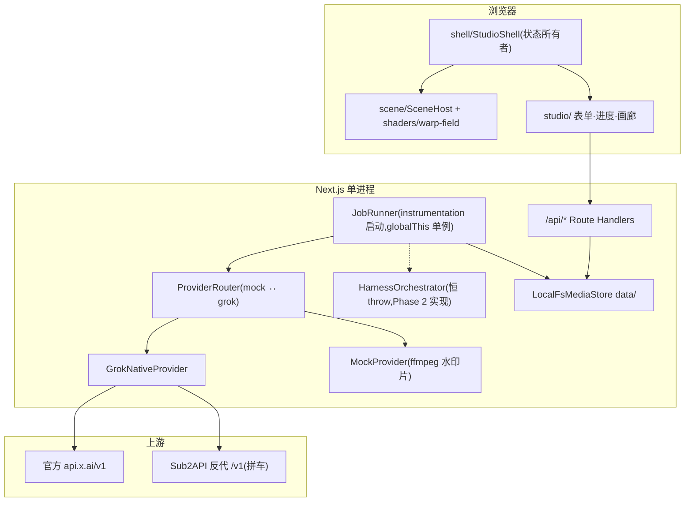

# 流光(Lumen)设计书 — rev 4(as-built)

| 字段 | 值 |
| --- | --- |
| 日期 | 2026-08-30 |
| 基线 | 仓库当前实现;本文以代码为准,取代 `docs/architecture.md`(rev 3,保留为 Phase 0 历史设计与决策依据) |
| 配套 | 计划书 `docs/plan.md`;审查报告 `docs/review-2026-08-29.md` |
| 环境 | Windows / PowerShell,`D:\dev\repos\VideoPlatFrom`,Next.js 16.3.3,pnpm 10.33 |

约定:审查报告 C1–C10 / M1.6 已按本文目标行为落地。标注 **[Phase 2]** 的是 harness 详设；当前已落地 Director、成本、Keyframe 基础能力、shot 并行/恢复与 stitch 库，但完整 orchestrator 仍保持恒 throw 桩。

---

## 1. 系统总览

单进程 Next.js 16 App Router(`next start`,Node 运行时)。Route Handler、in-process JobRunner、SSE EventEmitter 同属一个 isolate;媒体落本机 `data/`;不支持 serverless 与多实例(接口已为 BullMQ/S3 预留)。



### 上游选择(as-built,`src/lib/env.ts`)

| 配置 | 行为 |
| --- | --- |
| `XAI_API_KEY` | 优先使用,base 默认 `https://api.x.ai/v1` |
| 仅 `SUB2API_API_KEY` | base 默认 `http://127.0.0.1:8080/v1` |
| `XAI_BASE_URL` | 覆盖 base(自动补 `/v1`) |
| 都没有 / `LUMEN_FORCE_MOCK=1` | MockProvider |

视频与图片走同一套 REST(`/videos/generations|edits|extensions`、`/videos/{id}`、`/images/generations`),Sub2API 与官方字段兼容。**禁止** `openai.videos.*`(Sora 协议,非 xAI)。

## 2. 模式矩阵(as-built,含文生图)

| 模式 | 模型 | 端点 | 关键约束(服务端 Zod + `assertModeConstraints` 双重拒绝) |
| --- | --- | --- | --- |
| `text_to_image` | `grok-imagine-image-2.0` | `POST /images/generations` | prompt 必填;分辨率 `1k|2k`;同步返回(无 request_id 轮询),直接进 `persisting` |
| `text_to_video` | `grok-imagine-video-1.5` | `POST /videos/generations` | prompt 必填;duration 1–15(默认 8);7 种画幅;480/720/1080p |
| `image_to_video` | 1.5 | 同上 + `image` | 首帧必填;prompt 可空(空则省略键);`image` 与 `reference_images` 互斥 |
| `reference_to_video` | 1.5 | 同上 + `reference_images/audios` | ≥1 图或音色;图 ≤7、音色 ≤3;最高 720p |
| `edit_video` | `grok-imagine-video`(1.0) | `POST /videos/edits` | 源视频必填,≤8.7s(create 时按 sidecar 校验);禁 duration/aspect/resolution |
| `extend_video` | 1.0 | `POST /videos/extensions` | 源视频 2–15s;`duration`=延长段 2–10(默认 6);禁 aspect/resolution |

- 30/45/60 一律 400「长视频将由一致性管线提供,尚未开放」;UI 可见禁用。
- 尾帧(`last`)只存 `inputs/last.jpg`,**永不进入任何 Grok body**(golden test 保障);`lastFrameLocksOutput: false` 字面量。
- 所有 live 请求附 `storage_options: { filename: "{jobId}.{jpg|mp4}" }` 作 Files 备份;poll/响应解析 `file_output.file_id`。
- 图片/参考图经 sharp 压缩(≤256KB、最长边 1280)后以 data URI 发送;源视频 submit 时 `POST /v1/files` 得 `file_id`。Files 失败即 fail job,禁止源视频 data URI 兜底。

定价(`src/lib/cost.ts`,平坦价):1.5 = $0.08/s,1.0 = $0.05/s,图 $0.02/张;实际以 `usage.cost_in_usd_ticks / 1e10` 为准,两者都进 DTO。

## 3. Job 生命周期

状态:`queued → submitting → pending → persisting → succeeded`,终态另有 `failed | expired | canceled`。t2i 同步返回,submit 后直接 `persisting`。

- 每次状态转换先写 `data/jobs/{id}/job.json` 再发 SSE 事件;**轮询 `GET /api/jobs/:id` 是真相,SSE 尽力而为**。
- 轮询间隔 2s;单 job 15min 超时;`service_unavailable/internal_error` 指数退避重试 ≤2 次,`invalid_argument` 不重试。
- cancel:queued 直接终态;submitting/pending/persisting 标记后停 poll;取消后即使上游 done 也不得写 `outputs/`(下载进 tmp,确认状态后 rename);已有 `xaiFileId` 则尽力 DELETE。
- retry:仅 `failed|expired`,**新建 job** 复制 inputs 与参数,原 job 不变。
- boot recover(`instrumentation.register` → `startJobRunner`,幂等):`submitting` 无 remoteId → 回 queued;`submitting` 有 remoteId → 改 pending 续跑;`pending/persisting` 续跑;超 15min 的 **submitting/pending/persisting** 标 expired;`queued` 一律重新入队,不因排队久而失败。
- 并发 `JOB_CONCURRENCY=2`;活跃(queued+submitting+pending+persisting)≥ `MAX_QUEUED_JOBS=20` 时 `POST /api/jobs` 429。
- `sweepTmp`:boot + 每小时(timer `.unref()`),删 24h 前的 tmp 字节与 sidecar。

## 4. HTTP API(as-built)

全部 `runtime="nodejs"`,Zod 4 校验,中文错误,`JobPublic` 单一 DTO(见 `src/lib/jobs/schema.ts`;`output` 为 `kind: video|image` 判别联合)。

| 端点 | 说明 |
| --- | --- |
| `POST /api/uploads` | multipart 流式(@fastify/busboy);`role ∈ start|last|reference|source_video`;图 ≤12MB(sharp 后覆盖写)、视频 mp4 ≤48MB(ffmpeg 探针);写 `data/tmp/{up_16hex}` + sidecar json;**不**做模式相关校验、不调 Files |
| `POST /api/jobs` | 幂等 key 24h 重放;队列满 429;按 mode 校验(含 edit ≤8.7s / extend 2–15s);tmp 字节 move 进 `inputs/`;uploadId 必须匹配 `^up_[0-9a-f]{16}$` |
| `GET /api/jobs` / `GET /api/jobs/:id` | 列表(createdAt 降序)/ 单个 |
| `POST /api/jobs/:id/cancel|retry` | 见 §3 |
| `GET /api/jobs/:id/events` | SSE,`maxDuration=900`;15s `: ping` 心跳 + abort 时解除订阅 |
| `GET /api/media/:jobId/:file` | 白名单 `video.mp4|poster.jpg|image.jpg`;`jobId` 经 `assertSafeId`;Range/206;支持 suffix range `bytes=-N`,416 带 `Content-Range: bytes */size`;`?download=1` 加 attachment |
| `GET /api/health` | ffmpeg 二进制/字体/dataDir 可写/upstream kind/队列深度;缺 ffmpeg → `ok:false` |
| `POST/DELETE /api/auth/session` | 校验并写入/清除 HttpOnly Cookie `lumen_token`(此端点本身不要求已登录) |

全部 `/api/*`(除 `/api/auth/session`)校验 `LUMEN_ACCESS_TOKEN`(设置时);未配置则仅监听 localhost 场景使用。

## 5. 数据落盘

```
data/
  jobs/{jobId}/
    job.json            # JobRecord(JobPublic + schemaVersion/remoteId/assets/...)
    inputs/  start.jpg last.jpg source.mp4 ref-0..6.jpg
    outputs/ video.mp4 poster.jpg | image.jpg
    logs.jsonl
  tmp/{uploadId} + {uploadId}.json     # 24h TTL
  idempotency/{sha256}.json
```

`MediaStore` 接口(`storage/types.ts`)由 `LocalFsMediaStore` 实现,id 白名单 `[A-Za-z0-9_-]+`、rel 路径解析后必须落在 jobDir 内;后期 `S3MediaStore` 同接口替换。

## 6. 前端与场景层

- `StudioShell`(client)持有 job 状态,轮询 + SSE,映射 `SceneProgress { phase: idle|working|done|error, progress }` 给场景层;
- 场景层 as-built:`scene/SceneHost`(dynamic ssr:false)挂载放映机卷轴、光束与尘埃的 Three.js skin；`src/shaders/warp-field` 保留为独立的可替换 shader 资源，不由工作室 Shell 直接依赖。**修订原 KD 8**:皮肤 registry 未建,当前约定为——场景实现只依赖 three 与自身目录,不 import `studio/`、`@/lib/jobs`;更换皮肤 = 替换 `SceneHost` 所挂载的渲染模块;
- 单一 `three@0.185`;工作室场景与 warp-field 均不依赖 `three128` 别名;
- WebGL 失败降级 CSS 暗底,表单/按钮永远在普通 HTML 层,`prefers-reduced-motion` 停动画;
- 每模式控件矩阵、中文文案沿用 architecture.md §UI(已实现,以代码为准)。

## 7. Harness 一致性管线 **[Phase 2 详设 — 产品核心]**

- `Harness Director`：`src/lib/harness/director.ts` 使用 `grok-4.6` Chat Completions + 严格 JSON Schema，解析 `IdentityBible`、shots、packing 和 stitch；格式校验失败最多重试 2 次。默认走 `XAI_BASE_URL`，因此可用本地 Sub2API；当前不会被 JobRunner 调用。
- Harness 当前仍保持关闭：`orchestrator.execute` 恒抛，30/45/60 仍由 API 拒绝，避免半成品管线消耗上游额度。
- `cost.ts` 提供 Harness clip 成本与 QC 重试预算（1.5×）计算，未改变原生单 clip 计价。

### 7.1 管线

```
用户输入(prompt + 可选首/尾帧/参考图 + 30/45/60)
 → L1 Director(grok-4.6, 严格 JSON) → IdentityBible + shots + packing
 → L2 Keyframe(用户图 / grok-imagine-image-2.0 角色表)
 → L3 Per-shot 路由(i2v / r2v / extend / [M4] jimeng_first_last)
 → L4 连接(tail-chain / keyframe-cut / generate+extend hybrid)
 → L5 QC(时长/黑帧冻帧/视觉一致性打分)→ 失败回 L3 重试(≤2 次/shot)
 → L6 Stitch(ffmpeg concat, loudnorm, 硬切 20ms 音频 fade, 可选 freeze settle)
 → L7 交付(与单 clip 同一 outputs/ 槽位,画廊无感知)
```

### 7.2 关键规格(含审查优化 H1–H4)

- **Director(M2.1):** `chat.completions`(OpenAI SDK 指 `xaiBase()`),`response_format` JSON schema,Zod 校验失败重试 ≤2;输出必须满足 packing 合法性(单段连续动作 ≤25s = 15 gen + 10 ext)。
- **Keyframe(M2.2):** `src/lib/harness/keyframe.ts` 已实现尾段候选帧抽取与 Laplacian 方差选帧（默认最后 0.5 秒、12 帧），候选临时目录始终清理；`keyframe-plan.ts` 已实现用户首尾帧优先级和 tail-chain 抽取帧依赖校验；`identity-sheet.ts` 已实现从 Identity Bible 构造角色表 prompt、调用 `grok-imagine-image-2.0` 以及 moderation 拒绝门禁；`identity-sheet-store.ts` 已实现图片校验、JPEG 归一化、原子落盘到 `inputs/sheets/character-N.jpg` 和取消清理；当前尚未写入 JobRecord 或接入 JobRunner。
- **shot 级状态(M2.3):** `src/lib/harness/shot-state.ts` 已实现严格 schema、状态迁移、失败最多 2 次重排和 runnable 过滤；`state.ts` 已将 `HarnessPlan` 与 shot records 原子保存到内部 `JobRecord.harnessPlan/harnessShots`，重复初始化不会重置已成功 shot，Phase 1 public DTO 仍隐藏这些内部字段；`shot-router.ts` 已完成 T2V/I2V/R2V/Extend 到 Grok request 的严格映射和 Jimeng 拒绝；`shot-executor.ts` 与 `run-persisted-shot.ts` 已跑通单 shot submit/poll/persist/succeeded、有限重试、取消清理、pending/persisting 续跑；`shot-coordinator.ts` 与 `run-persisted-plan.ts` 已跑通无依赖并行、依赖等待、崩溃恢复（无 remoteId 回 queued，有 remoteId 续 poll/persist）；`stitch.ts` 已实现硬切 concat、20ms 音频 fade、loudnorm、可选 0.5–1s freeze settle。JobStatus 已并入 `directing|keyframing|generating_shots|qc|stitching`。orchestrator 仍恒 throw。
- **QC(M2.4):** ① `ffprobe` 时长误差 ≤0.4s;② `blackdetect/freezedetect`;③ grok-4.6 视觉 rubric(面部/发型/服装/光线/色调各 0–1 加权),**阈值由 `evals/` 对照集校准后固定**(H2),低于阈值同一 startFrame 收紧 prompt 重试;每 shot ≤2 次自动重试,之后 `needs_review`(M3 人审)。
- **成本护栏(H4):** 提交前展示 packing 预估(30s hybrid ≈ $2.10);job 累计实际成本超预估 ×2 → 停止重试并 `needs_review`。
- **尾帧策略:** M2.4(Grok-only)用户尾帧只作最后一镜 endFrame 参考 + 0.5–1s freeze settle;真正硬锁依赖即梦首尾帧(M4),API 可用性由 M2.0 spike 先行验证(H5)。
- 状态机扩展 `directing|keyframing|generating_shots|qc|stitching` 已并入 JobStatus（可取消、计入队列深度、15min 超时）；`HARNESS_ENABLED` 仅在 M2.4 被读取。

### 7.3 时长装箱(已实现纯函数)

| 目标 | 推荐 packing | 预估成本(平坦价) |
| --- | --- | --- |
| 30s | 15 gen + 10 ext + 5 gen(tail-chain) | ≈ $2.10 |
| 45s | (15+10) + (15+5),段间 tail-chain | ≈ $3.15 |
| 60s | (15+10)×2 + 10 gen | ≈ $4.20 |

## 8. Skills / Workflows **[Phase 3]**

沿用 architecture.md 设计:`skills/<id>/SKILL.md`(frontmatter 对齐 `SkillManifest`)、`WorkflowGraph` + `GateNode` 人审门、`awaiting_approval` 状态与 approve 路由。当前仅类型与空目录。

## 9. 安全

| 威胁 | 缓解 |
| --- | --- |
| key 泄漏 | 仅服务端 env;禁止 NEXT_PUBLIC;日志不打 key |
| 路径穿越 | media `assertSafeId`;uploadId 正则;MediaStore rel 越界拒绝 |
| 上传炸弹 | busboy 流式 + 大小上限;tmp TTL;超限即时删残留 |
| SSRF | 不接受用户任意 URL 转发上游;只送 data URI / file_id |
| 额度燃烧 | 并发/队列深度限制;**[M1.6]** ACCESS_TOKEN;Sub2API 场景务必不暴露公网 |
| 审核 | `respect_moderation === false` 视为失败,不进画廊 |
| AGPL | 禁止拷贝 ArcReel / OpenMontage 源码,只学概念 |

## 10. 部署与运维(Windows 注意项)

- 开发 `pnpm dev`;生产单节点 `pnpm build && pnpm start`,`DATA_DIR` 可挂盘;禁止多实例(SSE/内存队列同 isolate 约束);
- `outputFileTracingIncludes` 用 `./node_modules/ffmpeg-static/ffmpeg*`,兼容 `ffmpeg.exe`;
- `serverExternalPackages: ["ffmpeg-static", "sharp"]`;ffmpeg 一律经 `src/lib/ffmpeg.ts`(路径来自 ffmpeg-static,禁止 PATH spawn);
- mock 水印字体 `src/lib/media/fonts/NotoSansSC-subset.ttf`(OFL),缺失时 health `ok:false`;
- 观测:`log.ts` JSON 行 + `data/jobs/{id}/logs.jsonl`;health 顶栏点;指标 Phase 4 再 Prometheus。

## 11. 与 rev 3 的差异清单

1. 基线从"空脚手架计划"改为 as-built(Phase 1 已实现);
2. 新增 `text_to_image` 模式(同步返回路径、`image.jpg` 白名单、`1k|2k`);
3. 新增 Sub2API 上游与 `upstream kind` 概念;
4. 场景层按实现修订(SceneHost 放映机 skin,替代 skin registry;warp-field 作为独立 shader 资源;three 收敛为单一 0.185);
5. 源视频 data URI 兜底被判定违规,回归"Files 失败即 fail";
6. Windows 环境适配(tracing glob、路径);
7. harness 详设吸收 H1–H5(清晰度选帧、QC 校准、shot 断点/并行、成本护栏、即梦 spike 前置);
8. 最小鉴权(ACCESS_TOKEN)从 Phase 4 提前到 M1;
9. PR 计划由 `docs/plan.md` 的 M1–M4 里程碑取代。
