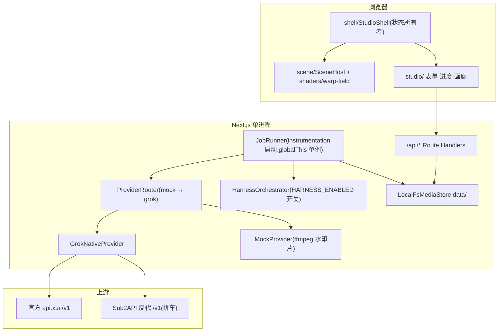

# 流光(Lumen)设计书 — rev 4(as-built)

| 字段 | 值 |
| --- | --- |
| 日期 | 2026-08-30 |
| 基线 | 仓库当前实现;本文以代码为准,取代 `docs/architecture.md`(rev 3,保留为 Phase 0 历史设计与决策依据) |
| 配套 | 计划书 `docs/plan.md`;审查报告 `docs/review-2026-08-29.md` |
| 环境 | Windows / PowerShell,`D:\dev\repos\VideoPlatFrom`,Next.js 16.3.3,pnpm 10.33 |

约定:审查报告 C1–C10 / M1.6 已按本文目标行为落地。标注 **[Phase 2]** 的是 harness 详设；2026-09-05（M2.4）起 orchestrator 已接入 JobRunner，由 `HARNESS_ENABLED` 开关。

---

## 1. 系统总览

单进程 Next.js 16 App Router(`next start`,Node 运行时)。Route Handler、in-process JobRunner、SSE EventEmitter 同属一个 isolate;媒体落本机 `data/`;不支持 serverless 与多实例(接口已为 BullMQ/S3 预留)。



### 上游选择(as-built,`src/lib/env.ts`)

| 配置 | 行为 |
| --- | --- |
| `XAI_API_KEY` | 优先使用,base 默认 `https://api.x.ai/v1` |
| 仅 `SUB2API_API_KEY` | base 默认 `http://127.0.0.1:8080/v1` |
| `XAI_BASE_URL` | 覆盖 base(自动补 `/v1`) |
| 都没有 / `LUMEN_FORCE_MOCK=1` | MockProvider |

视频与图片走同一套 REST(`/videos/generations|edits|extensions`、`/videos/{id}`、`/images/generations`),Sub2API 与官方字段兼容。**禁止** `openai.videos.*`(Sora 协议,非 xAI)。

## 2. 模式矩阵(as-built,含文生图)

| 模式 | 模型 | 端点 | 关键约束(服务端 Zod + `assertModeConstraints` 双重拒绝) |
| --- | --- | --- | --- |
| `text_to_image` | `grok-imagine-image-2.0` | `POST /images/generations` | prompt 必填;分辨率 `1k|2k`;同步返回(无 request_id 轮询),直接进 `persisting` |
| `text_to_video` | `grok-imagine-video-1.5` | `POST /videos/generations` | prompt 必填;duration 1–15(默认 8);7 种画幅;480/720/1080p |
| `image_to_video` | 1.5 | 同上 + `image` | 首帧必填;prompt 可空(空则省略键);`image` 与 `reference_images` 互斥 |
| `reference_to_video` | 1.5 | 同上 + `reference_images/audios` | ≥1 图或音色;图 ≤7、音色 ≤3;最高 720p |
| `edit_video` | `grok-imagine-video`(1.0) | `POST /videos/edits` | 源视频必填,≤8.7s(create 时按 sidecar 校验);禁 duration/aspect/resolution |
| `extend_video` | 1.0 | `POST /videos/extensions` | 源视频 2–15s;`duration`=延长段 2–10(默认 6);禁 aspect/resolution |

- 30/45/60:`HARNESS_ENABLED` 未开启时 400「长视频将由一致性管线提供,尚未开放」;开启后仅 t2v / i2v 可提交,任务走 §7 管线,**这三个时长永不进入 Grok 请求体**(rest-map 仍拒绝,golden 保障)。
- 尾帧(`last`)只存 `inputs/last.jpg`,**永不进入任何 Grok body**(golden test 保障);`lastFrameLocksOutput: false` 字面量。
- 所有 live 请求附 `storage_options: { filename: "{jobId}.{jpg|mp4}" }` 作 Files 备份;poll/响应解析 `file_output.file_id`。
- 图片/参考图经 sharp 压缩(≤256KB、最长边 1280)后以 data URI 发送;源视频 submit 时 `POST /v1/files` 得 `file_id`。Files 失败即 fail job,禁止源视频 data URI 兜底。

定价(`src/lib/cost.ts`,平坦价):1.5 = $0.08/s,1.0 = $0.05/s,图 $0.02/张;实际以 `usage.cost_in_usd_ticks / 1e10` 为准,两者都进 DTO。

## 3. Job 生命周期

状态:`queued → submitting → pending → persisting → succeeded`,终态另有 `failed | expired | canceled`。t2i 同步返回,submit 后直接 `persisting`。长片(30/45/60)走 `queued → directing → keyframing → generating_shots → qc → stitching → persisting → succeeded`,由 orchestrator 推进,runner 只接手最后的 persisting。

- 每次状态转换先写 `data/jobs/{id}/job.json` 再发 SSE 事件;**轮询 `GET /api/jobs/:id` 是真相,SSE 尽力而为**。
- 轮询间隔 2s;单 job 15min 超时;`service_unavailable/internal_error` 指数退避重试 ≤2 次,`invalid_argument` 不重试。
- cancel:queued 直接终态;submitting/pending/persisting 标记后停 poll;取消后即使上游 done 也不得写 `outputs/`(下载进 tmp,确认状态后 rename);已有 `xaiFileId` 则尽力 DELETE。
- retry:仅 `failed|expired`,**新建 job** 复制 inputs 与参数,原 job 不变。
- boot recover(`instrumentation.register` → `startJobRunner`,幂等):`submitting` 无 remoteId → 回 queued;`submitting` 有 remoteId → 改 pending 续跑;`pending/persisting` 续跑;超 15min 的 **submitting/pending/persisting/harness 各阶段** 标 expired;`queued` 一律重新入队,不因排队久而失败。harness 阶段的任务由 pump 重新交给 `orchestrator.execute`,它按 job.json 里的 plan / shot 记录续跑(shot 级 recover 见 §7.2)。
- 并发 `JOB_CONCURRENCY=2`;活跃(queued+submitting+pending+persisting)≥ `MAX_QUEUED_JOBS=20` 时 `POST /api/jobs` 429。
- `sweepTmp`:boot + 每小时(timer `.unref()`),删 24h 前的 tmp 字节与 sidecar。

## 4. HTTP API(as-built)

全部 `runtime="nodejs"`,Zod 4 校验,中文错误,`JobPublic` 单一 DTO(见 `src/lib/jobs/schema.ts`;`output` 为 `kind: video|image` 判别联合)。

| 端点 | 说明 |
| --- | --- |
| `POST /api/uploads` | multipart 流式(@fastify/busboy);`role ∈ start|last|reference|source_video`;图 ≤12MB(sharp 后覆盖写)、视频 mp4 ≤48MB(ffmpeg 探针);写 `data/tmp/{up_16hex}` + sidecar json;**不**做模式相关校验、不调 Files |
| `POST /api/jobs` | 幂等 key 24h 重放;队列满 429;按 mode 校验(含 edit ≤8.7s / extend 2–15s);tmp 字节 move 进 `inputs/`;uploadId 必须匹配 `^up_[0-9a-f]{16}$` |
| `GET /api/jobs` / `GET /api/jobs/:id` | 列表(createdAt 降序)/ 单个 |
| `POST /api/jobs/:id/cancel|retry` | 见 §3 |
| `GET /api/jobs/:id/events` | SSE,`maxDuration=900`;15s `: ping` 心跳 + abort 时解除订阅 |
| `GET /api/media/:jobId/:file` | 白名单 `video.mp4|poster.jpg|image.jpg`;`jobId` 经 `assertSafeId`;Range/206;支持 suffix range `bytes=-N`,416 带 `Content-Range: bytes */size`;`?download=1` 加 attachment |
| `GET /api/health` | ffmpeg 二进制/字体/dataDir 可写/upstream kind/队列深度;缺 ffmpeg → `ok:false` |
| `POST/DELETE /api/auth/session` | 校验并写入/清除 HttpOnly Cookie `lumen_token`(此端点本身不要求已登录) |

全部 `/api/*`(除 `/api/auth/session`)校验 `LUMEN_ACCESS_TOKEN`(设置时);未配置则仅监听 localhost 场景使用。

## 5. 数据落盘

```
data/
  jobs/{jobId}/
    job.json            # JobRecord(JobPublic + schemaVersion/remoteId/assets/...)
    inputs/  start.jpg last.jpg source.mp4 ref-0..6.jpg
    outputs/ video.mp4 poster.jpg | image.jpg
    inputs/sheets/character-N.jpg          # harness 角色表(仅 R2V shot 需要)
    shots/{index}/video.mp4 tail.jpg        # harness 每镜成片与 tail-chain 抽取帧
    logs.jsonl
  tmp/{uploadId} + {uploadId}.json     # 24h TTL
  idempotency/{sha256}.json
```

`MediaStore` 接口(`storage/types.ts`)由 `LocalFsMediaStore` 实现,id 白名单 `[A-Za-z0-9_-]+`、rel 路径解析后必须落在 jobDir 内;后期 `S3MediaStore` 同接口替换。

## 6. 前端与场景层(2026-09-05 晚按 Genius 交接包重建为深色单屏)

- 结构:`app/page.tsx`(server,读 `listJobRecords` 前 40 条)→ `components/lumen/LumenHome.tsx`(client,唯一状态所有者)。整站一个 100vh 单屏,三个视图:首页(标题 + 输入卡 + 最近 6 张成片缩略)→ 工作室(textarea 首次非空或点发送即转场:左「操作台」四组提示词芯片、右「展览区」进度 / 成片、输入卡落到右下)→ 作品(`mountRingDark` 环形画廊,视频 / 图片分栏,底部元信息 + 「用这条提示词再生成」「下载」)。
- 设计来源:`design_handoff/design_handoff_genius_home/`(README 为像素级规格,`Lumen v2.dc.html` 为定稿原型);落地摘要与有意偏离见根目录 `DESIGN.md`。视觉语言:页面 `#0a0d12`、卡片 `rgba(28,30,36,.92)`、描边 `rgba(214,228,255,.12)`、强调 `#DDE1E8`,圆角 26 / 22 / 12 / 9,Manrope + Noto Sans SC。品牌名 Genius,文案全中文。
- 路径收窄:UI 只暴露 `text_to_video / image_to_video / text_to_image`(内部 `t2v / i2v / t2i`)。请求体沿用 §4 契约:视频固定 `resolution: 720p`、`generateAudio: true`,时长 4/6/8/10(开启 harness 时循环追加 30/45/60),画幅 16:9 / 9:16 / 1:1;文生图固定 `imageResolution: 1k`;首帧 `startUploadId`(回形针上传,自动切图生视频)。尾帧入口已从 UI 移除(API 的 `lastUploadId` 仍在)。`reference_to_video / edit_video / extend_video` 仍保留在 API 与 provider 层。
- API 边界不变:`lib/client/jobs.ts`(upload / create / cancel / retry / 幂等 key)、`lib/client/useJobLive.ts`(SSE + 2s 轮询)、`lib/client/labels.ts`(终态判断 / 计时)。401 由 `LumenHome` 弹 `components/shell/AccessTokenPrompt`,顶栏「登录」也打开它。
- 场景层:`lib/scene/lumen-three.ts` 是纯 three.js(无 R3F)的两个 mount 函数——`mountDawn`(全屏 quad shader 黎明河面,pixelRatio ≤ 1.5,`setEnergy` 随任务进行提亮)、`mountRingDark`(真图 + 倒影的环,`R = max(2.6, n×0.58)`,平面原色不透明、悬停放大 1.04,拖拽 `setScroll` + 0.003 圈/秒自动慢转,raycast hover / click,`onTurn` 回报角度)。`components/scene/SceneHost.tsx` 在 `useEffect` 中挂载并 dispose;mount 抛错时静默留白。
- 成片来源:作品环与缩略直接用 `JobPublic.output`(视频取 `posterUrl`,图片取 `imageUrl`),按 `output.kind` 分视频 / 图片;无成片时回落 `public/lumina/*.webp` 八张样片。展览区成片用 `<video controls>` / ``,`object-fit: contain`。
- 依赖:`three@0.185` 单一版本;`@react-three/fiber`、`@react-three/drei`、`@phosphor-icons/react` 已卸载;字体经 `next/font/google`(Manrope / Noto Sans SC)。
- `/gallery`、`/jobs/[id]`、`/studio/*` 保留为跳转到 `/`。2026-09-02 的 Agent 会话页(`components/agent/*`)已删除,其决策记录见 `docs/review-2026-09-02.md`;2026-09-05 日间的 Mono-Color Blueprint 首页(`marks.tsx`、`mountReel / mountWall / mountDotField`)已被本节替代,记录见 `docs/handoff.md`。

## 7. Harness 一致性管线 **[Phase 2 详设 — 产品核心]**

- `Harness Director`：`src/lib/harness/director.ts` 使用 `grok-4.6` Chat Completions + 严格 JSON Schema，解析 `IdentityBible`、shots、packing 和 stitch；格式校验失败最多重试 2 次。默认走 `XAI_BASE_URL`，因此可用本地 Sub2API。mock 模式用 `mock-director.ts`：15s generate 片 + tail-chain I2V 的确定性计划（无 extend，因为 extend 需要 xAI Files）。
- **开关（M2.4 as-built）**：`HARNESS_ENABLED` 未开启时 `orchestrator.execute` 抛 `HARNESS_NOT_ENABLED`、API 对 30/45/60 返回 400；开启后 `createJob` 接受 30/45/60（仅 t2v / i2v），`costUsdEstimate` 先按 `packHarnessDuration` 预估，Director 出计划后按真实 packing 重算。`/api/health.harnessRunnable` 反映开关。
- `cost.ts` 提供 Harness clip 成本与 QC 重试预算（1.5×）计算，未改变原生单 clip 计价；新增 `LLM_RATE_USD_PER_MTOKEN`（grok-4.6 输入 $3 / 输出 $15 每百万 token，**列表价占位，未经 ticks 核实**）、`estimateLlmCostUsd`、`LLM_RESERVE_USD`（Director $0.30、视觉 QC $0.05 的保守预留）。成本护栏：`budgetCap`（纯函数，= 提交时 `costUsdEstimate × 2`，见 §7.2）覆盖**每一次**付费调用——分镜提交、Director、角色表、视觉 QC——超限即停并以 `budget_exceeded` 失败。

### 7.1 管线

```
用户输入(prompt + 可选首/尾帧/参考图 + 30/45/60)
 → L1 Director(grok-4.6, 严格 JSON) → IdentityBible + shots + packing
 → L2 Keyframe(用户图 / grok-imagine-image-2.0 角色表)
 → L3 Per-shot 路由(i2v / r2v / extend / [M4] jimeng_first_last)
 → L4 连接(tail-chain / keyframe-cut / generate+extend hybrid)
 → L5 QC(时长/黑帧冻帧/视觉一致性打分)→ 失败回 L3 重试(≤2 次/shot)
 → L6 Stitch(ffmpeg concat, loudnorm, 硬切 20ms 音频 fade, 可选 freeze settle)
 → L7 交付(与单 clip 同一 outputs/ 槽位,画廊无感知)
```

### 7.2 关键规格(含审查优化 H1–H4)

- **Director(M2.1):** `chat.completions`(OpenAI SDK 指 `xaiBase()`),`response_format` JSON schema,Zod 校验失败重试 ≤2;输出必须满足 packing 合法性(单段连续动作 ≤25s = 15 gen + 10 ext)。
- **Keyframe(M2.2):** `src/lib/harness/keyframe.ts` 已实现尾段候选帧抽取与 Laplacian 方差选帧（默认最后 0.5 秒、12 帧），候选临时目录始终清理；`keyframe-plan.ts` 已实现用户首尾帧优先级和 tail-chain 抽取帧依赖校验；`identity-sheet.ts` 已实现从 Identity Bible 构造角色表 prompt、调用 `grok-imagine-image-2.0` 以及 moderation 拒绝门禁；`identity-sheet-store.ts` 已实现图片校验、JPEG 归一化、原子落盘到 `inputs/sheets/character-N.jpg` 和取消清理；M2.4 起 `orchestrator.keyframe` 只为 `grok_r2v` 镜涉及的角色生成角色表，并经 `updateHarnessBible` 把 `sheetAssetIds` 写回 job.json。
- **shot 级状态(M2.3):** `src/lib/harness/shot-state.ts` 已实现严格 schema、状态迁移、失败最多 2 次重排和 runnable 过滤；`state.ts` 已将 `HarnessPlan` 与 shot records 原子保存到内部 `JobRecord.harnessPlan/harnessShots`，重复初始化不会重置已成功 shot，Phase 1 public DTO 仍隐藏这些内部字段；`shot-router.ts` 已完成 T2V/I2V/R2V/Extend 到 Grok request 的严格映射和 Jimeng 拒绝；`shot-executor.ts` 与 `run-persisted-shot.ts` 已跑通单 shot submit/poll/persist/succeeded、有限重试、取消清理、pending/persisting 续跑；`shot-coordinator.ts` 与 `run-persisted-plan.ts` 已跑通无依赖并行、依赖等待、崩溃恢复（无 remoteId 回 queued，有 remoteId 续 poll/persist）；`stitch.ts` 已实现硬切 concat、20ms 音频 fade、loudnorm、可选 0.5–1s freeze settle。JobStatus 已并入 `directing|keyframing|generating_shots|qc|stitching`。orchestrator 已接入 JobRunner（见下「编排」）。
- **QC(M2.4,as-built):** `qc.ts` 在每镜落盘前跑 ① 时长误差 ≤0.4s(extend 镜以「前一镜实测 + 延长段」为期望)、② `blackdetect`(≥0.5s 黑段)/`freezedetect`(≥2s、-60dB);`visual-qc.ts` 是 ③ grok-4.6 视觉 rubric(五维 0–1),对每镜抽**首 / 中 / 尾三帧**,参考图为**用户首帧(固定身份锚)**、本镜起始帧(上一镜尾帧)与角色表;`overall` 为五维均值,`identity = min(face, hair, wardrobe)`,`visualQcPasses` 要求两者同时 ≥ 阈值(审查 R04:换脸不能被光色均掉)。只在设置 `HARNESS_QC_VISUAL_THRESHOLD` 且非 mock 时启用——**阈值仍需 `evals/runs` 对照集校准**(H2),仓库不预设。这是抽样检查,不是逐帧检查;Director 目前只收到「有 / 无首尾帧」与参考资产路径,看不到图像内容(R07 记录的能力边界)。任一项不过 → shot `failed` → executor 用收紧后的 prompt(`tightenShotPrompt`,追加 Bible 锁定项)重试,≤2 次后 `needs_review`,job 以 `needs_review` 失败并在 error 里带最后一次 QC 原因。**终态失败即时升级(2026-09-05 晚第三轮续,tester 发现的结构问题已修):** `shot-executor.ts` 的 `executeShotOnce` 现在识别 `ShotFailure.terminal`——例如视觉 QC 判定预算超限这类不可重试的失败——命中后立即置 `needs_review`,不再进入重试队列白跑一轮(修前会先排一次重试,靠下一次分镜预留检查才拦住,浪费一次可能的付费尝试)。job 级 `qc` 阶段做聚合校验(每镜文件存在、qc 记录通过、成本未超上限)。拼接后再做**整片时长校验**(`verifyFilmDuration`,R08):期望 = 目标 + 定格(有用户尾帧时 0.75s),容差 = 0.4s × 镜数(逐镜误差会累计,不假装总和更准),不过 → `qc_duration` 失败并删成片;结果记在 `harnessStitch`。
- **成本护栏(H4,as-built,2026-09-05 晚第三轮：Director / 角色表 / 视觉 QC 纳入预留):** 四个数分开存——`costUsdEstimate`(提交时 packing 预估,30s ≈ $2.10,**永不改写**)、`costUsdPlanned`(Director 计划后按真实 packing 重算,**不参与预算计算**)、`costUsdActual`(所有上游回报费用之和,含按列表价折算的 LLM 调用)、软告警 `costOverTarget`。**预算上限 `budgetCap()` 是纯函数,恒等于 `costUsdEstimate × 2`**,不随 `costUsdPlanned` 浮动(评测按提交时的数字算达标率,上限跟着计划涨会让上限失去约束力)。`withReservation`(Director、角色表、视觉 QC——reserve → run → release,调用期间同步占位)与 `reserveShotBudget`(分镜提交与重试,跨 submit/poll/persist 占位到 `onState` 才释放)共用同一张在途预留表:**每一次付费调用前**都检查「已支出 + 其他在途预留 + 本次目录价预估 ≤ 上限」,超限直接 `budget_exceeded`(分镜/视觉 QC 是 `ShotFailure({ terminal: true })` → 该镜 `needs_review`;Director/角色表/整片是 `HarnessFailure` → job 失败),不再发请求。shot 记录的 `costUsd` **跨重试累计**(`priorCostUsd` 记前几次已花),上游没回费用的付费调用标 `costUnknown`;Director / 视觉 QC 的 token 经 `bookLlmUsage` 记入 `llmUsage`,回了 usage 的按 `LLM_RATE_USD_PER_MTOKEN` 折算美元并计入 `costUsdActual`,没回 usage 的记 `unpricedCalls`。`costIsIncomplete` 现在**只**看 `llmUsage.unpricedCalls > 0` 或某个 shot 的 `costUnknown`(LLM 调用只要回了 usage 就不再算「不完整」,不阻塞后续重试)——job `costIncomplete = true` 时 UI 成本显示「≥」,退款场景下账目不完整还会让 `reserveShotBudget` 直接拒绝重试(`budget_unknown`)。`costOverTarget` 是软告警:`costUsdActual` 超过 `costUsdEstimate × 1.5` 时置位一次并 `log warn`,不停任务,标志不回落。1.5× 是评测的成本达标线,2× 是执行硬停,两者不互换。**崩溃重启在途预留重建(2026-09-05 晚第三轮续,Codex 审查 P1 已修):** `generateShots` 调度前调用导出的 `seedInFlightReservations(records, shots, reserved)`,对状态为 `pending`/`submitting` 且已有 `remoteId` 的分镜按 `shotListPrice` 重建在途预留;`persisting` 的分镜费用已入账不重复预留。修前的问题是进程重启后这些「已提交未完结」的分镜会从预留表里消失,后续新分镜可能超支而不被拦截。
- **尾帧策略:** M2.4(Grok-only)用户尾帧只记录为最后一镜 endFrame,不进任何请求体;有尾帧时 stitch 在**目标时长之外**追加 0.75s freeze settle(定格取生成片末帧,不是用户尾帧图;它只是收尾方式,不等于「与用户尾帧匹配」,评测另记 `settleMatchesLastFrame`);真正硬锁依赖即梦首尾帧(M4),API 可用性由 M2.0 spike 先行验证(H5)。
- **编排(`orchestrator.ts`,as-built):** `lockPlan` 把 Director 计划归一化——只保留能物化的帧引用(用户首帧 → shot 0、tail-chain 抽帧 → `shots/{i-1}/tail.jpg`),有 startFrame 的镜强制 I2V;`beforeShot` 在依赖镜成功后用 `extractSharpestTailFrame` 抽尾帧;extend 镜把前一镜成片经 Files 上传为 `file_id`,用完即删;`stitchOrder` 让 extend 成片替换它延长的那一镜(extend 输出已含源片);拼接尺寸由画幅 + 分辨率推得(`stitchDimensions`)。每镜请求的 `jobId` 为 `{jobId}-shot-{i}`,mock 的暂存目录用完即删。
- 状态机 `directing|keyframing|generating_shots|qc|stitching` 已并入 JobStatus(可取消、计入队列深度);**超时语义**:每个 shot 的每次尝试轮询上限 15 分钟(`shot-executor`),启动恢复按 job `updatedAt` 15 分钟未动判陈旧,没有整片级 deadline(R11)。public DTO 新增 `harness.enabled`、`shots[]`(id / index / durationSec / status / retries / error)、`costUsdPlanned`、`costIncomplete`、`costOverTarget`(软告警,见上)、`retryBlocked`(见下 R09,`store.ts` 的 `toPublic` 派生计算,不落盘),Bible 仍不公开。恢复语义(2026-09-05 晚第三轮,`shot-recover.ts`):崩溃窗口落在「已 `provider.submit` 返回、`remoteId` 未落 job.json」之间(`submitting` 且无 `remoteId`)时,上游可能已接单,盲目重提交会重复付费,所以不走 `requeue` 而是直接判 `needs_review` + `error.code = "uncertain_submit"`,留给人工核对;其余 `requeue` 分支在续跑时保留 `costUnknown` 与累计后的 `priorCostUsd`,不再因重启而丢失账目字段。
- **人工复核最小闭环(R09):** 镜头重试耗尽 → job 以 `needs_review` 失败,`error` 带镜号与最后原因,`shots[]` 逐镜可见;用户点 Retry(`retryJob`)时 harness job **继承计划与已成功镜**(复制 `shots/`,失败 / 待复核镜重置为 queued、retries 0,成功镜的费用带入 `costUsdActual`),不重跑 Director、不重付成功镜。approve 路由与单镜重做 UI 仍在 M3。**复制校验(2026-09-05 晚第三轮续,Codex 审查 P1 已修):** `retryJob` 复制保留镜的成片目录后,对每个保留的 `succeeded` 分镜 `access` 其 `outputPath`;任一文件缺失就删除半建的新 job 目录并抛 `ProviderHttpError(500, "retry_copy_failed")`,不再让复制失败被 `.catch` 静默吞掉、留下标记 `succeeded` 但文件缺失的分镜。**Retry 禁用规则(`src/lib/jobs/retry-guard.ts`,用户决定):** job 的 `harnessShots[]` 中任一分镜的 `error.code === "uncertain_submit"`(即上文「恢复语义」提到的崩溃窗口)时,`retryJobUnlocked` 在状态检查后、任何写入前直接抛 `ProviderHttpError(409, "retry_blocked", message)`,message 按镜号升序列出中文说明;public DTO 的 `retryBlocked` 字段（`retry-guard.ts` 的 `retryBlock(rec)`）供 UI 判断是否隐藏一键重做入口,避免对可能已被上游接单的镜重复付费。

### 7.3 时长装箱(已实现纯函数)

| 目标 | 推荐 packing | 预估成本(平坦价) |
| --- | --- | --- |
| 30s | 15 gen + 10 ext + 5 gen(tail-chain) | ≈ $2.10 |
| 45s | (15+10) + (15+5),段间 tail-chain | ≈ $3.15 |
| 60s | (15+10)×2 + 10 gen | ≈ $4.20 |

## 8. Skills / Workflows **[Phase 3]**

沿用 architecture.md 设计:`skills/<id>/SKILL.md`(frontmatter 对齐 `SkillManifest`)、`WorkflowGraph` + `GateNode` 人审门、`awaiting_approval` 状态与 approve 路由。当前仅类型与空目录。

## 9. 安全

| 威胁 | 缓解 |
| --- | --- |
| key 泄漏 | 仅服务端 env;禁止 NEXT_PUBLIC;日志不打 key |
| 路径穿越 | media `assertSafeId`;uploadId 正则;MediaStore rel 越界拒绝 |
| 上传炸弹 | busboy 流式 + 大小上限;tmp TTL;超限即时删残留 |
| SSRF | 不接受用户任意 URL 转发上游;只送 data URI / file_id |
| 额度燃烧 | 并发/队列深度限制;**[M1.6]** ACCESS_TOKEN;Sub2API 场景务必不暴露公网 |
| 审核 | `respect_moderation === false` 视为失败,不进画廊 |
| AGPL | 禁止拷贝 ArcReel / OpenMontage 源码,只学概念 |

## 10. 部署与运维(Windows 注意项)

- 开发 `pnpm dev`;生产单节点 `pnpm build && pnpm start`,`DATA_DIR` 可挂盘;禁止多实例(SSE/内存队列同 isolate 约束);
- `outputFileTracingIncludes` 用 `./node_modules/ffmpeg-static/ffmpeg*`,兼容 `ffmpeg.exe`;
- `serverExternalPackages: ["ffmpeg-static", "sharp"]`;ffmpeg 一律经 `src/lib/ffmpeg.ts`(路径来自 ffmpeg-static,禁止 PATH spawn);
- mock 水印字体 `src/lib/media/fonts/NotoSansSC-subset.ttf`(OFL),缺失时 health `ok:false`;
- 观测:`log.ts` JSON 行 + `data/jobs/{id}/logs.jsonl`;health 顶栏点;指标 Phase 4 再 Prometheus。

## 11. 与 rev 3 的差异清单

1. 基线从"空脚手架计划"改为 as-built(Phase 1 已实现);
2. 新增 `text_to_image` 模式(同步返回路径、`image.jpg` 白名单、`1k|2k`);
3. 新增 Sub2API 上游与 `upstream kind` 概念;
4. 场景层按实现修订(SceneHost 放映机 skin,替代 skin registry;warp-field 作为独立 shader 资源;three 收敛为单一 0.185);
5. 源视频 data URI 兜底被判定违规,回归"Files 失败即 fail";
6. Windows 环境适配(tracing glob、路径);
7. harness 详设吸收 H1–H5(清晰度选帧、QC 校准、shot 断点/并行、成本护栏、即梦 spike 前置);
8. 最小鉴权(ACCESS_TOKEN)从 Phase 4 提前到 M1;
9. PR 计划由 `docs/plan.md` 的 M1–M4 里程碑取代。
