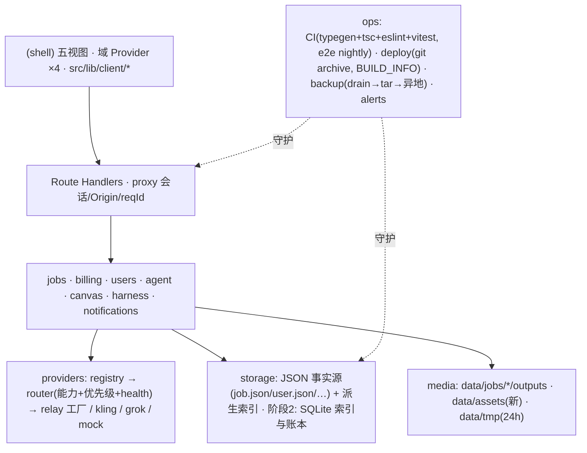
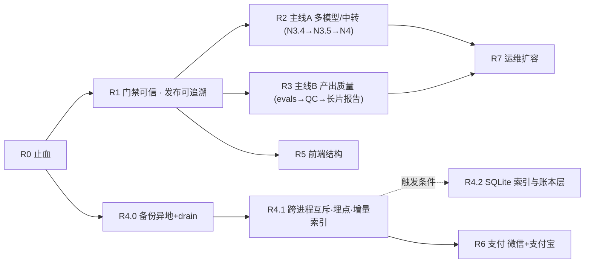

# 设计计划书 · 全仓优化与路线重排（2026-09 起）

状态：2026-09-13 **实施中，本文已作为当前执行路线**。已决（§8 标注）：D-1 a 移除 Tailwind（已落地）；D-2 a e2e 定时+手动（`74248a5` 已绿一次）；D-3 a 删除 skip-check；D-4 b 本机管理令牌（R4.1 已落地）；D-6 b 素材 30 天并明示；D-8 a 非 root（已执行）；D-9 是。另已决：R3 先出报价不开跑；R6 无商户主体→继续礼品码，R6 不开工；R7 告警接飞书/钉钉/企微机器人；R4.0 异地副本落阿里云 OSS；R5.2 本轮做。D-5 待 SQLite 触发条件成立再定（生产 Node 22.22.2，22.x 的 node:sqlite 仍为 1.1 Active development）；D-7 预算未定。N3.1–N3.4 已合入 `37123bd`；R0 代码与文档已通过本地门禁，`main` 首条绿 CI 为 `6b5449d`（R0.1 验收成立）；R1.1–R1.3 已落地并于 2026-09-13 部署 `d7f34eb` 实测通过（`--frozen-lockfile` 首过、`build.sha` 回显生效），R1.5 非 root 已执行，R1.4 发布目录仍待生产窗口；当前证据/剩余工作见 `docs/handoff.md`。用户允许门禁通过后提交推送 main，不等于允许部署或付费评测。本文取代 `docs/plan-next-2026-09-13.md` 的排期表；该文与 `docs/plan-unimplemented-2026-09-08.md` 的契约仍为引用源。以下正文保留起草时方案，实际进度以上述状态与 as-built 为准。

沿用的既定决策（不再讨论）：产品三卖点（`plan-next` §0.1）；D1 长片定价 ¥20/30/40；D2 `edit_video`/`extend_video` 移出路线图；D3 通用中转 provider（N3.1–N3.3 已提交，N3.4 进行中）；D4 微信 + 支付宝都接。

写法约定：不给周数（本仓库既有结论——没有真实延迟与返工数据时任何周数都是虚假精度）；每片用 S / M / L 标**相对**规模，用依赖与门禁定顺序。「验收」一列全部是可执行或可观察的判据。

## 0. 一句话

先把**门禁与备份**做成真的（现在 CI 全红、备份缺事实源、画布素材 24h 蒸发），再在**两条产品主线**——「多模型 / 中转」与「产出质量」——上并行推进，数据层按明确触发条件分三阶段演进，支付与运维扩容排在资金入口跨进程安全之后。

## 1. 产品定位 → 能力面 → 现状

从用户可见的功能面定义能力，再让实现层满足（全局规则）。

| 卖点 | 用户可见能力 | 现状（`dbead84`） | 缺口 |
| --- | --- | --- | --- |
| ① 优化视频产出 | 30/45/60s 身份一致长片；分镜进度；失败镜重做；成片可交付 | 管线供应商无关，可灵 / YMan 各一条 30s 实证；视觉 QC 阈值未校准默认跳过；`evals/runs` 为空 | **没有任何可复现的质量证据**；QC 自动重试在真实链路未验；档 B（r2v）未走到 |
| ② 多模型自由选择 | 模型下拉按产品 / 供应商分组、显示售价与特性；下架模型自动消失 | `GET /api/models` 已下发 `providerId/providerName/upstreamModel/costHint`；目录动态刷新 + 默认模型下架收缩能力（N3.3） | 管理页、创作面板分组与 costHint 展示（N3.5/N4）；治理换家（N3.4 进行中） |
| ③ 接中转站、价格低 | 一家中转 = 一段配置；管理接口增删改、discover、probe | `data/relays.json` + `/api/admin/relays`（N3.2） | 健康 / 冷却 / 半开（N3.4 进行中）；`relays.json` 未进备份（P0） |
| 基础：账号与钱 | 注册（邀请码）/ 余额两池 / 订阅 / 礼品码 / 流水 / 账户页 | 完整，资金不变量强 | 无支付网关（D4 待做）；备份同机无异地；CLI 无跨进程锁 |
| 基础：作品 | 瀑布流分页 / 标签 / 删除 / 分享 / 模板 / 通知 | 完整 | 无 |
| 基础：智能体 / 画布 | 提案审批制智能体；画布 DAG 报价 → 冻结 → 审批 → 结算 | 完整 | 画布素材 24h 蒸发（P0）；会话 / 画布无留存策略 |

## 2. 目标架构

### 2.1 不变的决策（写下来防止被「优化」掉）

1. 单体 Next.js + 进程内 runner；不引消息队列、不做多实例——直到 §3 的触发条件出现。
2. 资金不变量：余额判定在 `withAdmissionLock` 内与 `writeJob` 同临界区；先扣后写终态；`applyBalanceChange` 唯一扣款 / 退款入口；订阅只能用已购池；锁序 admission → user。
3. 事实源先写、派生物后更、派生物可重建。
4. Provider 层：能力 + 优先级路由；绝不静默落 mock；`priceCny` 只降不升；已计费请求不重发。
5. 前端：浏览器只经 `src/lib/client/*`；BEM + `data-*`；i18n 字典编译期校验。
6. 文档规则：只写当前真实状态。

### 2.2 要变的（本计划的对象）

| 层 | 现在 | 目标 | 属于哪个 R |
| --- | --- | --- | --- |
| 门禁 | CI 全红被忽略；本地三条 + 部署只跑 tsc | CI 三条真绿 + e2e 定时；部署输入 = git 归档，产物带 sha | R0 / R1 |
| 数据层 | JSON + 进程内锁 + 同机 tar | 阶段 0 异地一致性备份 → 阶段 1 跨进程互斥 + 增量索引 → 阶段 2 触发式 SQLite（索引与账本层） | R4 |
| 素材留存 | 上传 = `data/tmp` 24h | 被画布 / 模板长期引用的素材有独立留存（`data/assets/`） | R0.3 |
| 前端状态 | 一个 90 字段 Provider | 四个域 Provider + 兼容聚合 hook；大文件按视图拆 | R5 |
| Provider 治理 | 耗尽 6h 一档 | 分级冷却 / 半开 / 提交时确定失败换家（N3.4，进行中） | R2 |
| 质量证据 | 无 | evals 校准 → QC 阈值 → 长片质量报告常态化 | R3 |
| 收款 | 礼品码 / CLI | 微信 + 支付宝 Order 状态机 | R6 |
| 规则文件 | AGENTS.md 31KB 被截 | ≤12KB 规则 + 指向 | R0.6 |

### 2.3 分层图（目标态）

## 3. 数据层分阶段方案（用户要求评估）

### 3.1 三条路对比

| | A. JSON 加固 | B. SQLite（进程内库文件） | C. 外部 DB（Postgres/Redis） |
| --- | --- | --- | --- |
| 改动面 | 小：锁文件、备份 drain、索引增量 | 中：`storage/` 下加 repository 接口，逐模块迁；`job.json` / 媒体仍留盘 | 大：新服务、连接池、部署与备份体系全换 |
| 跨进程写 | 用 `data/.lock` 互斥，仍是「一个写者」 | 内建（WAL + busy_timeout），CLI 与服务可同时安全写 | 内建 |
| 跨实体事务 | 无（靠幂等 + 补偿，现状） | 有（扣款 + 终态 + 通知一个事务） | 有 |
| 索引 / 扫描 | 单文件整写；流水全扫 | SQL 索引 | SQL 索引 |
| 一致性备份 | 需 drain 写入再 tar | `VACUUM INTO` / backup API 在线一致快照 | pg_dump 等 |
| 运行成本 | 0 | 0（1.8G 机器上无新进程）；原生依赖与 sharp 同类处理，或 `node:sqlite` 零依赖 | 新进程 / 托管费；1.8G 机器上紧张 |
| 风险 | 低；但上限不变 | 中：资金迁移必须沿用 `migrate-billing` 的基线 sha256 纪律 | 高；当前规模（6 账号 / 45 任务）完全不需要 |
| 适合 | 现在就做 | 触发条件出现时 | 多实例成为真实需求时 |

### 3.2 推荐：A 现在做，B 触发式做，C 不排期

**阶段 0（随 R0/R1，不改数据格式）**
- 备份：`backup.sh` 白名单补 `relays.json`；新增 `POST /api/admin/maintenance {drain:true|false}`（管理员）暂停准入并等在途写完 → tar → 恢复；tgz 加密后推异地（OSS 或另一台机），保留策略与本机一致；`scripts/restore-check.mjs` 恢复演练：核对用户数、每账号两池余额、`billing.operations` 链自校验、`ref` 唯一、任务索引可重建。
- 记录服务器 Node 版本进 runbook（决定阶段 2 选型）。

**阶段 1（R4.1，仍是 JSON）**
- `data/.lock`：服务启动持有（pid + 心跳 mtime），CLI 启动先取锁，取不到就拒绝——`--offline` 从「声明」变成「校验」；或 CLI 改走本机 `127.0.0.1` 的 admin 接口（`plan-unimplemented` §10 已建议），两者选一（§8 决策 D-4）。
- 准入耗时埋点：`withAdmissionLock` 内记 `admission_ms` 到日志与 `/api/health`（登录态），有了 p95 才有触发条件。
- 索引写增量：`jobs/index.json` 改为「按月分片 + 当前片整写」或「追加日志 + 定期快照」，启动重建逻辑不变。
- run 文件：终态 run 归档到 `canvas-runs/<userId>/archive/`，`runHeldFunds` 只读活跃目录。

**阶段 2（R4.2，触发式）** — 任一条件成立即启动：
- (a) 需要第二个写进程（worker 拆分 / 多实例 / 支付回调与对账并发写账本）；
- (b) `admission_ms` p95 超过自定阈值（阈值由阶段 1 埋点后的基线定，不预设）；
- (c) 阶段 0 的 drain 备份不能保证一致（例如 drain 等待超时频发）。

做法：`storage/` 下定义 repository 接口（`JobIndexRepo`、`LedgerRepo`、`NotificationRepo`、`IdempotencyRepo`、`RunRepo`…），先给现有 JSON 实现套接口（行为不变、单测不变），再提供 SQLite 实现；迁移顺序按风险从低到高：派生缓存（jobs 索引、notifications、idempotency、provider-health、relay-catalog）→ canvases / runs / agent 会话 → users + billing（最后，沿用 `scripts/migrate-billing.mjs --offline --baseline` 的双 sha256 + 重放核对纪律）。`job.json` 与媒体文件继续留盘作为可导出事实与 blob。选型：`node:sqlite`（零依赖，需核对服务器 Node 版本与其稳定性标注）或 `better-sqlite3`（原生依赖，与 sharp 同一套部署处理）——§8 D-5。

**阶段 3**：外部 DB / 对象存储 / 队列——只在多实例成为真实需求时立项，本计划不排。

## 4. 路线图

### 4.0 依赖图

R2 / R3 / R4 / R5 在 R1 之后可**并行**（不同文件域，见每片「触碰范围」），但同一时刻只应有一个会话改 `src/lib/providers/*`（N3.4 正在进行）。

### R0 · 止血（S，不改产品行为）

| 片 | 内容 | 触碰范围 | 验收 |
| --- | --- | --- | --- |
| R0.1 | CI Typecheck 改 `pnpm exec next typegen && pnpm exec tsc --noEmit`；`deploy.sh` 同步 | `.github/workflows/ci.yml`、`scripts/deploy.sh` | `main` 上出现第一条绿的 CI 运行（`gh run list` 可查）；干净 clone 三条门禁全过 |
| R0.2 | `backup.sh` 白名单补 `relays.json`；文档写明 `relay-catalog/`、`provider-health.json` 可不备的理由 | `scripts/backup.sh`、`docs/runbook.md` | 服务器跑一次备份，`tar tzf` 列表含 `relays.json` |
| R0.3 | 画布素材留存：新建 `data/assets/<userId>/<assetId>{,.json}`；画布 material 节点建立时把 `data/tmp` 字节复制进 assets 并改引 `assetId`；`GET /api/uploads/:id` 兼容读两处；存量画布文档迁移脚本（找不到原件的节点标 `missing`）；`sweepTmp` 不变 | `src/lib/jobs/upload.ts`、`src/lib/canvas/{schema,run,dag,graph}.ts`、`CanvasView.tsx`、新 `src/lib/assets/`、`scripts/migrate-canvas-assets.mjs` | 单测：素材建立 25h 后 `validateGraph` 仍通过；e2e：画布素材节点刷新后缩略图可见；备份白名单加 `assets/` |
| R0.4 | `docs/handoff.md` §0 改写到当前基线与实测门禁数字 | `docs/handoff.md` | 基线 = `git rev-parse origin/main`；门禁数字 = 本轮 §2.1 |
| R0.5 | e2e `canvas.spec.ts:48` 稳定化：每段新建画布、断言 `patchB` 状态 409、拆断言；随后跑一次全量 e2e 留记录（N1.5） | `e2e/canvas.spec.ts`、`docs/handoff.md` | `--repeat-each 3` 全过；全量 35/35 |
| R0.6 | `AGENTS.md` 瘦身到 ≤12KB：只留规则与「去哪读」，as-built 细节回 `docs/design.md`；新增 `docs/README.md` 一张「现行 / 历史」文档索引表（F-18） | `AGENTS.md`、`docs/design.md`、`docs/README.md` | 字节数 ≤ 12,288；规则条数不减（逐条对照表附在 PR 描述）；索引表覆盖 `docs/` 下全部文件 |

门禁：R0 全部完成后，`main` 上一次 CI 绿 + 一次 e2e 全绿记录进 handoff，才进入 R1。

### R1 · 门禁可信与发布可追溯（M）

| 片 | 内容 | 验收 |
| --- | --- | --- |
| R1.1（已落地，`74248a5` 定时+手动各绿一次；验收口径连续 3 次绿） | e2e workflow：`workflow_dispatch` + 每日定时（`E2E_REQUIRE_MOCK=1`，装浏览器，上传 report 工件）；是否挂 PR 见 §8 D-2 | 定时运行连续 3 次绿 |
| R1.2（已落地） | eslint 范围加 `e2e scripts`；`scripts/*.mjs` 加 `// @ts-check` 并纳入 `tsc`（`allowJs` 已开） | 三条门禁覆盖全部可执行代码 |
| R1.3（已落地，2026-09-13 部署 d7f34eb 实测通过） | `deploy.sh`：`git archive HEAD` 到临时目录构建；拒绝脏工作树（或显式 `--allow-dirty` 并打印 diffstat）；写 `BUILD_INFO.json {sha, builtAt, node}`（`node` 是构建机版本）；`/api/health` 登录态回显 `build.sha`；服务器 `pnpm install --prod --frozen-lockfile`；三条门禁齐跑，`--skip-check` 已删（§8 D-3） | 部署后 `curl /api/health`（登录态）的 sha = 本地 `git rev-parse HEAD`；handoff「生产基线」行已改为从 health 读 |
| R1.4（待生产窗口） | 发布目录 `releases/<sha>` + `current` 软链（`plan-unimplemented` §10）；回滚 = 切软链 | 一次演练：部署 → 切回上一 sha → health 绿 |
| R1.5（已执行，2026-09-13） | 服务以专用账号 `genius`（uid 989）运行，drop-in 含 NoNewPrivileges/ProtectSystem=strict/ReadWritePaths/PrivateTmp；`/opt/genius` 整树 genius:genius、`.env` 640；runbook 已改写 | `systemctl show genius -p User` = genius 已验证；管理 CLI 以 `sudo -u genius` 执行成功 |
| R1.6（已核对，保留现状） | 安全收紧评估（审查 F-19 / F-20）：核对 Caddyfile 对 XFF 是覆盖而非追加；评估 `proxy.ts` 对「带会话 Cookie 且 Origin/Referer 双缺」的非 GET 请求改为 403 | runbook 记录 Caddy 核对结果；若收紧，`proxy.test.ts` 补该用例且 e2e / smoke 不受影响 |

### R2 · 产品主线 A：多模型与中转（N3.4 → N3.5 → N4；M）

N3.4（治理：分级冷却 / 半开 / 提交时确定失败换家 / 分镜级换家）**正在另一会话实施**，本计划不排它，只定其后：

| 片 | 内容 | 验收 |
| --- | --- | --- |
| R2.1 | N3.4 收口：合入后跑 R0.5 的全量 e2e；`provider-health.json` 进 `/api/health` 与管理接口；文档（design §2l、runbook「provider 耗尽」）改写 | 单测覆盖 `plan-relay-provider` §4c 表每一行；mock 注入「第一家结构化 5xx → 第二家成片」端到端 |
| R2.2 | N3.5 管理页（列表 + 健康灯 + discover / probe + 排序）| e2e：管理员登录可见，非管理员 404 |
| R2.3 | N4 创作面板：产品按供应商分组、显示售价 / costHint / 时长档 / 分辨率 / 参考图数；与动态目录联动 | e2e：下架默认模型后下拉不再出现该产品 |
| R2.4 | N1.4 `minimax-h3` 真实积分核对进 `yman/catalog.ts` | `costUsdActual` 不再用兜底估价 |
| R2.5 | `relays.json` 写锁（F-11）；`smoke:live` 改为按当前 ORDER 的 t2v/i2v/t2i 三条（不再依赖 XAI） | 并发 PATCH 单测；生产 smoke 一次成功记录 |
| R2.6 | `jobs/runner.ts`（1125 行）按既有函数边界拆 `runner/{submit,poll,persist,failover}.ts`，行为不变；**排在 N3.4 合入之后**（N3.4 正在改换家逻辑） | 既有 `runner.test / failover.test / uncertain-submit.test` 不改断言全过 |

### R3 · 产品主线 B：产出质量成为一等公民（M，需付费预算）

卖点①至今零证据。这一条线的产出是 `evals/runs/*.json` 与固定下来的 `HARNESS_QC_VISUAL_THRESHOLD`。**已决：先出报价不开跑**（预算经 PR 描述拍板后才执行付费校准）。

| 片 | 内容 | 验收 | 停止条件 |
| --- | --- | --- | --- |
| R3.1 | 素材：有授权的 `character-zh/en.jpg`（来源、授权、日期登记进 `evals/README.md`）；`pnpm evals:check` 转绿 | `evals:check` 退出 0 | 无合规肖像则只跑 `subject: scene` 用例 |
| R3.2 | 校准轮：`purpose: calibration` 样本按 rubric v2 人评 + `HARNESS_QC_VISUAL_MODEL` 打分，报告误放 / 误拒，定阈值；**预算显式写进 PR 描述** | `evals/runs/<date>.json` 含每条 case 的 identity 三维、技术门槛、成本三字段 | 预算到顶即停；`costOverTarget` 连续出现即停转分析 |
| R3.3 | 报告轮：`purpose: report` 样本验证阈值；QC 失败镜自动重试在真实链路跑通一例 | `harnessCases` 至少 4 条有 `arm: harness` 与 `naive_concat` 对照 | 同上 |
| R3.4 | 档 B（YMan r2v 参考图）长片一条（N1.2） | `harnessPlan` 含 `r2v` 镜、参考图为角色表 | |
| R3.5 | 常态化：每次改 Director / keyframe / shot 路由 / QC / stitch，合并条件加「跑 `harnessCases` 中指定 2 条并附记录」（写进 AGENTS 规则） | 规则落地 | |

### R4 · 数据层（§3；R4.0 S，R4.1 M，R4.2 L 触发式）

| 片 | 内容 | 验收 |
| --- | --- | --- |
| R4.0（已决：异地副本落阿里云 OSS） | 备份 drain 接口 + 异地加密副本 + `restore-check.mjs` 恢复演练 | 一次完整演练记录进 runbook：恢复出的用户数 / 两池余额 / `ref` 集合与源一致 |
| R4.1（进行中：D-4=b 管理令牌 + CLI 走 `/api/admin/*` 已落地，`admission_ms` 埋点已进 health；索引增量写与 run 归档未做） | CLI 走 admin 接口（D-4）；`admission_ms` 埋点；索引增量写；run 归档 | CLI 在服务运行时 `--offline` 被拒绝的测试 / 手测；health 有 `admission.p95Ms`；`runHeldFunds` 只读活跃目录的回归用例 |
| R4.2 | repository 接口 + JSON 实现（行为不变）→ SQLite 实现按 §3.2 顺序迁移 | 每模块迁移前后：既有单测不改断言全过；users+billing 迁移前后双 sha256 + 流水重放余额一致（沿用 `migrate-billing` 纪律） |

### R5 · 前端结构（M）

| 片 | 内容 | 验收 |
| --- | --- | --- |
| R5.1（已测，数字见 handoff §5） | React Profiler 量化：提示词击键、SSE 进度到达两种场景下的消费者重渲次数与耗时（375 宽移动视口） | 数字进 PR 描述，作为拆分前基线 |
| R5.2（已决：本轮做；R5.1 基线见 handoff §5） | `ShellContext` 拆 `SessionProvider` / `JobsProvider` / `ComposerProvider` / `NoticesProvider`；`useShell()` 改为聚合四者的兼容 hook；组件逐个改用细粒度 hook | e2e 全绿；Profiler 重渲次数下降（与 R5.1 对比） |
| R5.3 | `CanvasView.tsx` 拆节点卡 / 报价层 / 冲突弹层 / 轮询 hook；清掉 3 处 `exhaustive-deps` 禁用（改 ref 或正确依赖） | `react-hooks/exhaustive-deps` 0 disable；canvas e2e 全过 |
| R5.4 | `globals.css` 按视图拆到 `styles/{shell,home,composer,create,login}.css` | 视觉回归：e2e 截图对比或人工五视图核对 |
| R5.5（已落地） | Tailwind 去留（D-1）；legacy 重定向页改 `next.config.ts` `redirects()` | `pnpm build` 通过；四个旧路径 307 到 `/` |

### R6 · 支付网关（D4：微信 + 支付宝；L）

前置：R1（发布可追溯）+ R4.0（备份可恢复）+ R4.1（CLI 与服务互斥——对账脚本会成为账本的第二个写者）。方案正文沿用 `plan-unimplemented` §8：`PaymentOrder` 状态机、回调验签（微信 v3 平台证书 / 支付宝公钥）、`ref:pay:<orderId>` 走 `applyBalanceChange`、退款 unknown 态、对账只查未定订单。**已决：无商户主体，继续走礼品码，R6 不开工。**

| 片 | 内容 | 验收 |
| --- | --- | --- |
| R6.1 | Order 存储 + `POST /api/payment-orders` + `GET /:id`；服务端定价，不信任浏览器金额 | 单测：重放同幂等键返回原订单 |
| R6.2 | `POST /api/payments/{wechat,alipay}/webhook`：proxy 精确放行两条路径、自行验签、事件唯一持久化、幂等入账 | 单测：重复 / 乱序 / 错金额 / 错签名 / 服务重启后重放 |
| R6.3 | 订阅页充值入口 + 订单状态轮询 + 成功页不作到账证据 | e2e（沙箱 mock 回调） |
| R6.4 | 退款：锁定可退余额 → 渠道退款 → 冲销；已消费进人工 | 单测覆盖 §8.3 全部分支 |
| R6.5 | 对账任务 + runbook「支付对账」 | 沙箱一次完整闭环记录 |

停止条件：商户资质 / 渠道政策未定 → 继续礼品码，R6 不开工。

### R7 · 运维扩容（N6；M）

告警接实际渠道（已决：飞书/钉钉/企微机器人 webhook；`ALERT_WEBHOOK_URL` 生产配置 + 一次真实触发验证）；指标（`submission_unknown`、`settlement_pending`、备份年龄、队列等待、`admission_ms`）进 health 与日志；`MemoryMax` 下长片 + 生图 + 拼接峰值实测并定 `HARNESS_SHOT_CONCURRENCY`；会话 / 画布留存策略（沿媒体 30 天，明示；D-6）；`data/` 增长与 run 归档巡检进 runbook；服务器 Node 版本、Caddy 版本与 XFF 行为写进 runbook「环境事实」一节。

### J · 暂缓

挑战赛、技能市场、多人画布、模板管理后台、即梦 provider——按 `plan-unimplemented` §11：有目标用户、成功指标、预算与停止条件后再排期。

## 5. 覆盖与验收清单（交付时逐行勾）

| ID | 单元 | 检查 | 环境 |
| --- | --- | --- | --- |
| C-1 | CI `main` | 最近一次运行 conclusion = success | GitHub Actions |
| C-2 | 干净 clone | `pnpm i --frozen-lockfile && next typegen && tsc && eslint src e2e scripts && vitest run` 全过 | Ubuntu（CI）+ Windows（本机） |
| C-3 | e2e | 35/35，`--repeat-each 3` 下 canvas.spec 稳定 | mock，3177 隔离端口 |
| C-4 | 备份 | `tar tzf` 含 `relays.json`、`assets/`；异地副本可下载解密；restore-check 通过 | 服务器 |
| C-5 | 画布素材 | 建节点 → 人为把 sidecar mtime 改到 25h 前 → sweep → 节点仍可用 | 本地 |
| C-6 | 部署 | health 回显 sha = 部署 commit；回滚演练一次 | 服务器 |
| C-7 | 资金基线 | R4 每次迁移前后：全部账号两池余额 + `ref` 集合逐字节一致 | 服务器（离线窗口） |
| C-8 | 前端 | Profiler 基线 vs 拆分后；五视图 375/390/768/1440 视觉核对 | 本机 Chrome |
| C-9 | 质量 | `evals/runs/` 至少一份校准 + 一份报告；`HARNESS_QC_VISUAL_THRESHOLD` 写进生产 `.env` 并记录依据 | 真实上游，预算显式 |
| C-10 | 文档 | handoff / design / runbook / AGENTS 与上述全部一致；AGENTS ≤ 12KB | 仓库 |

## 6. 风险登记

| 风险 | 影响 | 缓解 |
| --- | --- | --- |
| 并发会话同时改 `src/lib/providers/*` | 合并冲突、互相覆盖 | 一个域一个会话；R2 等 N3.4 合入后再开 |
| R0.3 存量画布素材原件已被 sweep 删除 | 迁移脚本找不到字节 | 节点标 `missing` 并在 UI 提示重新上传，不伪造 |
| R4.2 资金迁移出错 | 直接的钱账事故 | 只在触发条件成立时做；离线窗口 + 双 sha256 + 重放核对 + 备份可恢复（R4.0 先行） |
| R3 付费评测超预算 | 真钱 | 每轮预算写进 PR 并由用户确认；`costOverTarget` 即停 |
| R5.2 拆 Context 引入行为回归 | UI 细节漂移 | 兼容 hook 过渡；e2e 全绿为合并条件 |
| 1.8G 机器上 e2e / 构建挤占 | 生产抖动 | 构建与 e2e 只在本机 / CI 跑，不在生产机 |
| 中转随时下架模型 | 用户提交失败 | N3.3 动态目录 + N3.4 收缩能力（进行中） |

## 7. 与既有计划文档的关系

| 文档 | 处置 |
| --- | --- |
| `docs/plan-next-2026-09-13.md` | 本文拍板后其 §2 排期表作废（顶部标状态即可，正文不改）；D1–D4 与 §0.1 定位继续有效 |
| `docs/plan-unimplemented-2026-09-08.md` | F/G/I/J 契约与 §8 支付方案继续作为 R6 / R7 的正文引用 |
| `docs/plan-relay-provider-2026-09-13.md` | N3.4 / N3.5 正文引用（R2） |
| `docs/plan.md`、`docs/architecture.md`、`review-*.md` | 历史；R0.6 附带的 `docs/README.md` 索引表标为历史 |

## 8. 待用户拍板

| # | 决策 | 选项 | 建议 |
| --- | --- | --- | --- |
| D-1 | Tailwind 去留 | a) 删依赖换手写 reset；b) 保留并写明理由 | **已决 a**（已落地）——全仓 0 处工具类，少一层构建 |
| D-2 | e2e 进 CI 的方式 | a) 仅定时 + 手动；b) 每个 PR 都跑（约 5 分钟 + 装浏览器） | **已决 a**，稳定后再 b |
| D-3 | `deploy.sh --skip-check` | a) 删除；b) 保留但要求 `--reason "..."` 并写进 BUILD_INFO | **已决 a** |
| D-4 | 跨进程互斥方式 | a) `data/.lock` 文件锁；b) CLI 改走本机 admin 接口 | **已决 b（本机管理令牌，R4.1 已落地）** |
| D-5 | SQLite 选型（阶段 2 才用） | a) `node:sqlite`（零依赖，需核 Node 版本与稳定性标注）；b) `better-sqlite3` | 阶段 1 记录服务器 Node 版本后再定 |
| D-6 | 画布素材留存期限 | a) 永久（随画布文档）；b) 沿媒体 30 天并明示 | **已决 b**，与 H §9.4 一致 |
| D-7 | R3 首轮校准预算上限 | 金额由你定 | 写进 PR 描述再开跑 |
| D-8 | 服务运行身份改非 root（R1.5） | a) 本轮做；b) 推后 | **已决 a（已执行）** |
| D-9 | 本文是否即刻取代 `plan-next` 排期 | 是 / 否 | **已决：是** |
