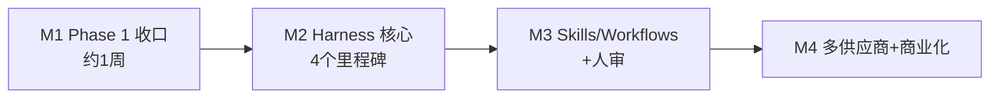

# 流光(Lumen)计划书 — rev 4(as-built 基线)

| 字段 | 值 |
| --- | --- |
| 日期 | 2026-08-30 |
| 基线 | 仓库当前实现(Phase 1 已落地,M2.3 库层已齐,未 git 提交) |
| 配套文档 | 设计书 `docs/design.md`;审查报告 `docs/review-2026-08-29.md`;历史 Phase 0 设计 `docs/architecture.md` |
| 状态 | 执行中。2026-09-05 完成 Blueprint 首页重建(见 `docs/handoff.md`)。下一刀: M1.1 git 提交 → M2.4(QC + 接入 orchestrator + 放开 30/45/60) |

---

## 1. 产品定位

**一句话:** 类即梦 AI 的视频/图片生成工作室,后端接 xAI Grok Imagine;**核心资产是自研 Harness(一致性控制管线)**——把 ≤15s 的 Grok 原生 clip 导演、锁帧、链接、质检、拼接成 30/45/60s 身份一致的长视频。

分层价值:

1. **底座(已基本完成):** Grok 原生五种视频模式 + 文生图的 1:1 端到端回路(提交 → 异步进度 → 本地持久化 → 画廊回放),官方 key 与 Sub2API 拼车两种上游。
2. **核心(本计划重心):** Harness 管线 —— Director LLM 分镜、Identity Bible、关键帧锁定、tail-chain/extend 链接、QC 重试、ffmpeg 拼接。竞品可以复刻"包一层 API",难以复刻的是这条管线与其评测体系。
3. **延伸:** 文件化 skills/workflows、人审门、即梦首尾帧硬锁、账密计费多租户。

## 2. 现状盘点(2026-08-30)

产品可用形态:本地单用户工作室,Grok 原生五视频模式 + 文生图端到端(提交 → SSE/轮询 → 落盘 → 画廊)。Harness 库层(导演、锁帧、分镜并行/恢复、硬切 stitch)已齐,**尚未接到 JobRunner**,选 30/45/60 仍 400。`pnpm test` 145 绿,`tsc --noEmit` 绿。git 仍只有 create-next-app 的 initial commit,全部业务代码未提交。

| 模块 | 状态 |
| --- | --- |
| 类型 + Zod 模式矩阵(含 t2i) | ✅ 有单测 |
| Grok REST client / rest-map / router / mock provider | ✅ 有 golden 测试;源视频禁止 data URI |
| Job 状态机 / 磁盘 store / in-process runner / 幂等 / sweep | ✅ 含 harness 阶段 `directing…stitching`;boot recover;并发 2 / 队列 20 |
| HTTP API(uploads 流式 / jobs / cancel / retry / SSE / Range media / health) | ✅ Range suffix、SSE 心跳、uploadId 正则、ACCESS_TOKEN |
| 工作室 UI(2026-09-05 Blueprint 单页首页:三条路径、折叠面板、任务读数、成片、画廊、存档、详情) | ✅ 像素级按交接包还原;UI 只暴露 t2v / i2v / t2i,30/45/60 与 r2v / edit / extend 不在 UI 上 |
| 场景层(纯 three.js `mountReel / mountWall / mountDotField` + `SceneHost`) | ✅ 单一 `three@0.185`,R3F / drei / 图标库已卸载 |
| Harness 库层 | ✅ Director / keyframe / shot 并行与崩溃恢复 / stitch;orchestrator 恒 throw |
| Harness 产品化(接 runner、QC、放开长视频) | ⏳ M2.4 |
| git 提交 | ❌ 仅 `3038174 Initial commit from Create Next App` |

## 3. 阶段计划

### M1 — Phase 1 收口与加固(先于一切)

目标:底座可信、可回归、可安全暴露给小范围用户。

| # | 任务 | 状态 | 验收 |
| --- | --- | --- | --- |
| 1.1 | 按模块分批 git 提交全部现有代码 | ❌ | 仍只有 initial commit;工作区大量未跟踪文件 |
| 1.2 | 修复 C1:Files 失败即 fail,删除 data URI 视频兜底 | ✅ | `toSendableVideo` / rest-map 拒绝源视频 data URI,有 golden |
| 1.3 | 修复 C2:tracing glob `ffmpeg*` | ✅ | `next.config.ts` 已用 `ffmpeg*` |
| 1.4 | 修复 C3:uploadId 正则校验 | ✅ | `^up_[0-9a-f]{16}$`,单测覆盖 |
| 1.5 | 修复 C5–C10 | ✅ | Range suffix、cancel 落盘、recover、SSE 心跳、tmp 清理、cancel 删 file |
| 1.6 | 最小鉴权 `LUMEN_ACCESS_TOKEN` | ✅ | 未配置则本地单用户;配置后 `/api/*` 需 Bearer/Cookie |
| 1.7 | 统一 three 版本,移除 `three128` | ✅ | 仅 `three@0.185` |
| 1.8 | 收口测试门禁 | ✅ | `pnpm test` 145 绿;`tsc --noEmit` 绿 |
| 1.9 | 真实 key 冒烟 | 🟡 | `data/jobs/` 已有成片,但无正式 ticks 对账记录、无 `evals/runs/` |

### M2 — Harness 核心(产品主线)

前置一次性工作(M2.0,~2 天):

- **评测集:** `evals/` 下 20 条固定 prompt(5 模式 × 中英文 × 边界时长)+ 人工评分 rubric(面部/发型/服装/光线/色调,各 0–1)；✅ 已建立并通过结构校验。
- **即梦 spike(1 天,H5):** 验证火山/Ark 首尾帧 API 真实可用性与效果,决定 packing 里"硬锁尾帧"档位是否成立。**此结论直接影响 M2.3 设计,必须前置**,不留到 PR 15；⏸ 当前没有即梦凭据，未发起外部请求。
- **成本模型进 `cost.ts`:** 30s hybrid ≈ $2.10、60s ≈ $4.20,QC 重试预算系数 1.5;✅ 已提供纯函数与单测；UI 提交前展示留待 Harness API 启用。

| 里程碑 | 内容 | 验收标准 |
| --- | --- | --- |
| M2.1 Director | `grok-4.6` chat.completions 产出 Zod 严格校验的 IdentityBible + shot list + packing;失败重试 2 次 | ✅ 规划器、严格 schema、重试和本地 fake 协议测试已完成；尚未接入 orchestrator |
| M2.2 Keyframe | `grok-imagine-image-2.0` 角色表/关键帧;用户首帧注入 shot[0];tail-chain 抽帧用清晰度选帧(H1) | 🟡 抽帧、选帧、角色表生成/审核/落盘已完成；写入 JobRecord 与 JobRunner 待 M2.4 一并接入 |
| M2.3 链接与生成 | per-shot 路由(i2v/r2v/extend);shot 级状态与断点续跑(H3);无依赖 shot 并行 | ✅ 并行、依赖等待、崩溃恢复、硬切 stitch 库已完成;orchestrator 仍恒 throw |
| M2.4 QC + Stitch + 放开 30/45/60 | 时长校验、黑帧/冻帧检测、grok-4.6 视觉一致性打分;把 Director→Keyframe→Shots→Stitch 接入 orchestrator;读取 `HARNESS_ENABLED`;UI 启用 30/45/60 | ❌ 无 `qc.ts`;stitch 未写入 `outputs/`;30/45/60 仍 400。验收:评测集 30s 成片一致性人审 ≥4/5 的比例 ≥70%;单片成本 ≤ 预估 ×1.5 |

状态机已并入 `directing|keyframing|generating_shots|qc|stitching`；`HARNESS_ENABLED` 仍仅在 M2.4 被读取。orchestrator 保持恒 throw(与现设计一致)。

### M3 — Workflows & Skills + 人审

- `skills/<id>/SKILL.md`(YAML frontmatter 对齐 `SkillManifest`)+ workflow 图执行器;
- `awaiting_approval` 状态 + `POST /api/jobs/:id/approve`;单镜重做 UI;
- 验收:一条含人审门的 45s workflow 端到端走通。

### M4 — 多供应商 + 商业化

- `JimengProvider`(按 M2.0 spike 结论实现首尾帧硬锁,替换 freeze settle);
- 账户/credits/支付;`S3MediaStore`;BullMQ 队列;多实例部署;
- 验收:双供应商混合 packing 出片;计费与 ticks 对账误差 <1%。

## 4. 质量与评测(贯穿)

- **回归:** 任何 prompt 模板/harness 改动后必跑 `evals/` 20 条,评分留档在 `evals/runs/{date}.json`;
- **单测门禁:** `pnpm test` 绿是合并前提;REST golden、状态机、Range、Zod 矩阵不允许回退;
- **成本守护:** `JOB_CONCURRENCY=2`、`MAX_QUEUED_JOBS=20`、提交前预估、`cost_in_usd_ticks` 对账;M2 起 harness job 增加单 job 成本上限(超预算 ×2 自动停止重试)。

## 5. 风险登记(更新)

| 风险 | 严重度 | 缓解 |
| --- | --- | --- |
| 即梦首尾帧 API 不可用/效果差 → 尾帧硬锁卖点落空 | 高 | M2.0 spike 前置验证;fallback = freeze settle + keyframe-cut |
| QC 视觉打分不可靠 → 一致性无法保障 | 高 | 对照集校准阈值;人审兜底(M3);指标进评测集 |
| harness 单片成本超预期($3+/30s) | 高 | 成本模型 + 重试预算封顶;480p 试跑,通过后再高清重打 |
| Sub2API 上游行为与官方漂移(字段/状态) | 中 | golden test 双上游 fixture;health 显示 upstream kind |
| in-process runner 在 HMR/崩溃下丢任务 | 中 | 已有磁盘状态 + boot recover;M4 换 BullMQ |
| vidgen URL 过期 | 中 | 已实现 done 后立刻下载 + storage_options 备份 |
| 端口暴露烧额度 | 中 | M1.6 最小鉴权;README 警告 |

## 6. 下一步(按优先级)

0. **首页收尾(小):** 「video · fast」模型变体需要 API 契约支持才可接入;Playwright 冒烟(空态 / 提交 / 详情)未建;移动端只做了基本折行。详见 `docs/handoff.md`。
1. **M2.4(产品主线):** QC(时长 ≤0.4s、blackdetect/freezedetect、视觉 rubric)→ 把已有 Director / Keyframe / shot plan / stitch 接入 `harnessOrchestrator.execute` → 读取 `HARNESS_ENABLED` → 放开 30/45/60。Grok-only:用户尾帧用 freeze settle,不调即梦。
2. **M2.2 收口(随 M2.4):** 角色表 assetId 写入 JobRecord / Identity Bible;`sheetAssetIds` 进入 R2V 参考图。
3. **M1.1:** 按模块分批 git 提交,避免工作区继续只活在未跟踪文件里。
4. **M1.9 补记录:** 用真实 key 跑 3s 480p T2V → I2V → extend → edit,把 ticks 与 `evals/runs/{date}.json` 留下。
5. **M2.0 即梦 spike:** 仍缺凭据,阻塞 M4 尾帧硬锁,不阻塞 M2.4。
6. **M3 / M4:** skills/workflows 执行器、人审门、Jimeng、账密、S3/BullMQ — 排在长视频回路跑通之后。
